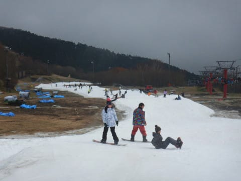

# 2020/11/8(日)のイエティ速報＆ゲレンデ状況動画…かなり混んだよ（涙）．天気は曇り時々晴れ

📅 投稿日時: 2020-11-09 02:49:05

ということで．

本日はイエティで滑ってきました～！

今シーズンも，早くもシーズン滑走3日目ですが…

今日のイエティ，かなり混みました(涙)

いつも通り，あさイチは良かったんですけど…

10時ごろになると．

これまたいつも通り人が増えてきて…

リフト待ちがすごいことに(涙)

…これだけ混雑したのに，

いつもなら10時ごろには動き出す

クワッドと並行するペアリフトが

本日は動かず(涙)

なので，午前10時以降は10分前後の

リフト待ちがずっと続きました(泣）

うーむ．

イエティはコースが狭くて人が多いけど，

リフト待ちがこの時期にしては少ない…

ってのがメリットだったけど…

うーん．

これでリフト待ちが長いとかなり残念な

感じ(涙）

で．

今日はナイターも人が多めで．

大変残念ながら，ナイターの

リフト待ちもかなりのものでした…(泣）

うーむ．

今日はリフトがムチャ込みだったのが残念．

でも，20～30分待ちの軽井沢よりマシだよね

と，自分を慰めていたのでした…

そして．

いつも通りのコース状況動画を上げておきます．

午後3時ごろの状況です．

雪自体は，1-2か所茶色いところがある以外，

厚みは十分なのが分かるかと…

また明日，詳細レポートやります～！

## 💬 コメント一覧

### 💬 コメント by (ほっぽ)
**タイトル**: Unknown
**投稿日**: 2020-11-09 06:27:52

Sさん

日曜日、スゴい混雑ですね。

日曜はそれほど混まないナイターもこのリフト待ちとは。

平日ナイター組からは想像出来ません😵

日曜ナイター行こうかなと思ったけど、止めて正解ですね。

私は今夜上がる予定です。

### 💬 コメント by (Skier_S)
**タイトル**: ＞ほっぽさま
**投稿日**: 2020-11-10 01:17:32

日曜は混みました…

昼間は青のペアリフトが動いてなかったのが痛かった．

そして，ナイターも10分近く待ちました（涙）

日曜ナイター，来なくて正解だったと思います（泣）．

