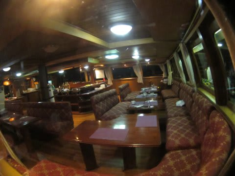

# 子連れコモドダイビングクルーズagain　その7　サザンスター号1日目はまだ終わらない

📅 投稿日時: 2011-09-03 02:33:53

🏷️ カテゴリ: [ダイビング日記](ce3a7a8d424d112fce83ee85c81a0e344.md)

という感じで．

コモドでの1本目から，大大だーい満足．

エグジット後本船に戻ると…

サンセットタイム．

満足ダイブのあとは，

お留守番していた妻と娘も含めて，みんなでサンセットを眺めながらだべってます．

ああ…初日からいきなり満足ダイブだったことよ…

夕日が沈むと，夕食タイム．

なんか，魚の丸焼きが出てますね…豪快です．

しかし．炊飯器でご飯が出てくるっていうのがインドネシアの船の上って感じがしない…

でも，パンがあんまり好きじゃない娘にとっては嬉しい日本人向け仕様ですね～．

で．

夕食が終わっても．

濃いぃサザンスタークルーズの初日はまだ終わらない．

夕食の後…

今度はオプションのナイトダイブ！

…妻はあんまりナイトダイブが好きじゃないので…

…好きじゃないはずなので…

…たしか，それほど大好きじゃなかったはずなので…

妻は，夕食を食べてネムネムになっている娘を寝かしつけるお留守番役．

…私一人で潜りに行きます．

ごめん，妻．

で，

ナイトは，並行して走るもう一艘の船のメンバーと一緒に

潜るので…

横に停船しているもう一艘の船へ移動してブリーフィング．

この，もう一艘の船．

ヨーロピアンが喜びそうなウッディーな帆船風の船で，

結構広いんですが…

ボートから階段を上って乗り降りするとか，ダイブデッキが斜めに

傾いてるとか，カメラ置きスペースがないとか…

うーん．しまじの方が揺れも少ないし，いいなぁ．

とりあえず．

去年はいなかったけど，3年前に乗船したときにガイドしてくれた

サムと久しぶりに再会し．

ブリーフィングのあとは．

ナイトダイブへGo!
