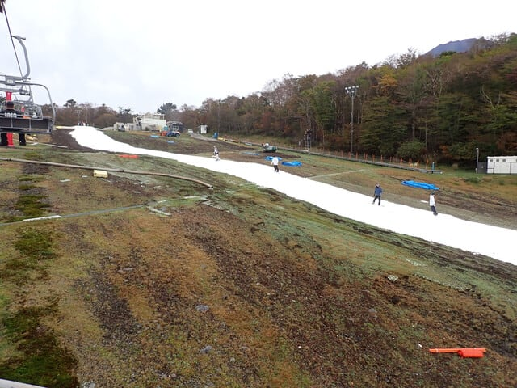
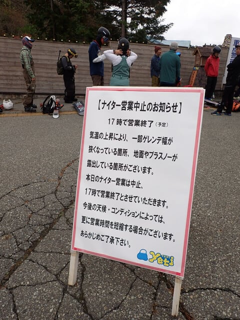
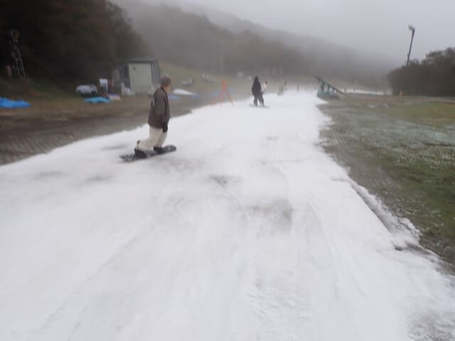
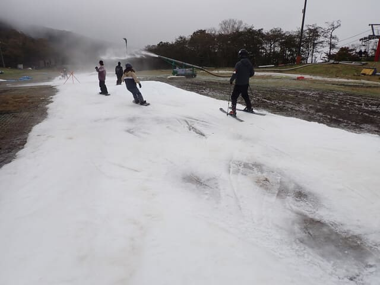
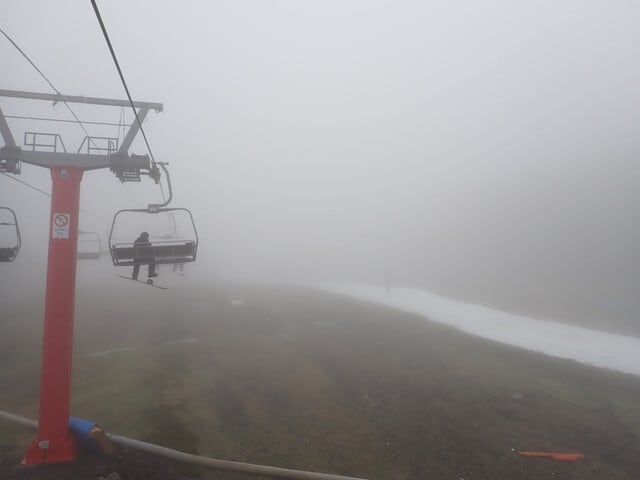
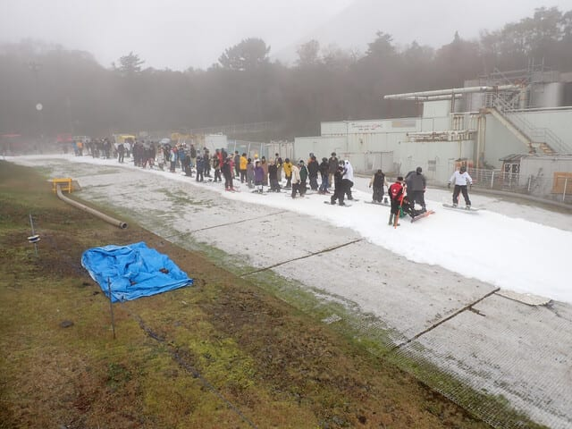
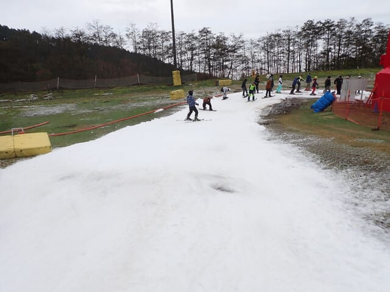
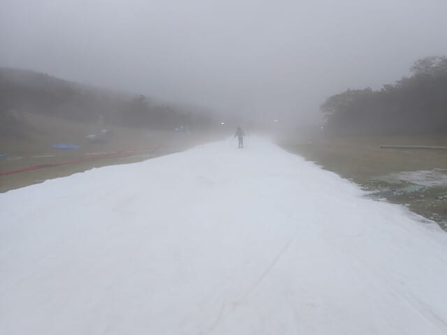
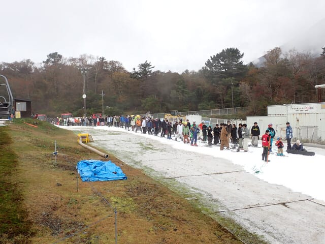

# 2024/10/26(土)2025シーズンオープン翌日のイエティの滑走速報＆ゲレンデ状況動画…そこまで混まなかったけど，コースは細く雪は薄いよ（涙）

📅 投稿日時: 2024-10-27 02:40:02

ってなことで．

予告通り，昨日オープンしたイエティへ

2025シーズンの初滑りに行ってきました～！

今日は帰宅は夜9時ごろと早かったの

ですが，その後一仕事せねばならず，

いつも通りの深夜便となってしまったので，

今日は速報＆ゲレンデ動画にて…

まず．

やはり気温が高く，雨も結構降ったという

オープン前の天気の影響で，

例年より雪が少なく…

かなりゲレンデの幅は狭く，雪は薄かった

です（涙）

そのせいで，オープン2日目の本日の段階で，

早くもナイター中止となりました（激涙）

今日も気温が高いし，日曜はさらに雪が

溶けそうな天気なので，ほぼ確実に

日曜もナイター無しだと思います…

とりあえず．

かなりの造雪能力を誇るイエティなので．

例年なら，オープン時期は幅はそこまで

広くなくても，そこそこの厚みの雪が

準備されているはずが…

今年は営業2日目としては，これまでに

ないくらいに雪が薄く，朝のうちから

ゲレンデがところどころ茶色くなって

ました…（泣）

穴がひどく開きそうなところは，スタッフが

人海戦術で埋めてたので，コースが途切れそう

になるとかいうほどひどくはなかったですが…

でも，シーズン2日目としてはかなりヤバい

感じ．

で．今日の天気は曇り時々ガスで，ときおり

こんな感じで視界が悪くなることはあった

ものの，雨は降らず，日差しもなかったので

板は滑ったし，硫安が効いたバーンは

そこまで緩まずに済んだのが，まだ救い

だったでしょうか…

あと，ゲレンデが狭くて，結構凸凹とかが

多いうえに視界も良くなくて危険と判断

したからか．

例年にはない，リフトを降りたスタート地点で

一旦全員を止めて，コースが混雑しないよう

数人ずつ滑らせるというシステムが

朝からラストまで運用されてました～！

そのおかげで，下に人が溜まることなく

リフト待ちはほとんどなかったし．

コースの上の人も，いつもの激込みな

デンジャラス状態に比べれば，

かなりクリアな状態で滑れて，

昼過ぎくらいまでは良かったかな…！！

ピーク時は，滑り出しまで7-8分くらい

待たされたけど．

同じ待つならリフト待ち7-8分より，

スタートで7-8分まってコースがクリア

なほうがいいので…

このシステム，今後もやってほしいと思いつつ．

今日くらいの混雑だったからできた技で，

もっと人が増えると破綻するかも…

ということで．

この日の午後2時過ぎくらいのコース状況の

動画です．

スタート制限のおかげで，最初は目の前の

人が少ないですが，この回は前に滑り

出したボーダーの集団に追いついてしまい，

ちょっと混雑状態になった回です…

午後はこんな感じが多かったですが，

昼過ぎまでは，毎回ガラガラに近い状態で

滑れて，結構よかったです～！

## 💬 コメント一覧

### 💬 コメント by (1kamakura)
**タイトル**: Unknown
**投稿日**: 2024-10-27 06:39:56

江戸の秋

今シーズンの初滑り、

おめでとうございます㊗️

やっぱりボーダーが圧倒的に多いですね。

早く他のスキー場もオープンしてもらわないと、集中しちゃいますね。

今度Sさんの滑りが見たいです♪

是非よろしくお願いします🙇‍♀️

### 💬 コメント by (カンタロス)
**タイトル**: Unknown
**投稿日**: 2024-10-27 08:40:52

エスさま、こんにちは。

貴重な動画ありがとうございます。

これはもはや修行レベルのゲレンデですね（笑）

シーズンインはもう少し先だな！と思いつつ、この状況が続くようだと狭山がガチガチに混むのでは？？とか思います…

### 💬 コメント by (Skier_S)
**タイトル**: 明日はイエティ営業中止
**投稿日**: 2024-10-27 22:18:07

＞江戸の秋さま

無事シーズンインしました～！

ボーダーが感覚的には8割でしょうか．やっぱりボーダーが多いです．

私の滑りは…人様にお見せするほどでもないので，恥ずかしくて晒せないです…（笑）

＞カンタロスさま

修行レベルです．

普通のスキーヤーは行かないほうがいいと思います．

逝ってしまった人，滑らないと死ぬ人が行く場所だと思ってます（笑）．

今週末3連休，狭山も軽井沢も激混みだと思います…

