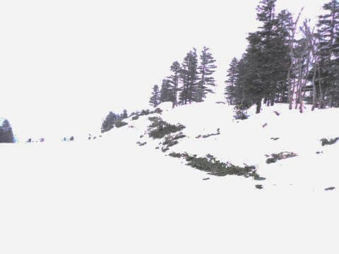

# 2023/3/25(土)の志賀高原焼額スキー場は…終日みぞれ～雪，気温が高く雪は4月下旬並み，一気に雪が減ったよ（泣）

📅 投稿日時: 2023-03-26 00:13:47

🏷️ カテゴリ: [2023スキー滑走日記](cd943df30cfcc3d0896469e2ff98720cd.md)

ってなことで．

今日は2週間ぶりに志賀高原に舞い戻ってきました～！！

もう，滑りたい欲求がMAXで，久しぶりの志賀高原で

テンションMAXだったので．

昨晩2時間半睡眠，今日も2時間睡眠だったけど，

ウキウキ気分で眠さもふっとんで4時間運転

で志賀高原にやってきたわけですが…

志賀高原へ上ってきたら…

雨だよ(涙)

関東から長野まで，ずっと雨でしたが．

志賀高原に上がってきても，雪にならず

雨なんですけど…(激泣)

さらに追い打ち．

朝イチゴンドラにならぼうとすると

焼額第1ゴンドラ，故障により営業開始が1時間ほど

遅延予定

という非情な案内が…（涙）

今週から第1ゴンドラ横の第3高速リフトは営業しないので，

1ゴンが動かないと，逃げ先がない…（泣）

なので，急遽スキー場が準備したバスで，

イチゴン前から2ゴンへ移動！

私にとっては珍しい2ゴンスタートとなりましたが，

移動のせいで，営業開始に間に合わなかった…（残念）

そしてさらに残念なことに．

山頂でも+3度と異常な高温で．

おかげで，朝イチは一応シマシマだったものの，

雪はかなり緩めで，残念な感じ…（涙）

天気は，山頂付近は小雪がぱらつき，リフト乗り場付近は

液体がぱらぱらと落ちてくる感じで．

ゴーグルに水滴がついて見にくい，これまた

残念な感じ（涙）

ウェアもびしょぬれとは言わないまでも，

しっとりしてくるし．

天気が悪いこともあり，ゲレンデはさすがに

ガラガラ．

ただ…

朝からこんな雪なので．

2週間ぶりとはいえ，テンションが上がらない…（涙）

で．

9時過ぎには，故障で営業開始が遅れていたイチゴンが

動き出しました！！

イチゴンが動いてなかったので，誰も滑って

なかったGSコースの一本目は気持ちよかった！！

けど…

雪がざぶざぶなので，3本目にはもう荒れ荒れ

バーンになってくるという，この悲しさ（涙）

なぜ…

なぜ2週間ぶりにやっと滑りに来れた週末に

限って，ざぶざぶ雪の荒れ荒れの，ゴーグルびしょぬれで

前が見えない天気になるかな…（涙）

そして，オリンピックコースに行ってみると…

うぎゃーーーー！！

なんじゃこりゃ！！

そこかしこに，土が出てきてるよ！！

特に，コースの中間の斜面が急になる斜面

変化のあたりは，コース幅半分以上に土が

出ているので，幅1/3以下ぐらいしか滑れなく

なってるし…

それ以外も，オリンピックコースは雪が薄く，

あちこちにブッシュが…

これ，来週まで雪が持たないかも…（激泣）

そのほか，唐松コースもコースの端っこに

土が出始めてきてるし…

パノラマコースの廊下の脇も一気に

土が出てきてるし

第1ゴンドラの乗り場もかなり茶色く

なってきたし…

この2週間で激烈に雪が解けました（激涙）

ダメだ…

今シーズン，とてもGWまで雪が持つと

思えない…（泣）

この残念な雪の状況で，さらにガスっぽくて

視界は悪いし．

残念だ…

せっかくの2週間ぶりのスキーなのに，

残念だよ…（涙）

ただ．

一応昼間も完全に雨にはならず，

すぐ融ける感じではあったものの，山頂は

終日雪だったし．

ふもとは雨だったけど，ザーザーぶりに

なることは無かったし．

雨っぽい感じの天気のおかげで，

雪は張り付き雪にならず，かなり板が

滑る雪だったし．

晴天で板が全く滑らない，妖怪板つかみが

ラッシュアワーのように大量発生する雪よりは，

雨で板が気持ちよく走るほうが100倍マシだ！！！！

…と，自分を騙して．

今日も日が暮れるラストまで滑ったのでした…

いや．

やっぱりスキーは，板が走る雨の日に限り

ますね！！！（やけくそ）

…で．

明日もかなり雨っぽい雪が降り，

今日よりもさらに強い降りの天気になりそうです…

とりあえず．

明日，奇跡のマイナス10以下の度冷え冷えで，

激烈パウダーになるように祈って寝ます…

おやすみなさい…

## 💬 コメント一覧

### 💬 コメント by (レインボー75)
**タイトル**: Unknown
**投稿日**: 2023-03-26 12:05:42

日曜日の志賀高原情報

朝の湯田中は雨。でも、予想外の強風でニゴン、いちごん、奥ゴン運休

やむなく2高に移動。雨の中、待つこと30分。ベタベタになっていやになり、唐松一本だけで終了。あまりの根性なしに、誰もが唖然。でも、余は満足じゃ！こんな条件でも滑り続けれる人は、世に一人しか知りません。

### 💬 コメント by (油漏＠あちこち)
**タイトル**: 雨
**投稿日**: 2023-03-26 15:21:00

お疲れ様です。

私が２万メートルチャレンジの日の予報も雨でしたが、滑らなくなるよりマシだろうと思い決行しました。霧が出て視界が数メートルになったり、雷が聞こえてきて強制終了が危ぶまれましたが、何とか達成しました。

やはり板の走る雨の日は最高ですね!

因みに今職場で残務整理中です。スキーに行けないのに、羨ましいなぁと思わないのはナゼだろう？

### 💬 コメント by (Skier_S)
**タイトル**: 今日もダメな一日だった…
**投稿日**: 2023-03-27 01:21:39

＞レインボー75さま

まさかリフト1本だけで帰られるとは…

30分リフト待ったんなら，少なくともそれだけ分は滑らないともったいない感じですね（笑）．

＞油漏れ＠あちこちさま

そうでしたか…20000mチャレンジ，雨の中実行されたんですね！！

でも，春先になると．

滑らないアイスバーンより，雨で滑るバーンの方がいいですよね（言い切り）

