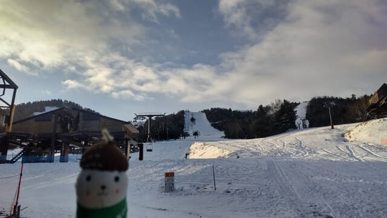
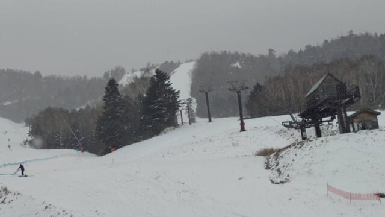
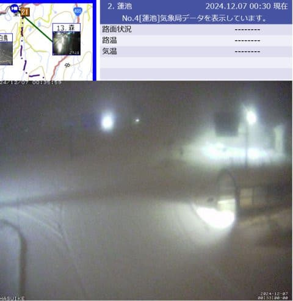
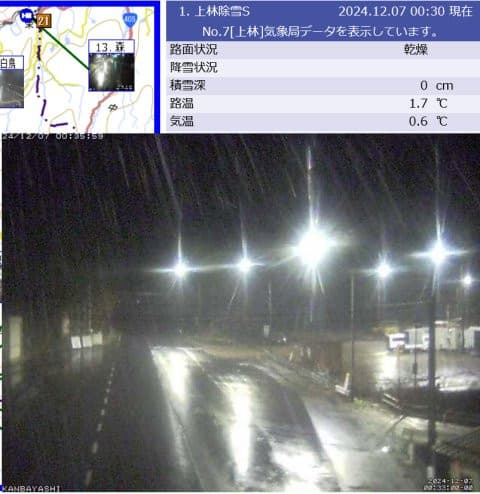
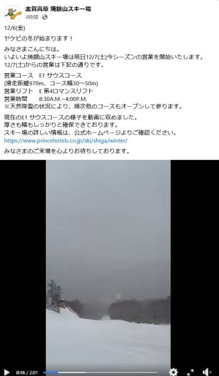
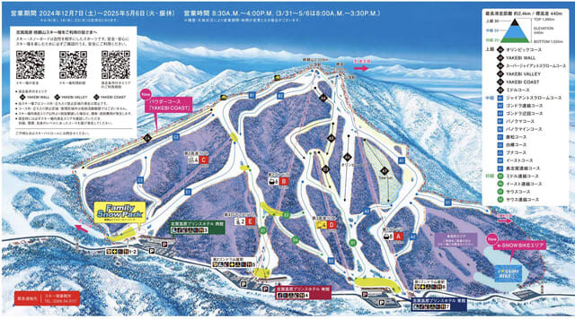
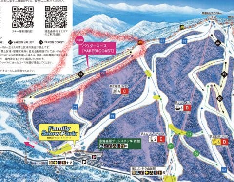

# 焼額山スキー場のゲレンデマップ更新…新コースは旧第1高速跡地！そして明日から志賀高原で滑ってます～！

📅 投稿日時: 2024-12-07 01:05:20

えー．

本日，6日金曜日の志賀高原ですが．

おこみん特派員によると，朝は晴れて

いたようですが…

リフト営業後すぐににわかに掻き曇った

かと思うと，雪が結構な勢いで

降りはじめ…

あっという間に数㎝積もったようです…！！

昼前まででこのくらい積もったようなので…

午後は降りが弱まったようですが，

週末前にちょっとでも雪が積もってくれるのは

嬉しい限り…！！

ちなみに，6日深夜…というか，日付が変わって

7日の0時半現在では，志賀高原では雪が降り，

道路も白くなってます…！

道にタイヤ痕がついてないので，降りたての

雪がそこそこの量積もっていることがわかり

ますね…！！

（[北信建設事務道路気象状況カメラ](http://hokushin.pref-nagano-roadcamera.jp/)より）

ちなみに．

志賀高原の登り口の上林では，雨に

なっているようなので，明日の朝

これが冷えると凍って危ないかも…

明日の朝，志賀高原を登る方は，

路面がツルツルに凍結してるかも

と覚悟して登ってきた方が良いです…

（[北信建設事務道路気象状況カメラ](http://hokushin.pref-nagano-roadcamera.jp/)より）

ちなみに，明日からオープンの，我が

ホームゲレンデ焼額．

明日は第4ロマンスのみの営業のよう

です（ちょい涙）

うーん．さすがに第2高速は動かないか…

ただ，天然降雪の状況により，順次

ほかのコースもオープンと書かれている

ということは．

おそらくゴンドラや第2高速を動かせる

スタッフはスタンバイしているんだと

思うので…

土曜にどっさり積もったら，日曜に

ゴンドラ営業もありうるかも？？？（期待薄だけど）

今のところ，志賀高原の天気は

土曜：朝までに10cm積雪，あさイチ気温は-5℃，

　終日雪が降ったりやんだり，時折日も射す

日曜：朝までに10cm積雪．朝イチ気温-6℃，

　終日雪降り，昼間だけで10cm積雪？

という感じでしょうか…

もう少し風が北に回ると，もっと積もるん

だけど，それでもこの週末でちょっと積もって

くれそう…！

土日とも，朝は天然雪が乗ったゲレンデで

滑れそうです！！

そして．

明日オープンの焼額．

本日ホームページの一部アップデートがあり，

ゲレンデマップが新しくなってました～！！

（[焼額山スキー場ホームページゲレンデマップページ](https://www.princehotels.co.jp/ski/shiga/winter/coursemap/)より，以下同じ）

大きな変更点としては…

そうです．

パウダー新コースである，ヤケビコーストの

新設です！！

コースは，ここだ！！

旧第1高速リフト跡地ですね…

まあ，コース幅が狭いので，

オープン直後3分でパウダーのおいしい

ところが無くなっちゃいそうな感じ

ですが．

それでも，新コースができるのはいいニュース！

とりあえず．

明日からオープンの我がホームゲレンデの

焼額．

当然，私はオープン日の明日から滑って

きます～！！！

あと2時間半後に出発です～！！！

…いつも通り，2時間くらいしか寝れない…

2時間睡眠で出発して滑ってきます…←仕事から帰宅したのが深夜12時とか

遅かったんだから，こんなブログ書いてないで寝ろ

## 💬 コメント一覧

### 💬 コメント by (レインボー77)
**タイトル**: Unknown
**投稿日**: 2024-12-07 16:53:22

土曜日の志賀高原情報

湯田中では朝から雪が降り始め、ようやくスキーの季節到来の感じ。志賀高原スキー場開き祭が熊の湯であるけど、我らは一路ヤケビへ。

四ロマだけの運行だけど、知ってる従業員も多いし、なんか落ち着く感じ。11時からリンゴor米がふるまわれました。私はでっかいリンゴ。頂くものを頂いたら、即終了して湯田中の仲よしラーメン。超美味しいのに年末で閉店とは悲しい限り。

明日は雪予報の一日。ニゴンに微かな期待を込めて、やっぱりヤケビがいいかなあ？

### 💬 コメント by (Hara)
**タイトル**: Unknown
**投稿日**: 2024-12-07 20:00:53

第一高速の跡！！　大きな声で言えないけど、時々、入ってました。木を切ったのですかね？

### 💬 コメント by (Skier_S)
**タイトル**: 今日から志賀高原！
**投稿日**: 2024-12-07 21:42:24

＞レインボー77さま

明日の第2ゴンドラは期待薄ですが…

でも，コースコンディションはさらに良くなると思いますよ！！

しかし仲よし食堂がなくなるのは残念…

＞Haraさま

おそらく木は切ってなくて，ツリーランコースとしてオープンするのかと思います…

国立公園で，新たに木を切るのはかなり条件が厳しいと思うので…

