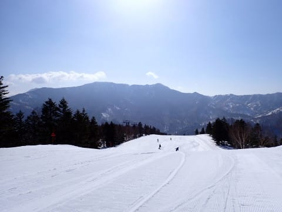
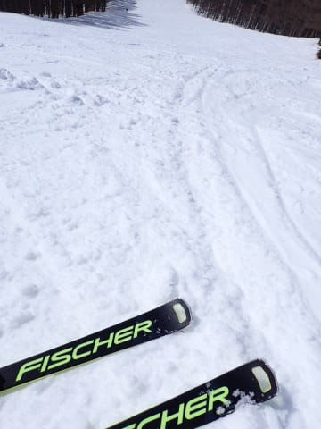
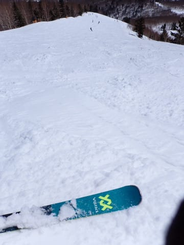
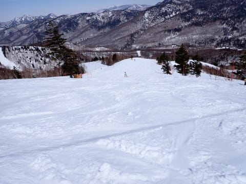
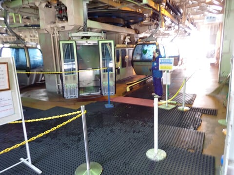
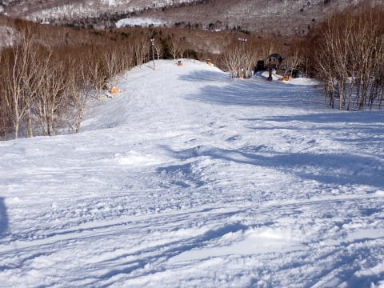
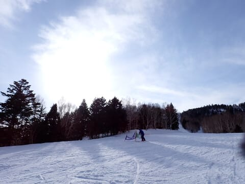

# 2024/3/31(日)の志賀高原スキー場，速報レポート！…朝から気温はかなり高く緩んだ雪(泣)．昼前にザブザブ雪，緩斜面は滑り悪め．午後はバーン荒れたよ

📅 投稿日時: 2024-04-01 03:12:35

ってなことで．

本日も営業終了までひたすら滑ってから

帰宅すると，もう夜11時近くで…

それから一仕事やっつけていると

こんな時間（泣）

もう夜中2時近いんですが…

先週も平均睡眠時間5時間を切る

年度末激務だったというのに，

土曜は2時間睡眠で朝3時過ぎに起き，

志賀で一日滑ってから夜12時過ぎまで

飲んでたので…2時間しか寝てないのに，

その後21時間ぶっ続けで起きていた

ということですね←アホ

さらにその後，6時間睡眠で

また日曜朝イチから滑りに行き，

いつも通りラストリフトまで滑って

たので…

今日はめちゃくちゃ眠いです…←当たり前だ

ってなことで．

本日の志賀高原，手短に速報モードにて！

えー．

まず．

今週末からいつもより30分早い，

8時営業開始の焼額第1ゴンドラで

滑り始めますが…

あさイチからすっきり晴天！！

ただ．

昨晩は気温が高く．

夜中に氷点下に落ちなかったという，

3月末としては異常なほどの高温だったので．

朝はシマシマなれども，かなり緩くて

板が潜っていくようなシマシマ…（涙）

かなり緩めの雪なので．

あっという間にバーンは掘れて

荒れ荒れになっていきます（泣）

朝から暑いくらいの気温と，

強烈な日差しで…

9時過ぎにはもうバーンがかなり荒れた

状態になっちゃったし．

標高が低い，ゲレンデ下部の緩斜面は．

黄砂の影響はほとんどない感じでしたが，

高温にやられた，滑りが悪めの雪に

なっていきました…（泣）

で．

荒れ荒れ＆滑りが悪い雪なので．

みんなあきらめて早く帰ったのか，

ゲレンデは昼には誰もいない

ゴーストタウン状態になっちゃったし…

今日は朝からかなりガラガラだった

焼額のゴンドラですが．

午後になるとほぼ飛び乗りになって

ました…

ってなことで．

ガラガラのリフト＆ゴンドラで，

ちょいと滑りの悪めの，荒れ荒れ

バーンをひたすら滑った一日

でしたが．

さすが午後3時ごろになると，

ちょっと気温が冷えてきて，緩斜面でも

板が走るようになってきたものの…

雪が緩かった本日．午後遅くになると，

バーンはかなりボコボコに…（泣）

ってな感じで．

いい感じの晴天で，ガラガラのゲレンデ

だったけど．

ちょっと滑りが悪めの雪と，

かなり荒れた凸凹バーンにやられて，

ちょいと楽しくなかった一日だった

かな…（泣）

…と，思いながらも．

いつも通り，やっぱり今日も日が傾き始める

16:15の営業終了まで，ひたすら滑り続けた

のでした…

うーん．

春ですねぇ…

せっかく冷えた3月だったのに，

これからは平年より高い気温の日が

続きそうで．

今週もまた水～木にかけて，また液体が

降りそう（泣）

冷え冷え3月のおかげで，このままだったら

GWまで行けそうな積雪量になってくれたけど．

果たして無事GWまでもってくれるのかな…？
