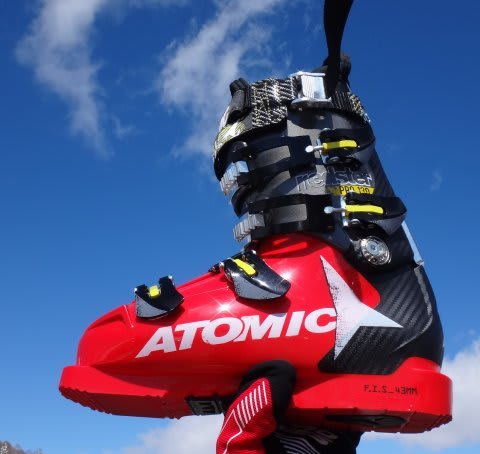

# ということで，ATOMIC redster WC 130を買ってみた

📅 投稿日時: 2015-11-20 01:21:10

というわけで．

[11月に開催された物欲選手権](e676591ac0d87f01c70ad0ad2ceae84f6.md)に完敗し．

ブーツを買ってしまったわけですが．

これまで使っていた，

[2シーズン前に買った，ATOMICのredster PRO 130．](m201404.md)

…このブーツを買う以前，

「テールを使うATOMICの板を買ったから，

バックサポートの強い，ATOMICのブーツを

履いてみたいなぁ…」

と思っていたけど．

幅広，甲が低い私の足型は，ATOMICブーツと

強烈に合わなかったため，

「私はATOMICブーツと相性が悪いから…」

と，あきらめていたところ．

なんと，この年のブーツから，シェルが熱成型で

足型に合わせて成型できる！

これなら，幅が広がるから，履けるはず！

…ということで，2シーズン前に買ってみたわけで．

実際に履いてみたところ．

ATOMICのBluester DEMO SXとの相性は最高！！

最初は異常なグリップ感にてこずったけど．

ターン後半に板のテール側を強烈に

食い込ませていくような感じで．

もう，ATOMICの板とブーツの組み合わせ，

無敵！！

…と，かなり気に入っていたのですが．

足幅が103mm以上ある，異常に幅広の足の私．

幅98mmの130 PROを，さらにメモリーフィット（シェル熱成型）

で広げても，熱成型可能な範囲を超えているらしく，

さらに削ったりシェル出ししたりして広げたんだけど…．

それでも，一日滑ると，我慢できないくらい

小指や親指の付け根が痛くなる…

という状況で．

さらに，足幅はタイトだけど，足首が細い私には，

足首のホールドが足りず．

[自作インソールを作って](e44589e80c529cb933f9dd83722343d1e.md)かさ上げして，

ホールド感を出していたんですが．

足が痛くなると，足に余裕をもたせるために

インソールを抜かざるを得ず，そうすると

ホールドが緩くなって足がブーツの中で動いちゃう…（涙）．

ということで．

このATOMICブーツ．

足首は緩いのに，幅がきつくて痛い！

という悩みがあり．

うーむ．

性能は最高なんだけど…

痛いブーツはどうしようもないから．

買い替えざるを得ないのかな…

と，悲しんでいた，つい先日．

いつものお店で相談したところ．

「ブーツは足首に合わせた方がいい．幅は何とかして広げる」

「足首が緩く足が中で動くから，足が動くたびに指先がゴツゴツ

　ぶつかって痛くなる．足首が締まれば痛くなりにくい」

…なるほど．そんなもんですか…

「その足首だと，95mm幅のWCじゃないとダメ．

　98mm幅のPROだと緩い」

ええええ！！！？？？

私の足幅，103mm超えてるんですけど?

95mm幅のブーツ，1cmくらい広げるの？？

大丈夫なの？

他のお店では，98mmのPROでも限界いっぱいって言われたのに…

それ以前に，WCって…私には幅が狭すぎて，試し

履きしたくても，私は履くことすらできないんですが？？

「大丈夫です．広げます．履けるようになります．

　絶対WCの方がいいです．

　それも，メモリーフィットかけません」

え？？

メモリーフィット，かけないの？

それがATOMICの売りなのに…

「メモリーフィットかけると，ちょっと足首が

　緩む可能性があるので．

　お客さんの足首はWCでもゆるいかも，ってくらい細いので，

　メモリーフィットかけない方がいい」

…そうなんですか…

ってことで．

紙に足型を写されたあと．

それをしげしげと眺めて．

「うーむ．ブーツ選びに苦労する足ですね…」

と，わけのわからない同情（？）をされてから．

ブーツ加工してもらったわけで．

…そして，一週間後．

加工が終わったブーツを履いてみると…

をを！

履けた！

足型にピッタリ合っていた，以前のSALOMON並みの

フィット具合．

…驚き…

まさか，試し履きすらできないブーツが，

こんなに素直に履けるなんて…

で．

先週のYetiでデビューさせてみたところ．

…今までのPRO，足首がいかにガバガバだったか，

よく分かる…

足首のFIT感がバツグンに上がりました！

そして．

しっかり幅を広げてもらえたので，幅が広い

PROよりも痛くない！

まだ，Yetiしか滑っておらず，急斜面やトップスピードでの

性能は見切れてないけど．

うーむ．

このブーツ．

かなり私の戦闘力を上げてくれそう…

## 💬 コメント一覧

### 💬 コメント by (いか)
**タイトル**: Unknown
**投稿日**: 2015-11-20 22:53:34

これはますますSXのテールでばんばん走ってオーソドックスな板で切り替え後に焦るようになる流れですね…わかります…(SXかつアトミックブーツ乗り)

### 💬 コメント by (Skier_S)
**タイトル**: いかさま
**投稿日**: 2015-11-20 23:43:12

…さすがによくお分かりで（笑）．

まさにその通りかと…

だんだんATOMICから離れられない体に

なっていきます（＾＾；

### 💬 コメント by (まいる)
**タイトル**: わたしもブーツ
**投稿日**: 2015-11-21 21:09:00

Skier_Sさん、こんばんは

私も先日神田でブーツ買いましたよ、スキーではなくスノーボードですが、deeluxe empire・・・

スポーツ祭りの時で、なぜか焼額だけの一日券があたりました(T_T)

アウトバックですが、たしかにエスティマより狭いですが、大勢で出かけることもなくなり、運転していてあきらかにアウトバックのほうが楽しいです(^^)

### 💬 コメント by (Skier_S)
**タイトル**: まいるさま
**投稿日**: 2015-11-21 22:53:50

をを！

ここにも物欲選手権で敗退した人が…（笑）．

でも，まいるさまはボーダーでしたか．

焼額限定の一日券…

微妙な感じですね．

せっかく志賀まで行くなら全山行きたい

所ですし（＾＾；

で．

エスティマよりアウトバックの方が，

運転の楽しさは桁違いに楽しいと

思います（笑）．

雪道は速いですよね～！！

スバル車．

