# 2007年8月　三宅島ドルフィンスイム＆ダイビング旅行記　その7

📅 投稿日時: 2013-09-16 01:14:39

えー．

これを書いている本人は．

タイのタオ島にいるわけですが．

2007年のドルフィンスイムレポート，続きます…

---

ってことで．

シュノーケルから開放され，思う存分息が吸える喜びで

しばらく放心状態…

次にイルカが見つかるまで，5分ほど休めるかな？

と思ってたけど，

わずか1-2分ほどで

「準備して～っ！」

うげげ．早っ！

ほとんど休みが無い…

…早くも1～2人，「次は休憩！」と宣言してます．

泳ぎすぎて，戻しちゃった人もいるぐらいヘビーでしたから…．

とりあえず，あわてて船べりに座って準備すると…

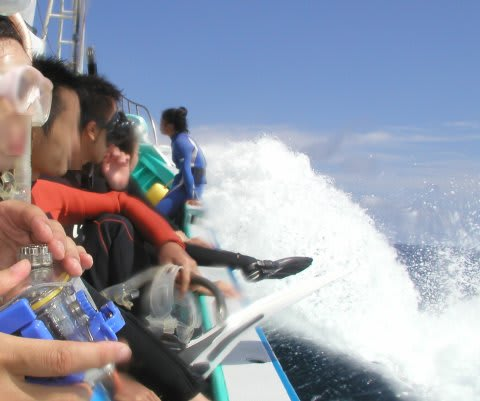

すぐに，

「飛び込んで～！」

の声．

今度は飛び込んだすぐに，こっちに向かって泳いでくる

イルカが！

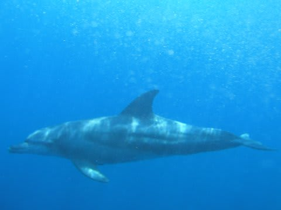

よし，今度こそ潜行！

と思ったけど．

軟弱ものの私は，一瞬ためらいが．

今泳いでいるところは，全く海底が見えない！

これまで，深いとはいえ，海底が見える海で潜ったことしかなくて．

底が見えない海でスキンダイビングをした経験が無い私．

海底が見えないと自分が何m潜ってるかつかみにくい．

限度を越えて潜りすぎちゃうんじゃないか？

とか，ちょっとビビリが入ります…

＃海底の目標物がないと，かなり潜りにくいよ！

…ためらっていると，イルカが2頭，水面近くで

みんなの横に並ぶような位置に！

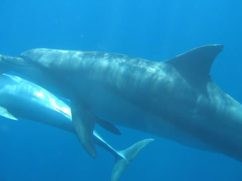

せいぜい水深1m程度を泳いでるから，こいつは水面で並走だ！

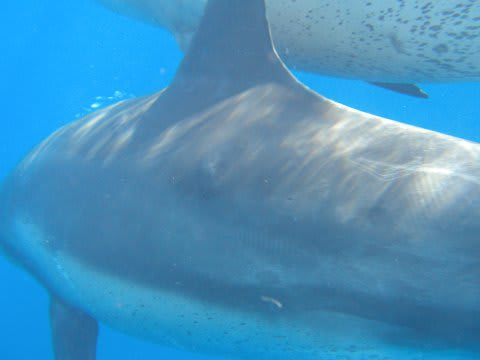

ち，近い！ここまで寄れるのかっ！

今度のイルカはゆっくり泳いでくれたので，20秒ほど

並んで泳げたでしょうか．

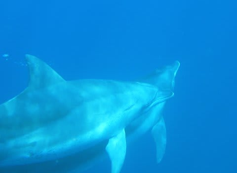

感動～！

イルカと並んで泳げたよ～．

…しかし．

全力フィンキック，30秒を過ぎたあたりでスタミナが切れてきます．

じりじりイルカから離されていく…．

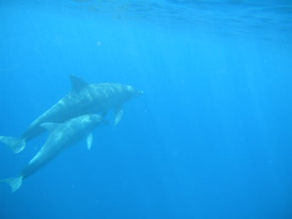

しかし，このイルカ2頭は，視界から消えることも無く，

我々の周りをぐるぐるぐるぐる回ってくれます．

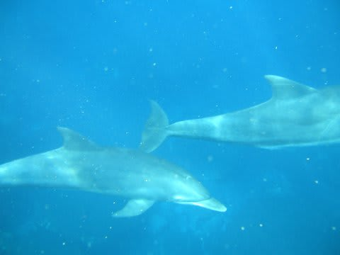

また，ちょうどこちらに向かってくるような位置になったとき，

今度こそ潜行！

ジャックナイフから，ドルフィンキックで深度を下げて…

…下げて…

…ちょいと浮力が大きい…(涙)．

適当に2kgほどウエイトをつけて来たのですが，どうやらこの

ウエイトがちと軽すぎた．

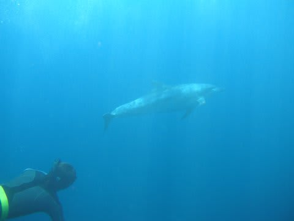

とりあえず，必死にキックで潜るけど，腕につけた深度計は，

わずか3m…．

うーん．あと2kgほどウエイトをつけてくれば良かった…

まぁ，ウエイトが軽い方が，浮上と水面で漂うのが楽だから

よしとしよう（プラス思考でごまかす）．

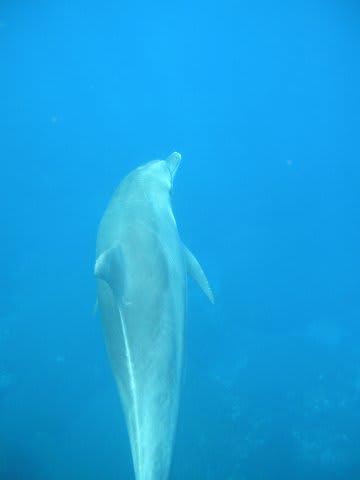

ということで，潜行してみたものの，潜行してイルカのいる

深度まで達して，イルカに近づく時間などを含めると，

私のスキルでは水中でイルカと並行して泳げるのは

せいぜい10秒以下．

シャッターチャンスはワンチャンスです．

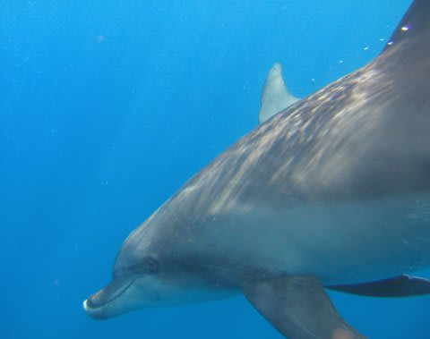

で，一緒に泳いでるガイドを見ていると，見事にイルカの

泳ぐ方向，速度と潜り始めのタイミングをぴったり合わせてます．

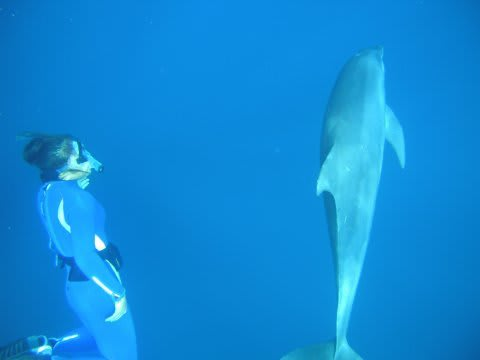

自分がちょうどその深度に達したときに，

そこにイルカがやってくるように調整しており，

水中ではほとんど泳いでません．

ふーむ．なるほど．水中で泳いじゃったら，あっという間に息が

苦しくなるからなぁ．泳いじゃダメなんだな…

という感じで，2度目のスイムも10分くらいで終わり，

船に上がり，また3本目の準備…

…まだまだ，ドルフィンスイムが続きます．

(もうおなかいっぱいって感じだけど)
