# 2024/1/20(土)の志賀高原焼額山スキー場は…曇りのち雪，朝は硬めのコロコロバーンが，午後に改善！リフト待ちはほぼ無し

📅 投稿日時: 2024-01-21 00:46:13

ということで，本日も志賀高原で滑ってました～！

いやー．

今日は朝のバーンコンディションがいまいちで

がっかりでしたが，むしろ午後になるにつれ

バーンがよくなっていく一日でした！！

ってなことで．

今日も8:30の焼額営業スタートを狙い，

焼額にやってきましたが…

ブーツをはくのに手間取り，第1ゴンドラ

営業開始に2分遅れて乗車（涙）

出遅れた…（泣）

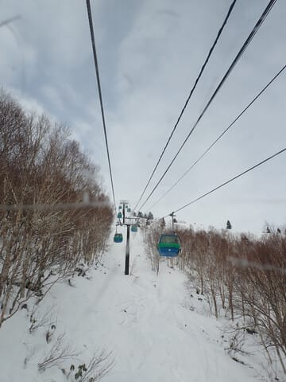

で．

あさイチの山頂の天気は…

わずかに日も差す薄曇りで．

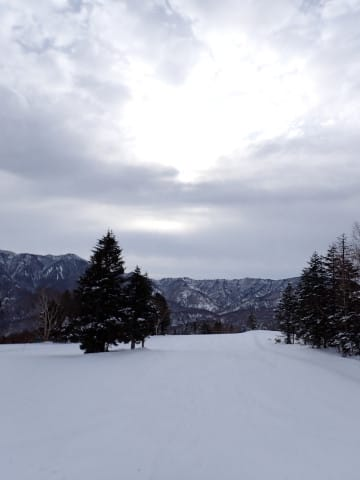

気温は-3度ですか…．

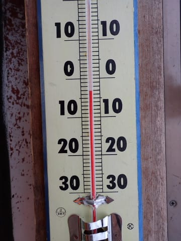

そしてあさイチのバーンは…

かなり締まった感じの，硬めのシマシマ！！

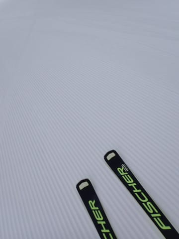

うほーー！！！

シマシマっ！！

…と，思ったけど．

シマシマはシマシマで，気持ちいいけど…

ちょいと硬くて，ボロボロ崩れるところもあり．

ところどころ「おっとっと」というところもある

シマシマ．

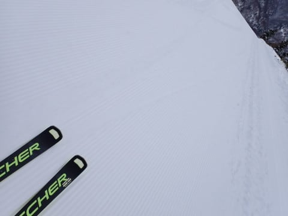

でも，

あさイチのシマシマは人も少なくて快楽～！！

朝の1本目は楽しいのだ！！

と，1本目は楽しんだけど…

2本目以降は，ちょっとバーンにコロコロが出たり，

下地の硬めにしまったところとコロコロの

コントラストが…（涙）

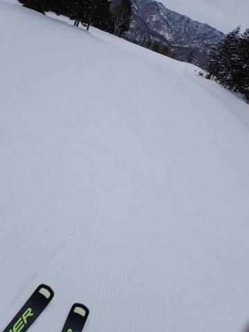

ってなことで．

朝から曇り，気温-4度，昨日緩んだ雪が

圧雪された，硬めのシマシマ．

という予想が，予言レベルで当たった午前中でしたが．

午前中はゲレンデがちょっと硬めで難しいうえ，

さらに9時半過ぎにはゲレンデの人口密度も

高くなってきちゃいました…（泣）

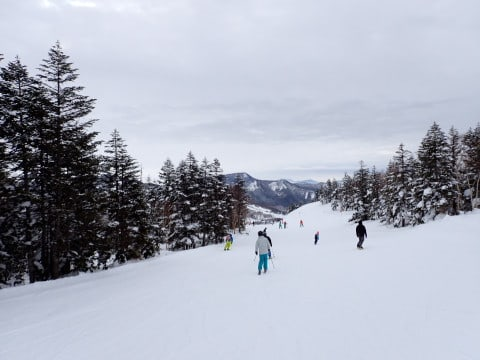

そのうえ，第2高速，第4ロマンス方面は

修学旅行生もいっぱいいて．

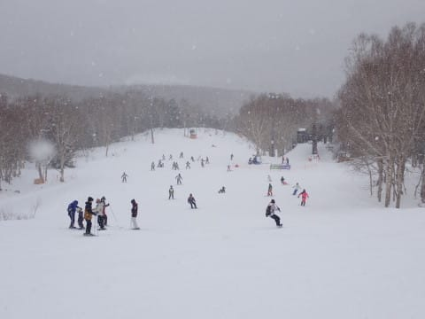

うーん．

快適に滑るにはかなり厳しい人口密度に（涙）

この人口密度だと，ハイスピード大回りをやろうと

すると，周りのスキーヤーを2-3人巻き添えに

する覚悟が必要ですね…（涙）

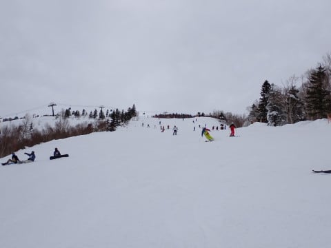

ただ，第2高速は一瞬こんだものの．

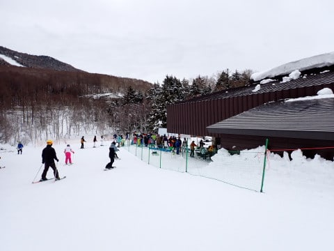

第1ゴンドラは，一番混んでいる朝10時過ぎでも，

ゲートの中で納まる程度の待ちで．

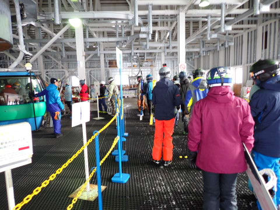

昼を過ぎると搬器1-2台待ち程度の，かなり

ガラガラだったし．

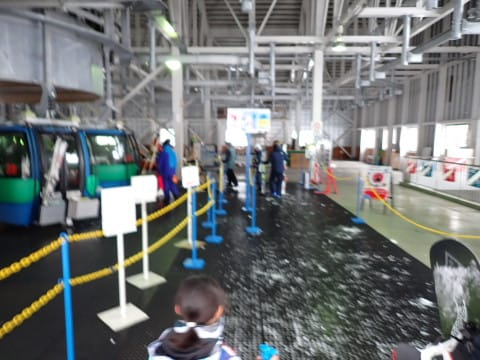

第2高速は午前11時ごろを過ぎると

もうスカスカで．

ゲレンデ人口密度は高めだったけど，

昼ごろには，リフト待ちがほぼなくて

快適でしたよ～！

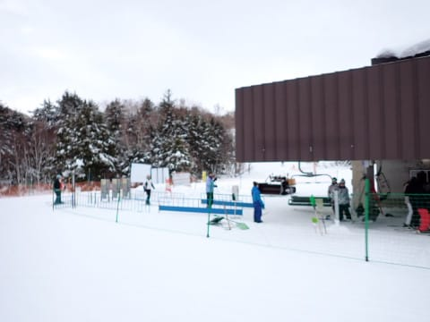

そして．

朝はちょっとコロコロが出て，ちょっと

楽しさに欠けるバーンコンディションだったのが…

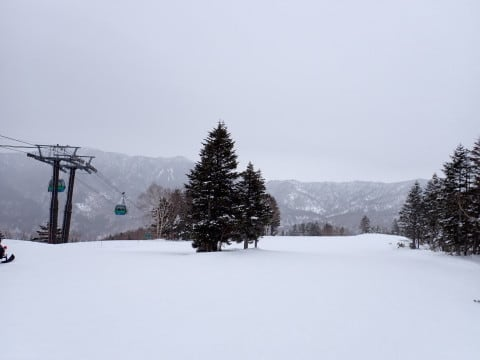

昼頃には気温が0度近くまで上がったので，

雪が柔らかくなってくれて，コロコロが

つぶれていってくれて…

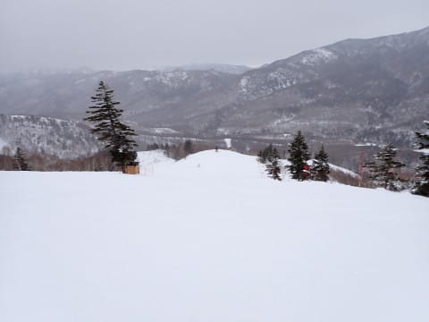

さらには．

予想より早めの午後1時ごろに雪が降り始め…

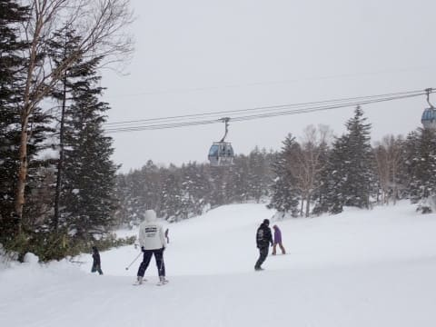

かなり気温が高い重い雪だったので，

風で飛ばされることなく，ゲレンデ全面を

きれいにうっすら覆ってくれて…

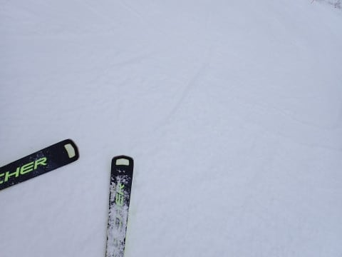

午後になるほど，バーンコンディションが

よくなっていきました～！

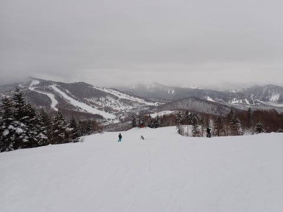

ってな感じで．

午後はバーンも人が少なかったし，

ゴンドラもリフトも待ちがないし，

バーン自体の下地はしっかり硬かったので，

バーンは全く荒れず，その上にしっかり

エッジが効く雪が乗ってくれたので

滑りやすかったし…

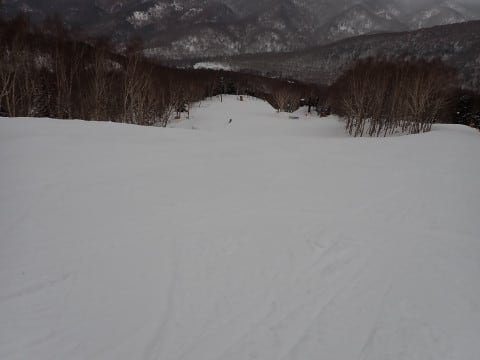

いや．

午後は雪がパラパラ降って2-3㎝積もった

ものの，前が見えなくなるほどの雪ではなく．

気温が高かったのに日が差して雪が緩むより，

ずっと恵まれた雪の状況でした～！！

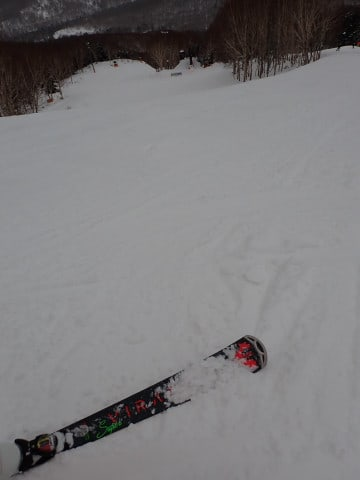

（注：この板は他人と取り換えて履いてみた板で，物欲に負けたわけではないですから！！）

ってなことで．

今日もいつものお約束通り，

16:15の営業終了まで滑り倒して，

結構満足の一日を過ごせたのでした…

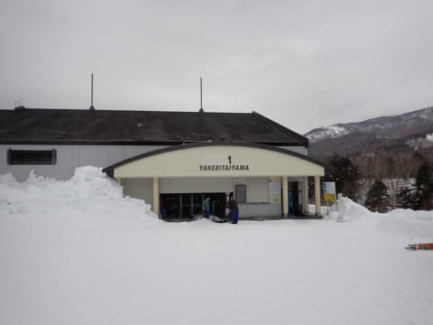

いやーー．

今日は意外と良かったよ！！

…明日は朝までに10～20㎝ほど重い雪が積もって，

うーん…昼間は標高が低いところは

雨になるかも…

雨にならず，雪になってくれたとしても，

ゴーグルやウェアにつくとべっとりする

雪だろうなぁ…

明日の気象庁の予想天気図が激烈に狂って，

激冷えになってくれないかな？？

とりあえず．

明日も志賀高原を滑ってます～！！

## 💬 コメント一覧

### 💬 コメント by (アツシ)
**タイトル**: Unknown
**投稿日**: 2024-01-21 01:40:38

朝10時過ぎのゴンドラ乗り場の写真に、私たちのグループが映ってます😊今日は職場の人たちが土日で滑りに来てたので合流して一緒に滑ってました。

スキー6人＋ボード1人のグループなんですが、スキーの6人はみんな私より上級者の人たちで、とっても楽しい１日でした。

自分は硬くて平らな朝イチオリンピックが快感でした。ヤケビクオリティの整備なので、思いっきり突っ込めました👍

リフト終了まで滑り、私だけ明日の仕事に備えて帰阪しました。5時に焼額を出て、11時に帰ったのですからまずまずです。１日早いせいか、高速がいつもより空いてました。

来週は妙高です。再来週は志賀に行けると思うので、見かけたら声かけます！

### 💬 コメント by (1kamakura)
**タイトル**: Unknown
**投稿日**: 2024-01-21 07:35:44

江戸の秋

昨日はなかなか良かったみたいで、

嬉しいですね！

Sさんはもしかして、昼食抜きで滑りまくっているのかしら？

とふと思ってしまった。

コメントのアツシさん↓

他人様のブログにお姿が写っているって、

なんか楽しいですね😆

### 💬 コメント by (地元民)
**タイトル**: Unknown
**投稿日**: 2024-01-21 09:16:44

気象台は大雪とかいってたが、下界はぜって〜雨って思ってました。もちろん雨です。

このブログの降雪予報の方が、長野地方気象台より、当たります。

### 💬 コメント by (副院長)
**タイトル**: Unknown
**投稿日**: 2024-01-21 22:34:51

S様、朝の名神は水たまりにハンドル取られる豪雨で、チンタラ走ってたのがよかったのか、志賀につくころには、雪になり、さらに、軟弱ものは、帰途につき、ゴンドラは動き出し、予想外の、重雪フラットバーンをS様なみのスピードで、滑れて楽しかったです。また、よろしくお願いします。

明日は、アイスバーンかな？

### 💬 コメント by (Skier_S)
**タイトル**: 今日は修行の一日
**投稿日**: 2024-01-22 02:36:48

＞アツシさま

あれ！？？写ってましたか？全く気付かず…

スキー6人，みんな上級者ってかなりレベルが高いお仲間ですね…

職場にそんなレベルが高い人がいっぱいいるとは！

また再来週，志賀高原でお会いしましょう…

＞江戸の秋さま

えー．私は昼ごはんは食べますが…

食べるんですが，リフトの上かゴンドラの中でカロリーメイトやパンを食べる

くらいで，レストランでゆっくりお昼ご飯を食べることはありません…

ご飯は食べますが，お昼休み抜きで滑りまくってます（笑）．

＞地元民さま

そうなんですよ…なんで大雪の予想だったのか，私には全くわからず…

気象庁は私の知らない何かのデータを持っているのかと勘ぐってました．

志賀高原の予想は，どんな天気予報サイトより正確だと自負してます（笑）

＞副院長さま

今日は一番いいタイミングでの参戦だったと思います…

明日はちょっとアインスバーンになりそう．

23日から雪が降って，ゲレンデ状態は回復しそうなんですけどね．

