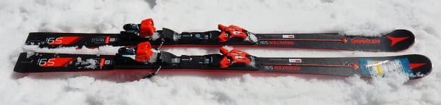
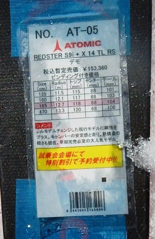
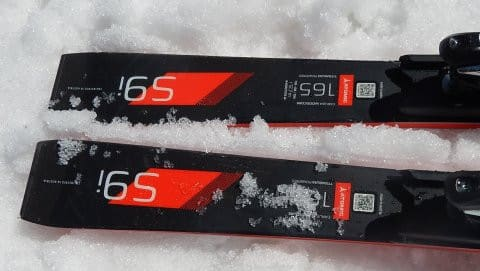
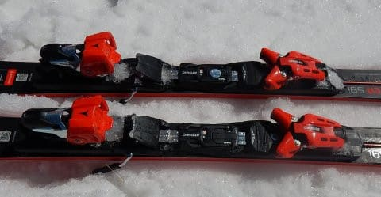
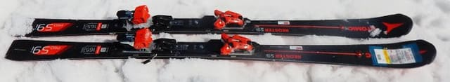
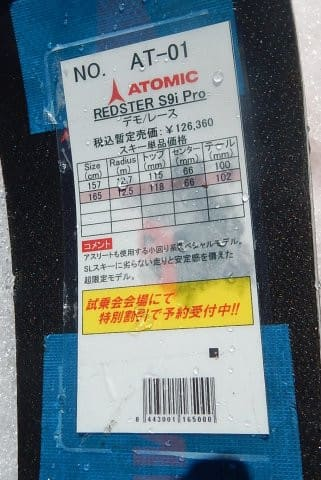
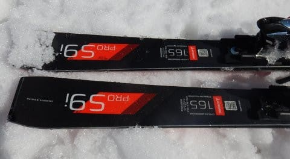
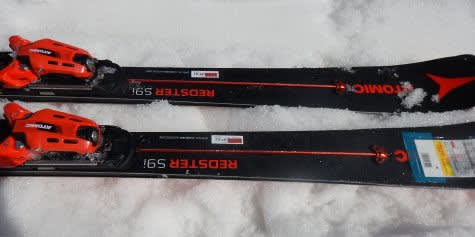

# 2019シーズンのスキー板，試乗レポート第3回…ATOMIC編その1

📅 投稿日時: 2018-04-11 01:33:00

🏷️ カテゴリ: [スキー板試乗](c0bd8048615710cee890e403a36cc9a2b.md)

どうも最近，夜起きていられなくなった

Skier_Sです…

うーむ．

昨日もBlogを書く前に気を失ってしまい．

気づいたら朝になっていました…

昨シーズンまで，こんな高頻度に

帰宅後気づかぬうちに寝ちゃってるってことは

無かった気がするんですが…（涙）

とりあえず．

今さら日曜の詳細モードレポートやってもなんなので．

本日はスキー試乗レポートです！

今日はアトミック編．

では，どうぞ～！

○ATOMIC REDSTER S9i 165cm

基礎小回り

165cmでR=12mと，完全小回り用の基礎板．

この板はビンディングがX12TLかX14TLかの解放値の

違いは選べるようですが．

X12VARは選べないようです…

で．

一見完全去年モデルのキャリーオーバに見えますが．

フレックス強化を行ったらしく．

昨年よりしっかりした板になったようですが…

履いてみたところ．

やはり，カルバコアの軽量さが効いていて．

かなり軽快で，軽い板に感じます．

軽くて動かしやすいので，自分の意のままの

所に板を動かしていけます．

私の愛機のSXのように，谷回りからガッツリ

食い込んでいくのではなく，

むしろ谷回りで板を動かしながら捉えていく感じ．

で．

昨シーズンモデルより，テールの張りが

強くなった感じがあり．

山回りでのグリップがかなり強くなって，

圧も溜まりやすくなってる感じ．

しっかり圧が溜まって，返りも昨年モデルより

強くなったような気が…

山回りでしっかりグリップして，たまった圧が

適度なばね感で戻ってきて，気持ちよく切り替え

できます．

その切り替えも，板が軽いので，谷回りで

好きなように動かすことができて．

旋回半径を手軽に決められる，自由度の

高さがあります…

昨シーズンのS9iはちょっと弱いかな，と思ったけど．

今シーズンのS9iは山回りの切れ感＆気持ちいい

返りが強まったし．

それでいて軽くて，軽快に自由に動かせる板という

基本は変わらず．

雪が柔らかめだったので，しっかりパックされた

固い斜面で履いてみるとちょっと弱く感じるか

もしれないけど…

…軽快なのに，そこそこのスピード耐性があり，

これは，かなりいい板なのでは？？

○ATOMIC REDSTER S9i pro 165cm

基礎小回り．

SL用セカンドモデルのS9のコアを軽量カルバコアにして．

ビンディングをX12VARにした，このモデル．

フレックスもS9iより強く，その上ビンディングも

VARになってるので，かなり強く感じる板です．

昨年はServotecがついてなかった気がするんですが．

今年はS9i同様，Servotecがつきましたね…

残念ながら，この板を試乗できたのは午後遅く，

雪がかなり緩んできたタイミングだったので，

どうもこの板の本領を発揮できなかった感じが

あるのですが…

とりあえず，固い板です．

コアがしっかり硬い感じ．

この日午後の春雪ではたわませることができず．

小回り板なのに，山回りで板がそれほど回ってこず，

どちらかというとミドルターンっぽくなっていきます…

フレックスが強いので，高速耐性は強そう．

板が比較的軽いので，谷回りでは動かしやすいですが．

でも，ProじゃないS9iに比べると，VARビンディングの

重さが効いているのか．

軽快さではS9iの方に軍配が上がります．

たぶん，固い斜面でしっかりたわませれば回って

行くんだろうけど．

春の重いドボドボ雪では全然たわまず，

圧も溜まらないので．

かなりまっすぐ走る板に感じてしまいました…

この板は，おそらくしっかり固い斜面を，

結構なスピードで切っていくということに特化した

板ですね．

春の雪や荒れた雪で滑る板じゃない感じ．

いろんなコンディションで滑るなら，S9iのほうが

楽しい感じがします．

で．

この板を履き終わって．

普段履いているSXで滑ったら．

同じザブザブ春の雪でも．

「うぉぉぉ！SXってやっぱりよく曲がる！

　楽しぃ～！！！」

って思ったので．

VARビンディング付きSXの後継機はS9i Proじゃないか？？

…と，かなり期待して試乗したこの板でしたけど．

私にとって，SXの後継機にはなりえない感じです…

## 💬 コメント一覧

### 💬 コメント by (新潟のスキーヤー)
**タイトル**: Unknown
**投稿日**: 2018-04-11 22:04:04

フルモデルチェンジしたアトミック、

来季もSX越えは無かったですかぁ…

私も今季、慌てて型落ちSXをバーゲンプライスで購入しといて良かった！

Sサンと違って…

何台も購入できませんでしたが…笑

重くていいので前のブルースターに

戻って欲しい…。

### 💬 コメント by (Skier_S)
**タイトル**: 新潟のスキーヤーさま
**投稿日**: 2018-04-12 01:32:06

やはり，自分にとってはSXを超えなさそうな

感じですが．

ただ，S9iは昨年よりさらに良くなった感じがあります．

これなら，SXと別物と割り切れば，

次期主力戦闘機として候補に挙げていいかな，

というレベルです．

ただ，S9i Proの方は…

私が普段履きとして使うにはかなり辛い

板だと思いました．

私では履きこなせない板です…（涙）

