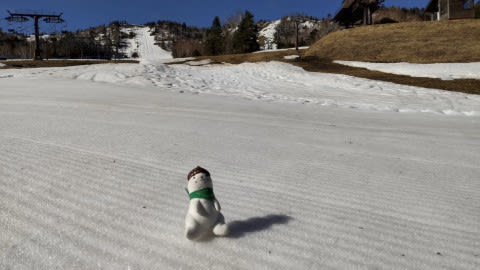

# 更新遅れた…2021/5/6(木)の志賀高原，熊の湯スキー場特派員情報！

📅 投稿日時: 2021-05-07 10:50:57

昨日は6泊7日志賀高原滞在後の仕事初日

というのもあり．

夜は疲れて即寝でした…

だもんで，今日も朝更新！

ってなわけで．

5月5日で志賀高原のシーズン券の利用も

終わり．

志賀高原で営業しているのは，残るは

熊の湯の下半分と、横手＆渋だけですが…

昨日の6日も，志賀高原特派員が熊の湯

レポートを送ってくれました！

今日は朝からすっきり晴天で，

気温が高かったようで．

朝からおこみんは暑そうです←いや，暑そうって…分かんないから

滑れるのは第2ペアの中間点から下，

この第2緩斜面のみですが．

一応人工雪がしっかり盛ってあるのもあり，

コース幅全面滑れます！

…ただ，朝から暑かったため．

雪はザブザブで，朝イチから板が潜るような

今シーズンで一番緩い雪だったようです(涙)

ただ，人が少なくて幅いっぱい滑れるので，

それでも楽しかったようですが．

第3緩斜面は表向きクローズということになって

ますけど，まだ滑れるようです…

しかし．

昨日は気温が高かったので，雪は

かなり重そうですね．

さて．熊の湯．

今週末だけではなく，来週まで営業する

とのことですが…

12日，13日の水，木あたり雨になりそうなので．

今週は問題なさそうだけど，来週まで

耐えてくれるかな…？？

…すみませんが，コメント回答は今晩に！

## 💬 コメント一覧

### 💬 コメント by (大阪のK)
**タイトル**: Unknown
**投稿日**: 2021-05-07 16:50:17

Sさま、今シーズンは焼額山で時々ご挨拶できるほどしかお会いできませんでした。

小生、5月4日をもってシーズンを終了しました。

Sさまはこれから月山などに行かれるんでしょうか？

お身体に気を付けて、来シーズンも宜しくお願い致します。

多分また年パスを買い求めます🎵

### 💬 コメント by (Skier_S)
**タイトル**: ＞大阪のKさま
**投稿日**: 2021-05-08 03:41:30

今シーズンもお世話になりました～！

私のシーズンはまだ終わりませんよ…

(K奈川県に緊急事態宣言が出たら終わるかも)

また来シーズン，志賀高原でお会いしましょう！！

