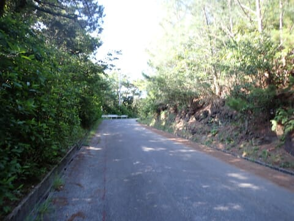

# 2024年8月，今年も座間味で親子ダイビング！その17…ダイビング終了後，座間味の高月山に登ってみた

📅 投稿日時: 2024-09-15 04:56:06

世の中は3連休か…

3連休…

3連休ってなんだっけ…

今日も結局ほとんど一日，宿題をこなすため

泣きながらPCの前に座り続ける一日を

すごしてましたが…

でも，この3日間出勤せずに済むし．

Web会議もないので，平日よりは少し

心の余裕があるのが救いか…

でも，このクリティカルな状態の今，

スキーシーズンじゃなくてよかった…

…まさか，スキーシーズンにまたこんな

苦しい状況に陥らないよな…

そうならないよう，祈るばかり…

とりあえず．

仕事は辛いけど，今日も楽しい座間味ダイビング

旅行記です…！

（仕事がクリティカルな時に，沖縄の写真を

見ると仕事がさらに嫌になる…）

ーーー

（[前回はこちら](ea705fe857a7ecc83bbe117a2963a9d03.md)）

ってなことで．

この旅行のラストダイビングを終えて，

ボートは座間味港に戻ってきました…

港について下船が近づくと．

あぁ…終わっちゃった…

という寂しい感じがしてきますね（涙）

そして．

今回はわずか2日間だったけど．

お世話になりました，ティンガーラ号！

ずっと晴天でべた凪の，いい2日間

だったよ！！

ってなことで．

名残を惜しみながら港を後にして…

宿の星砂さんへ戻ってきます．

ダイビング器材は，トラックで別途

届けてくれてるので…

宿に戻ったら，届いていた器材を洗い場で

しっかり洗って塩抜きします．

ダイビングが終わって悲しいところに，

めんどくさい作業が待っているのが

また寂しさを増強するんですよね…（涙）

本格的な塩抜きは家に帰ってからやるので．

とりあえずざっと洗って塩抜きした

器材を干して…

で．

シャワーを浴び終わると16時半．

結構いい時間ですが，今日の夕食は

18時半からの予約．

まだ2時間近くありますね…

うん．ここは一丁，去年行きたかったけど

時間がなくて行けなかった，高月山に

行ってみますか…！

高月山とは，座間味の中心街の裏山にあたり，

座間味の街からは1.4kmほど．

標高も130mと高くなく，徒歩でも30分で

行けるレベルのお気軽な山だけど，

結構景色が良いところです…

座間味島では160mの大岳が最高なので，

最高峰というわけではないですが，

座間味の街から古座間味ビーチや北側の

東シナ海まで見通せる展望台もあり．

座間味島全体でみると，こんな位置関係に

なるところ．

娘も誘ったけど…

「暑いから行かない」

という返事（ちょい涙）

…確かに，外に出歩くのをためらうほどの

暑さだったので，それが正常な判断かも…

なので一人寂しく宿を後にして．

小学校の横を通って，展望台への道の

入口に向かいますが…

座間味の小中学校．

グラウンドが芝生だし，環境がよさそうだけど．

こんなでかい校舎が埋まるほどの生徒が

いるのかな…？？

小学校を通り過ぎたすぐ先にある，

展望台への道の取り付きからは，

かなりの上り坂になります…

展望台の駐車場までは，こんな感じの

結構急な舗装道路をひたすら登っていく

感じ．

途中には，太平洋戦争での沖縄戦最初の

上陸地となった座間味の歴史を感じさせる，

集団自決の碑とかがあったりしますが…

この案内板にあるように，蝶がいっぱい

飛び交っている，静かな道で．

こいつはオオゴマダラかな？

かなり近寄らせてくれる蝶々さんもいました…

ってなことで．

さらに日差しが照り付けるアスファルト道を

歩くことしばし…

宿から15分ほどで，高月山の駐車場まで

到着…！

（かなりハイペースで登ったので，

普通の人は25分くらいかかると思う）

高月山の山頂付近は，高月山園地という

公園になっていて…

ここから100m先に第1展望台，

150m先に第2展望台があります．

ということで．舗装路が終わった先，

駐車場からさらに100mほど行くと…

やってきました，高月山第1展望台です！

（[続く](e83e7a035b5792332e3954b15ec8a361a.md)）
