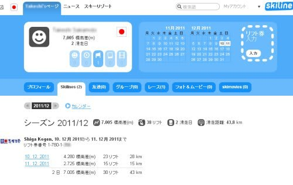
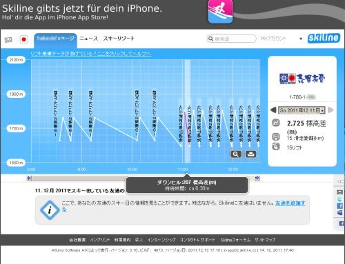
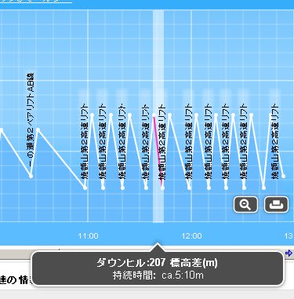
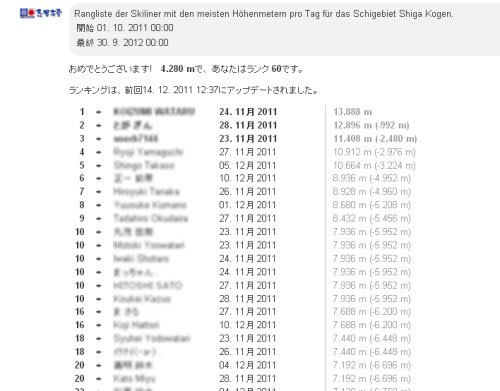

# 志賀高原の新リフト券はすごいよ！…SKILINE

📅 投稿日時: 2011-12-16 00:11:44

🏷️ カテゴリ: [スキー雑談](c1f9d2cb7478308da16419928ea3945e9.md)

ということで．

志賀高原のリフト券システムが新しくなったんですが．

いやー．

すごいんですよ．これが．

記録マニアにはたまらない感じで．

何がすごいかって…

滑り終わったあとに，

[SKILINEのウェブページ](http://www.skiline.cc/home)にアクセスするわけですよ．

そして，リフト券に印刷されている番号をポコポコと入力すると…

こんな感じで，トータル標高差何m，滑走日数何日，って表示されて，

何月何日に，リフト何本，距離何km滑ったかが分かるようになっているんですね～

そして．

滑った日には，何時にどのリフトに乗ったかも全て記録されてます．

さらに，こんな感じで，リフトを滑るのに何分何秒かかったかもわかってしまうという…

これだと，207mの標高差を5分10秒で滑ったみたいですね．

うはははは．

面白いぞ．これ．

[私のSUUNTOのAltimax](e764f37b2c20923a0b722f930137c0e5e.md)だと，標高差とリフト本数（50m以上登って下った回数)

が出るだけだけど．

これだと，

・標高差

・リフト本数

のほかに，

・滑走距離（乗ったリフトの長さ)

がでるという…

さらに．

こんな感じで，一日で滑った滑走標高差のランキングが出てしまうのだ．

…こんなもの出されたら，トップを目指したくなってしまうではないか！

とりあえず．

シーズン券じゃなくても，1日券でも記録を確認できるみたいなので．

これは楽しめるよ～！！

## 💬 コメント一覧

### 💬 コメント by (コロネ)
**タイトル**: 凄いですけド
**投稿日**: 2011-12-16 16:03:53

こんにちは。 

う～ん。確かに記録マニアには

涙物システムですが… 

これ、記録として残っちゃうから、

家族に嘘付いてスキーには行けなくなるかも(笑) 

志賀高原という広いエリアだから

考え付いたシステムですね！

### 💬 コメント by (Skier_S)
**タイトル**: 確かに…
**投稿日**: 2011-12-16 23:17:52

隠れてスキーに行った場合，記録を人に見せられなくなりますね(笑）．

ただ，リフト券の番号を入力しただけでは滑走距離などは見ることができず，アカウント登録をしなくてはならないので，他人に勝手に記録を見られる心配は無いですよ～．

アウトなのは，自分で見せちゃったときだけですから，ちょっと安心なのでは？？

では，また今晩から志賀高原へいってきます～

