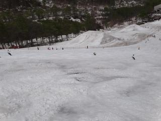

# 5月21日　かぐらの写真追加

📅 投稿日時: 2011-05-24 02:40:17

🏷️ カテゴリ: [2011スキー滑走日記](ca488c98cfb9169941c3e73770dcefb56.md)

5月21日土曜日のかぐらの写真，追加しておきます．

ゴンドラ降り場からメインバーン．

Webカメラとほぼ同じアングルでしょうか．

メインバーン，高速リフト下です．

ぼちぼち，雪がはげかけたところがあります．

和田小屋から高速リフトの間のコースも，幅いっぱい滑れます．

メインコース下のパークです．

この時期にこれだけ本格的なパークがあるのはすごい…

ジャイアントコース下部の，リフト乗り場に向かうところ．

これをみていると雪がいっぱいありますが，ジャイアントコースは

そろそろコブ溝に土が出始め，ちょっとやばいかな．

メインコースの下の部分，夕方になるとちょっと薄くなる

部分もあります．

ごく一部だけですが…

リフト待ちは最大こんな感じ．10分待ち程度でしょうか．

先週よりましです．

ゴンドラコースの取り付き部分はこんな感じ．

ゴンドラコースは来週末まで持つかな～

みつまたコースは完全廊下状態．

これは，来週末までもったら奇跡でしょう…

…来週末までは持ってほしいですが．
