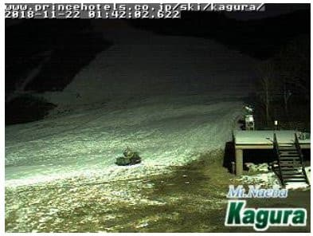
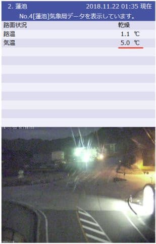
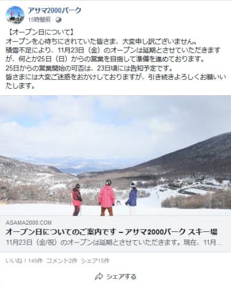

# 残念ながら，23日オープン予定のスキー場軒並み延期（涙）．かぐら・熊の湯はまだあきらめてないようだけど…

📅 投稿日時: 2018-11-22 02:15:11

🏷️ カテゴリ: [日記](cc4b5682fb7b8b144980957a978653fb0.md)

えー．

やはり，予想通り，今晩は冷え込みが弱かったので．

昨日の天気予想で

21日夜から22日朝にかけて，人工降雪機が

動かせない可能性が大です（泣）

と書いた通りになってしまったようで．

かぐらのライブカメラを見ると，夜になっても

人工降雪機は動いてませんね…（涙）

（[かぐらHP](https://live.monitorbox.jp/site/kagura/90/)より）

なぜ，こんな天気予想ばっかり当たるん

だろうか…（泣）

そして．

志賀高原の蓮池も，深夜1時半で+5℃！！

気温が高すぎます…（涙）

おかげで．

この3連休に行く予定だったアサマ2000．

23，24日の営業は諦めたようです（泣）．

（[アサマ2000FB](https://www.facebook.com/asama2000park/posts/2809487992409957)より）

ということで．

24日にアサマ2000に行く予定でしたが，

キャンセルとなりました（涙）

今のところ，25日のオープンに向け準備中のようです．

そのほか，23日オープンをアナウンスしていたスキー場は

・丸沼…オープン延期（予定日未定）

・鹿沢…オープン延期（予定日未定）

・八方…オープン延期（予定日未定）

・栂池…オープン延期（予定日未定）

・湯の丸…一日延期，24日朝9時オープン予定

となってますが…

湯の丸，ホントに24日にオープンできるのかな？

で．

こんな状況にもかかわらず．

かぐら，熊の湯はまだ23日の営業を諦めてないようですね

熊の湯，23日から行けるのかなぁ…

とりあえず，明日の午後からの雪に期待ですね．

で．これからの天気予想ですが．

昨日の段階では，

志賀高原は，西風で22日夜には雪が止んじゃいそう，

書きましたが．

今日の最新天気図を見ると．

なんと，23日午前中まで北風の予報に変わりましたね～！

22日夜から23日にかけて，新潟だけじゃなく，

志賀高原でも雪が降り続けるかも…！

ただ，志賀高原でどのくらい積もりそうかは微妙です．

ホントにちょっとの風向きの違いで，積もるか

積もらないか，結構違っちゃうので．

今の段階では，

「祈るのです！祈れば積もりますっ！！」

としか言えない状況です…

ですので．

引き続き皆様には．

日ごろの行いに気を付けていただくとともに．

雪が積もるよう，これから23日にかけて．

ひたすら全身全霊で

「降れ降れ踊り」

を熱く激しく踊り続けていただきますよう，

よろしくお願いいたします…
