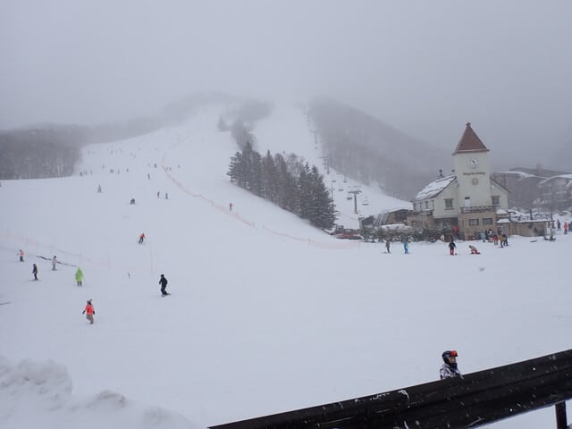

# 2025/3/16(日)の志賀高原スキー場速報レポート！…強風でサンバレーのみ営業，朝は荒天吹雪，昼は風はあるけど晴れ間も，夕方はガス．気温は高かったけど雨はほとんど降らず

📅 投稿日時: 2025-03-17 02:53:13

🏷️ カテゴリ: [2025スキー滑走日記](cacd3fbf84d4a679ee61a5894c3f95e14.md)

えー．

本日の志賀高原ですが…

かなり悲惨でした（涙)

まぁ，ゴンドラはヤバいだろうな…

と，前日から予想はしていたものの．

朝，宿を出る前に焼額山の営業予定を

確認すると…

なんと．全山運転見合わせ！！（涙）

第2高速どころか，4ロマすら動かない

とは…！！！！

（[焼額山スキー場Facebook](https://www.facebook.com/yakebitaiyama/posts/pfbid0UnADpaBdnsjM1gsxpkf1CvcBqBGSCntALeiTp4Lf67qJikdcZ2KmahzpyfjYoxnWl)より）

さらに12時になると．

天候回復の予定がなく終日運休との

案内が…（激涙）

（[焼額山スキー場Facebook](https://www.facebook.com/yakebitaiyama/posts/pfbid0gMh8gn3pLcSVWiQUFmnWBraiDGAr2p12897s4LhMZuCF8UwqwuNCYhgV93YkDhi2l)より）

ちなみにこの日．

志賀高原全山で動いたのは，

サンバレークワッド

熊の湯第1

の2本のみ！！！

2本だけです．

全山でたった2本．

これ以外は全く動かず…（激泣）

（[志賀高原索道協会リフト運行ページ](https://shigakogen-ski.or.jp/print.html)より）

金曜の天気予想で，

　ただ，強烈な南風が吹き，営業できない

　ゴンドラやリフトが多発しそう…

とは書いたけど．

多発するどころか，ほぼ全滅とは…

まぁ．

でも．

完全全滅じゃなく，動いたリフトが

あるだけマシ…

ということで．

今日はサンバレーを滑ってきました～！！

動いているリフトが2本のみ．高速リフトが

動いているのはこのサンバレーだけ

だったので，かなり多くの人がここに

集中したようで…

かなりの人口密度（泣）

こんなに混んでるサンバレーは

見たことが無い，というレベルの混雑！

そして，午前中はかなりの吹雪＆風で

視界も悪く，かなり修行感が強かったけど…

なぜか昼間になると晴れ間も見えてき

ました！！

12時半から午後3時くらいまでは曇ったり

晴れたりで，ずっと晴れたわけでは

ないですが，風も弱まりましたよ～！！

雪はかなり重い雪で，硬い下地の上に

重い雪が乗った感じで，雪はそんなに

良くなかったけど．

午前中に帰った人が多かったので，

午前中の悪天候を耐えた人には，

リフト待ちもそれほどない，晴れた

バーンがご褒美として与えられました！！

午後4時ごろには，またガスが出てきて

しまったものの．

かなり湿雪の吹雪→晴れ時々曇り→ガス＆小雪と，

まぁかなり湿った雪で，ほとんど雨に近い

雪になったタイミングもあったものの，

ほぼ雨になることはなく．

午後は結構な雨降りの中滑ることになるのかも…

という心配は杞憂に終わり．

雨の危機は無事乗り越えました～！！

…てな感じで．

今日もラストリフトまで滑ってきました～！！

…ひたすらサンバレークワッドを60本…

まぁ，跫音悪天候＆混雑にしては良く

滑ったかな．

で．

今日は強風でリフトが止まる予想は

当てたけど．

まさか昼間に風が弱まり，晴れ間も

見えるとは予想外…

…しかし，いまだに何でこの天気図で

昼間に晴れたのか，全くわからん．

午前9時の子の天気図を拡大すると．

うーん．太平洋側に低気圧中心があり，

金曜の予想より，低気圧が南にズレて

くれたおかげで，気温もそこまで上がらず，

雨になるに済んだのかな…

とはいえ．

850hPa天気図だと，低気圧中心は本州

ど真ん中．

長野直撃コースだったので，

標高1500mのサンバレーでは，低気圧

直撃を食らったのかと…

でも，この天気図で．

なんでこの新潟から北信にかけて，

雲がほとんどない晴れのエリアが発生

してるんだろう…？？？

まぁ，いろいろ解析した結果．

本州を直撃した低気圧．

前線を張った一つの低気圧に見えるけど．

地形の影響でいくつもの細かい低気圧に

分かれてたみたいで…

まぁ，この図の低気圧が，右上がへこんだ

ハートみたいになっていますが．

どうも実態はこの北と南の二つの低気圧…

というか，実態はさらに多くの低気圧に

分かれてたっぽい．

それで，ミクロスケールで見ると，

複雑な気象変化があったんじゃないかな…

とりあえず．

予想通りの強風で，焼額は運休しちゃったけど．

予想外の昼間の晴れ間で思ったより楽しめて．

朝のうちは，

天気も悪いし混んでるしリフト1本だけで

飽きるし，早めに帰ろう…

と思っていたところが．

昼からは予想外に楽しくて，営業終了まで

滑ってしまったのでした…

また明日の夜中に，精神力が残っていれば

詳細レポート書きます～！！

## 💬 コメント一覧

### 💬 コメント by (777lucky)
**タイトル**: Unknown
**投稿日**: 2025-03-17 07:09:50

お疲れ様でした。

いつも詳細な情報、とても活用させてもらってます。

### 💬 コメント by (hapi44)
**タイトル**: Unknown
**投稿日**: 2025-03-17 11:16:28

こんにちは！

大変な中…60本ラストまで楽しむ！

さすがですね😆

私も土曜日に群馬へ行きましたがすっかり春スキーでした😅

### 💬 コメント by (アツシ)
**タイトル**: Unknown
**投稿日**: 2025-03-17 12:36:18

やはりあのまま、他のリフトは動かなかったのですね。9時前に下山の判断をして大阪へ向いて帰る途中、開田高原マイアに寄りましたが、道中、安曇野から南が雪のため、高速も一般道も大変でした。見込みでは12時には着くと思っていたのが、13:30頃の到着になり、しかもゲレンデは本降りの雨＆濃いガス。２時間程度の滑走のため午後券を買うか迷った挙句、滑走を諦めて帰宅しました。18:30頃には帰宅できたので身体は楽ですが、得るもののない１日になってしまいました。

### 💬 コメント by (副院長)
**タイトル**: Unknown
**投稿日**: 2025-03-17 12:46:05

S様、お疲れ様です。日曜日、午前は熊の湯も、爆風、ガリガリでしたよ。サンバレー移動してから、穏やかな天気となり、リフト待ちほぼ無く、最終まで楽しめましたね。サンバレーでお会いした時から、絶対ラストまで滑られると思いましたわ。

で、本日、月曜日、ご機嫌バーンです。荒れてない、下硬い、適度な重さの雪のってる。エッジ噛みまくり。妖怪無し。申し訳ありませんが、たのしみます。レインボー部隊見かけましたが、声かける暇も有りませんでした。

### 💬 コメント by (レインボー77)
**タイトル**: Unknown
**投稿日**: 2025-03-17 13:06:36

月曜日の志賀高原情報

朝の蓮池-4℃、曇り空。

まずはニゴンが強風で減速運転。所々でひどい横揺れがあり、減速は納得。土曜のガタガタ雪、日曜の強風運休のあとだけに、白樺のフラットバーンは久々の快感5点。唐松もまずまずの4点。オリンピックはフラットアイスの上に新雪5センチで、きっもちいい5点。GSもフラット5点。パノラマも5点。焼額一番の雪質を誇るイーストは安心安全の4点。奥志賀の方からガスが徐々に侵入してきたけどそれほど深くならず、昼から強風降雪のはずの予報が大きく遅れて、ストレス解消の一日(午前だけ)でした。副院長さんは意識してるのですがなかなか目に入らず、失礼ばかりしております。

### 💬 コメント by (Skier_S)
**タイトル**: 日曜はサンバレーが動いただけマシだった
**投稿日**: 2025-03-18 01:17:57

＞777luckyさま

コメントありがとうございます～！！

いろいろ情報量が多い（？）Blogですので，これからも参考にしてやってもらえれば…

＞hap44さま

いやーーー．

早くに帰るつもりだったんですけどね…

最後まで滑るつもりはなかったんですけどね…

やっぱり，リフトが動いていると帰れなかったです

＞アツシさま

結局，終日サンバレーと熊の湯第1以外は全く動きませんでした．

逆にその2本は最後まで運転していたのですが．

南に行くと雨になるだろうなぁ…と思っていたのですが，やっぱり雨でしたか…

お疲れさまでした！！

＞副院長さま

サンバレー，思ったより良かったですよね…！！

朝は混雑してるし雪面は見えないし，どうなるかと思いましたが．

まさかラストまで滑ると思いませんでした（笑）．

＞レインボー77さま

ええええ！！

今日は良かったんですか…！！

そこまで雪が積もってなかったから，そこまで回復しないだろうなぁ…と思っていたんですが．

ゲレンデが回復したようで良かったです！

