# 6月5日の月山詳細

📅 投稿日時: 2011-06-08 01:38:15

という感じで．

日曜に無謀にも日帰り月山を強行したわけですが．

その詳細をば…

日曜は，朝8時過ぎに到着したんですが．

駐車場は結構いっぱいでしたね～

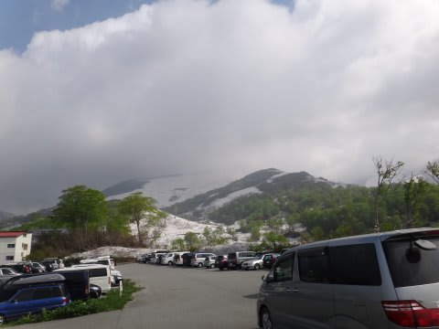

満車になるほどではないですけど，今日の混雑を十分予想させる

混み具合．

この写真では山頂がちょっとガスってますが，山頂に上がるころにはガスが上がってました．

で，ゲレンデに向かいますが．

駐車場からの道路が突き当たって，姥沢小屋に曲がるあたりから

雪が積もってます．

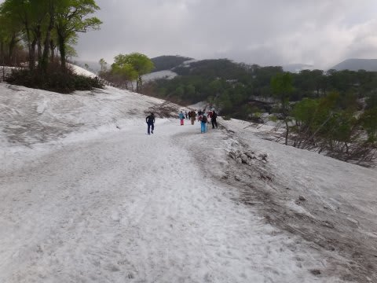

今年は雪が多いですな～．

…雪の上をリフト乗り場まで歩くのはかなりつらい…

天気がよく，結構暑いので汗だくになります．

リフト営業開始は8時から．

8時過ぎにリフト乗り場に着くと…

リフト券売り場も，リフト乗り場もすごい列だよ．

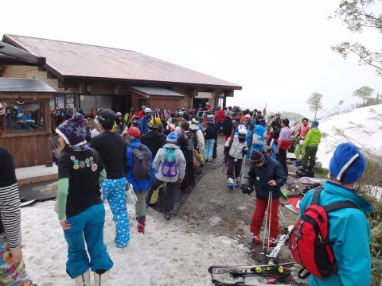

朝イチのリフトは10分待ち．

そのあとも，列は長くなり続けます…

とりあえず，リフトに乗って山頂へ．

リフトはまだスキー履いて乗り降りできます．

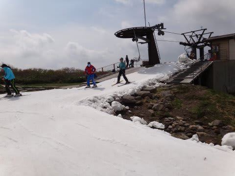

あと1週間くらいは，ぎりぎりスキー履いていけるかなぁ．

で，リフトの山頂に出ると．

あーーー．

雪はまだまだたっぷりあるなぁ．

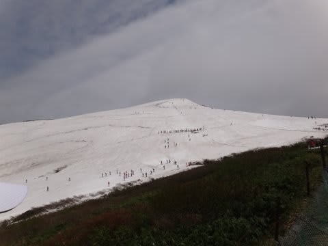

山頂から上のTバーは2本．

沢コースから大斜面まで，ほぼ全面雪に覆われてます．

雪はスプーンカットや板に張り付く雪ではなく，

この時期にしては結構板が滑る，いい雪．

ただし．

ただし．

うわさには聞いていたけど，今年はクレバスが多いよ…

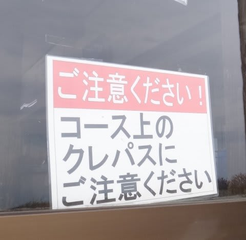

＃クレパスって…子供が絵を描くときに使うやつ？

例年にはない，異常な多さ．

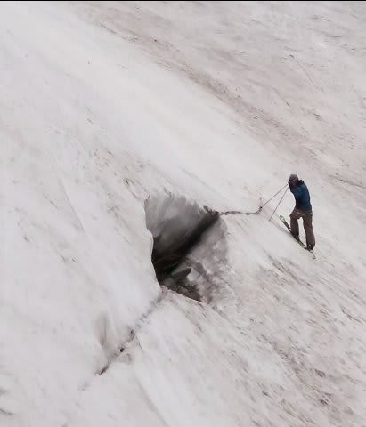

まず．

大斜面へのトラバースラインが，クレバスに邪魔されて，

クレバスの間のわずかなスペースを通る感じ…．

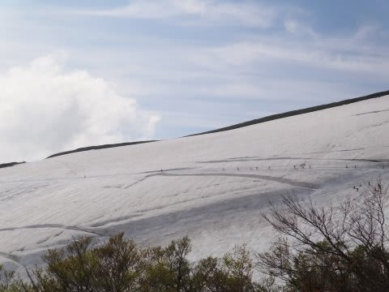

クレバスの間を通るときはこんな感じ．

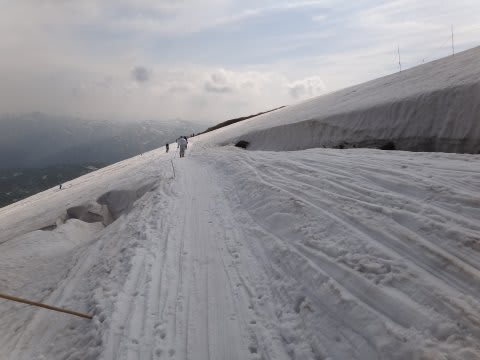

で．

大斜面ですが．

雪は幅いっぱい着いていて，コブラインが複数本．

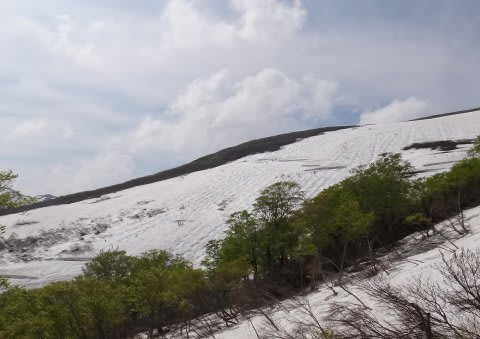

しかし．

途中，クレバスが横につながっているようなところがあり．

完全に大斜面が途中で途切れてます…

でも，大斜面のクレバスは，下の図の丸で囲った部分に横一列につながるように並んでいる

以外にはほとんどなく，大斜面が上下で2分割されている感じですか．

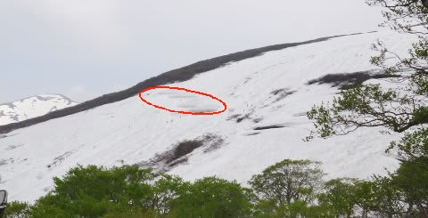

大斜面がクレバスでずたずたになっているかと思っていたけど，

それは無く，大斜面の下から見上げるとこんな感じで，

きれいにコブラインが並んでます．

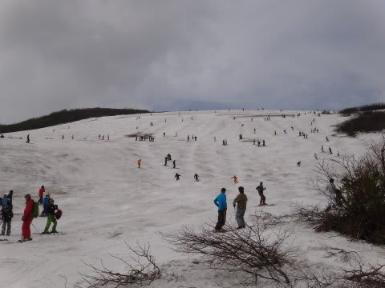

この写真でいうと，クレバスは最も上の部分にちょっと見えてますね．

クレバスより下のライン，十分長いことがわかるかと．

大斜面のクレバス部，上から見るとこんな感じ．

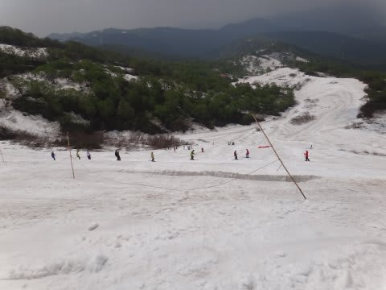

こういう感じのところを通って…

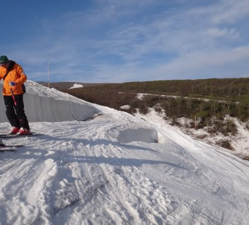

クレバス部の上から下に移動します．

クレバス部の上もきれいにラインがついているし…

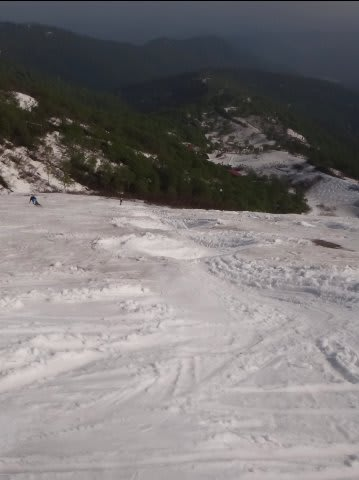

下もこんな感じで，結構長いラインなので，コブ好きにはたまらんです．

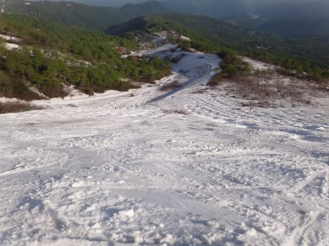

ただ…

欠点は．

リフト並ぶなぁ．

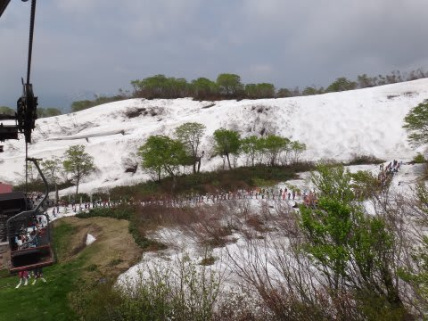

10時ごろは20分待ちくらい．

11時ごろに10分待ちちょい，

12時ごろに5分待ちと，だんだん短くなったのが救い．

午後になると，ほとんど待ちはなかったですね～．

Tバーも，下のTバーは午前は5分前後待ったかな．

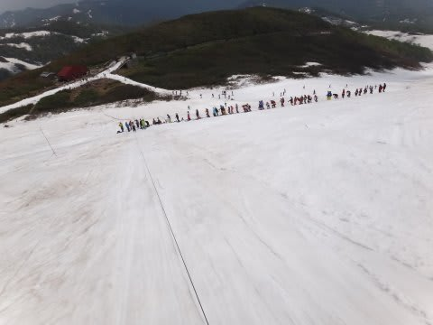

Tバーの途中にも小さなクレバスがありましたね～

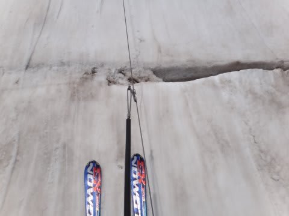

Tバー脇のコース上も，気持ちよく滑っていたら，埋まったクレバスの

凹みにいきなり突っ込むのでご注意．

ただ，数はそんなに多くないので，場所はすぐ覚えられます．

しかし．

気温も暑すぎず快適．

Tシャツだとちょっと寒い程度．

長袖Tシャツの上にミドルジャケットかレインウェアっぽい

のを上に羽織ればちょうどいいくらいですかね．

雪も，リフト乗り場付近はちょっと板に張り付くものの，

先週までのかぐらに比べれば滑ります．

そんな快適なコンディションの中，こんな斜面を気持ちよく大回りで

滑れるんですから…

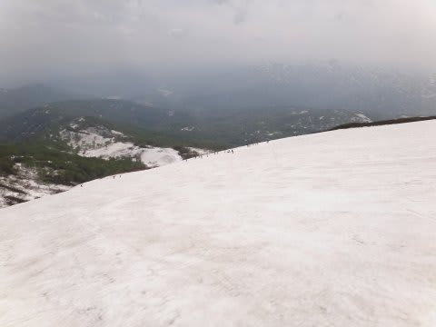

この時期に，これ以上，何を望めるの？？？

ってほど，満足した月山．

ついつい，リフトストップまで滑ってしまったのでした…

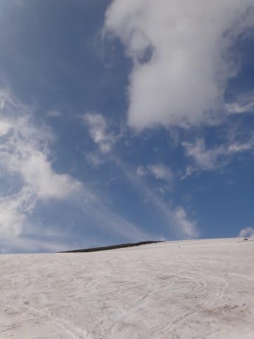

いやー．

今シーズン，もう一回行きたいなぁ．
