# コドモとコモド！子連れダイブクルーズ30　ウルワツ観光，そして帰国

📅 投稿日時: 2011-08-03 00:40:04

🏷️ カテゴリ: [ダイビング日記](ce3a7a8d424d112fce83ee85c81a0e344.md)

んで．

車をチャーターしてお出かけした先は…

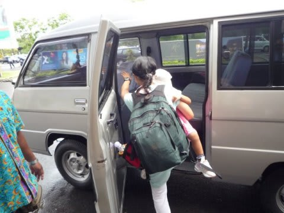

まずは，タナロット寺院．

空港から1時間ほどの，海沿いにある有名な寺院です

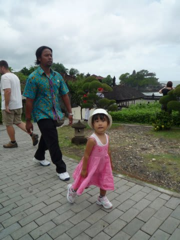

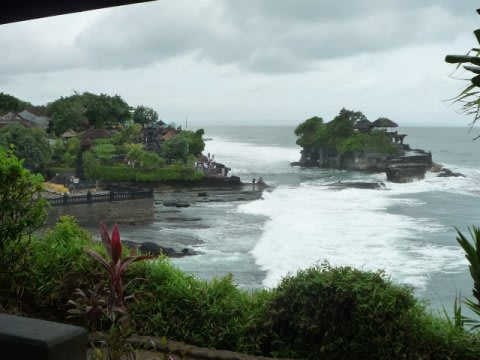

しばし散策．

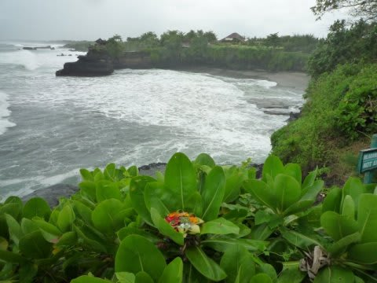

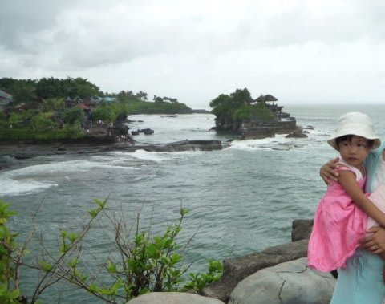

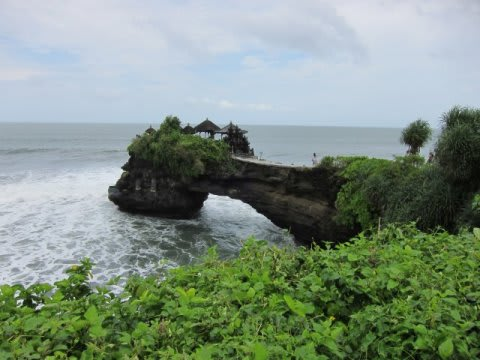

タナロット寺院のそばのレストランで遅めの昼食後…

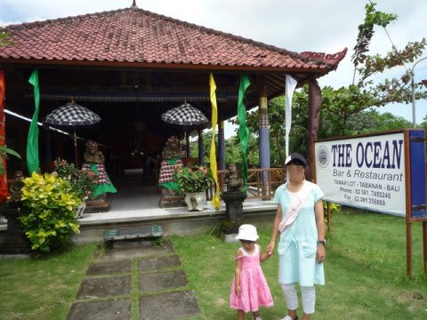

今度はウルワツ寺院へ向かいます．

ウルワツ寺院…

それは，私にとって，忌まわしき場所．

ここは，景色がきれいで，ケチャックダンスが見られて有名な寺院なんですが．

2年前のクルーズで来たとき．

土砂降りでケチャックダンスが早めに切り上げられ，

さらに雨にぬれてデジタル一眼を水没させてしまい．

その上，雨でびしょぬれになったため風邪をひいて，

そのあと一ヶ月以上直らなかったという．

踏んだりけったりの経験をした，とんでもないいわくつきの場所．

今回こそ，ちゃんとしたケチャックダンスを見るんだ！

と，意気込んでリベンジへ．

…

しかし．

行きの車の中で，すでに小雨．

うーーーーーーん．

何かに呪われているっ！！

現地に到着するころは，何とか雨はやみました．

でも…前回も，ケチャックが始まるまでは晴れてたんだよなぁ…

とりあえず，寺院を見学．

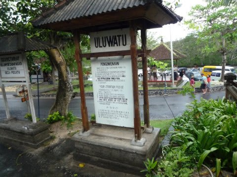

相変わらずここもサルが多いの～．

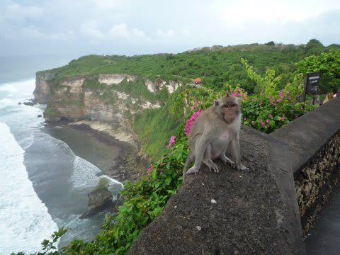

がけの上からの景色もきれい．

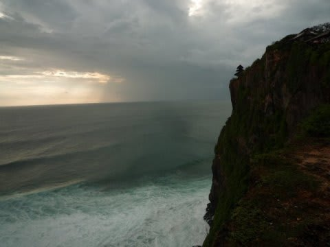

うーん．ウルワツの方が，タナロットよりいいなぁ．

こっちにくれば，タナロット見なくてもいい気がする…

6時からケチャックがスタートなので，5時40分ごろには

席に着きます．

さーて．

雲行きが良くないけど，天気もってくれるかなぁ…

私の呪いは，ちゃんと払われるのか？？

最後よければすべてよし，で終わるのか？？

ダンスが始まりました．

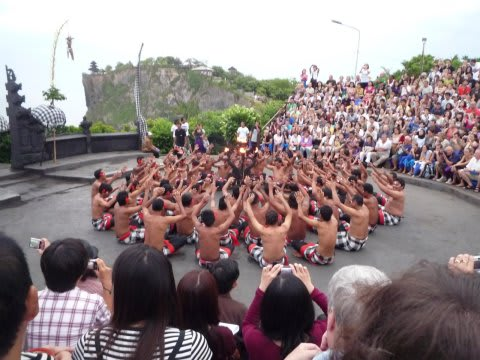

とりあえず，今は雨は降ってないぞ！

ダンスは進み…

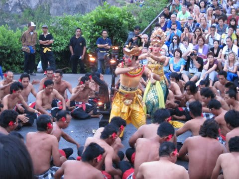

1時間ほどかかって，最後のファイヤーダンスへ．

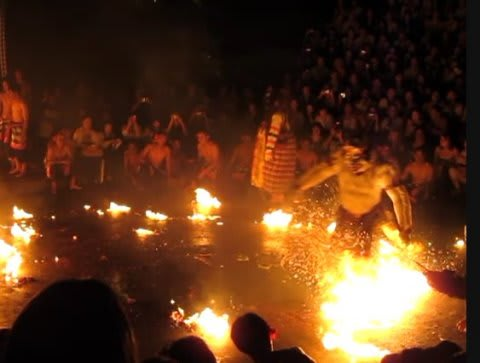

えええ？

こんなに長いステージだったのか．

前回見たときは，土砂降りだったから，30分くらいで終わっちゃったのに…

とりあえず，最後まで雨が降らずに終了！

うーーーん．呪いは無事解けたようだなぁ．

かなり見ごたえあるステージでした．

見に行く価値はありますなぁ

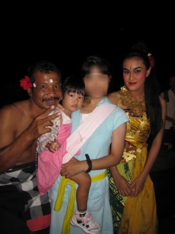

その後，空港へ戻ると午後8時近く．

K澤さんお勧めのフードコートで夕食を食べて，

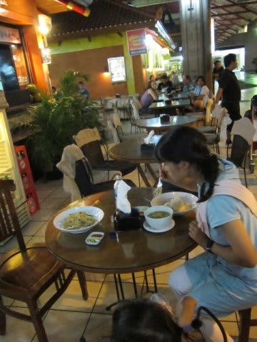

チェックインをして，おみやげ物屋を冷やかしつつ

のんびりすごしていると搭乗時間です．

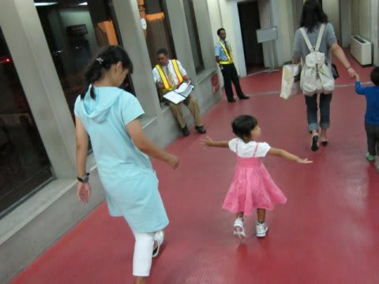

帰りの飛行時間は7時間．

昨日は睡眠時間も短かった上に，今日は一日移動＆観光で

へとへとだったので，乗った瞬間に爆睡．

機内食も食べずに寝続けて，気づいたら日本へ到着してました．

深夜便だったので，娘もずっと寝ていた様子．

こうして，船の上でも飛行機でもぐずることなく，無事

娘は子連れダイブクルーズを乗り越えられたのでした…
