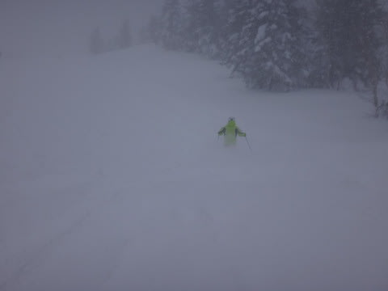
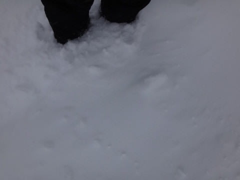
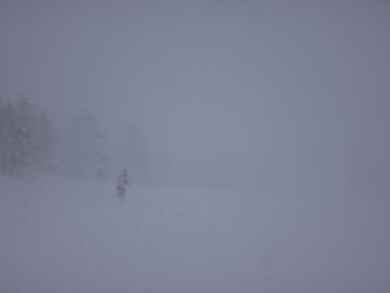
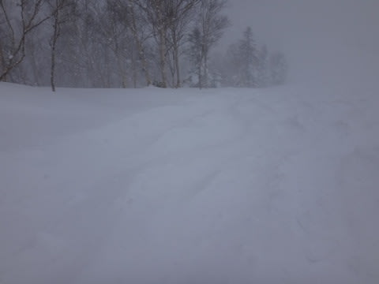

# 1月19日の志賀高原，速報モード

📅 投稿日時: 2014-01-20 00:42:56

えー．

昨日の夜から，かなりの勢いで雪が降り続き．

今日は一日，パフパフでしたよっ！

コース脇や非圧雪コースは，膝パフ！

今シーズン一番のパウダーっ！！

で，終日かなりの量が降り続け…

人が少なかったのもあり，夕方までコースの

いたるところに深雪が残っていて．

一日ぱふぱふデーでしたっ！

＃逆に言えば，圧雪コースは終日もさもさでしたが…

ってことで．

詳細は，また明日…
