# 焼額山スキー場の歴史を振り返ってみる6…2007年のリフト・ゴンドラ11本体制から，現在の5本体制になるまでの歴史

📅 投稿日時: 2020-10-02 00:07:28

🏷️ カテゴリ: [スキー雑談](c1f9d2cb7478308da16419928ea3945e9.md)

ということで．

[第1回](ecf9ef2318d00e5a9f4905a77d965f4f6.md)　オープン直後の焼額

[第2回](ecbab91b3def3f225ca2f665143d0d3fc.md)　バブル時代の第2ゴンドラ側ができるまで

[第3回](ee5b743600a6fe727ce465ad2a03c1625.md)　オリンピックまでの拡大期

[第4回](ed91f8f5b9a240a0fb9ec5089bf2122a3.md)　志賀全域の，1999年と現在の比較

[第5回](e7845fbeb5b3bb2d7f3f18006f3fc039a.md)　なんとか踏みとどまった2007年まで

と，語り続けてきた焼額山スキー場の歴史．

今回が最終回です！

えー．

前回の2007年までは，なんとかピークの

11本体制をキープし続けた歴史でしたが．

今回，2008年からは，ひたすら縮小の

歴史になります…

○25年目　2008シーズン

この年．

ついにマップ上に残ってはいたものの，

運転されることが無くなっていた

第1ロマンスA線

第1ロマンスB線

第5ロマンス

の3本のペアリフトがマップから落ちました…！

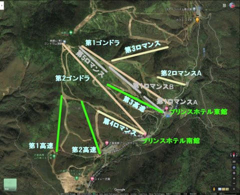

これで，焼額はピークの11本体制から，

8本体制になります…

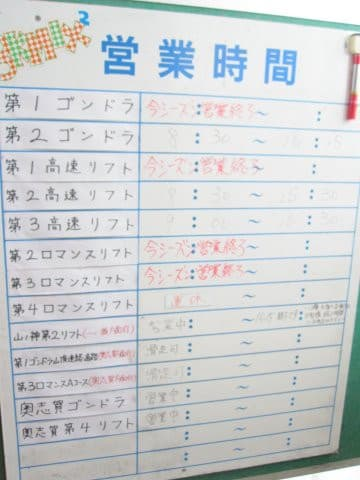

（1ロマA，Bと5ロマが消えた営業案内板）

○26年目　2009シーズン

この年，ゲレンデマップは2008年と

ほぼ変わらないのですが．

昨シーズンにマップから落ちた

1ロマAが物理的に撤去

されました…（涙）

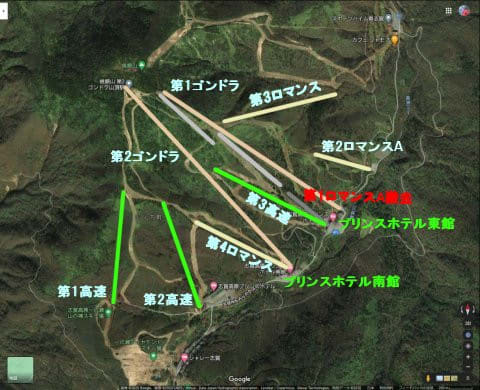

一旦リフトマップから落とされても，

物理的に残っていれば，3ロマのように復活も

ありえたけど．

これで，1ロマAの復活の目は断たれたのでした…

1990年代に撤去された2ロマBに続く，

焼額山では2本目の撤去リフトでした．

○27年目　2010シーズン，28年目　2011シーズン

この2年間は，ゲレンデマップ的には2009年から

変化なし．

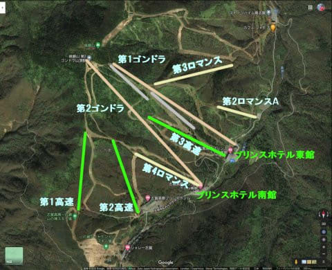

ただ，さらにスキー客減少が進み．

第1高速の乗車人数が減ったのか，

第1高速が土日のみ運転になりました…

そして，白樺コースでアフタヌーンファーストを

やっていたのがこの時期でしたね！！

ただ，2011年の衝撃的ニュースとして．

東日本大震災の電力不足の状況を鑑み，

4月第1週で営業終了になってしまい．

このあと2016年まで，焼額はGW営業を

やらなくなってしまったのがショックでした…

○29年目　2012シーズン

この年は，リフト券が現在のカードチケットに

切り替わり．

ゲートシステムの全入れ替えを行ったのですが．

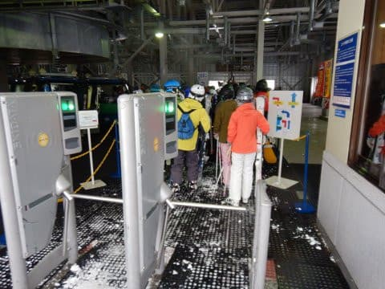

…この時，

ゲート装置をつけるのに，1リフト当たり

100万円近くかかってしまうとのことで．

ゲート付け替えのお金を出せず，

[志賀高原全域](e2514eb2a6ea0d5e7d40a49cacdab08d2.md)で，

廃止になったリフトが続出（涙）

蓮池ロープウェーも，この年に消えました…

焼額もゲート交換の余波で．

第1高速リフト

第3ロマンスリフト

がマップから落ちました…っ!!!（激涙）

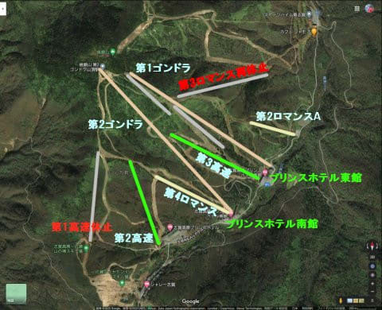

第3ロマンス…

せっかく復活したのに，また廃止とは…っ！！

そして，第1高速リフト．

設備は撤去されず残っているものの，

ゲートシステムは外され，新しいゲートは

取り付けられず．

このまま廃止か，あるいは復活してくれるのか…？

と，天を仰いで嘆いた思い出があります．

○30年目　2013シーズン

この年は2012シーズンから変化は無しでした

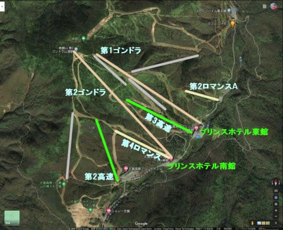

この頃の営業案内板には，

今は無き第2ロマンスがまだ残ってますね…

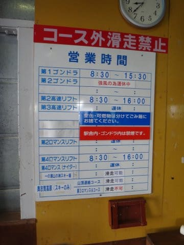

○31年目　2014シーズン

この年，昨年まで何とかパーク営業で

生き残っていた

第2ロマンス

が，ついにマップから落ちました…

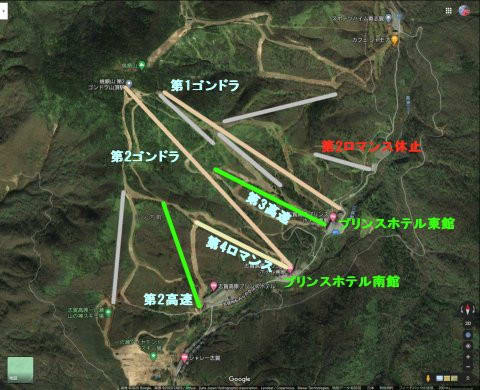

2014シーズンをもって，運転リフトは

現在と同じ5本体制となりました…

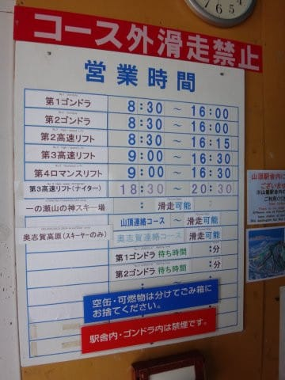

あと，

私の記憶があいまいなんですが．

このあたりの年から，

焼額のゴンドラやリフトが，

減速運転がデフォルト

となり，お客さんがよっぽど多いとき

じゃないとスピードが上がらないという，

悲しい仕様になった気がします…

1ゴンは最大速度6m/sで，5分30秒ほどで

山頂まで行け，これだと1時間で5本

滑れるはずなんですが．

…今はお客さんが少ないと4m/s近くまで

スピードが落ち，山頂まで8分ちょい．

これだと，ギリギリ1時間4本滑るのが限度．

お客さんの数によって0.1m/s刻みで

スピードを調整していますが，

最大6m/sを出したことは，おそらくここ

数年は無いですねぇ…

いつの間にか，運転速度4m/sの3高，2高も

3m/sの減速運転が通常運転になり

ました…（ちょい涙）

（一の瀬，西舘山も高速リフトは減速運転が

　通常状態になってしまったので，

　今もフルスピードで常時運転しているのは

　奥志賀ゴンドラ＆高速ペアリフトくらい？）

○32年目　2015シーズン

2014シーズンと変化なし．

営業リフトは5本だけど，営業してないリフトが

まだ5本，撤去されずに残ってました．

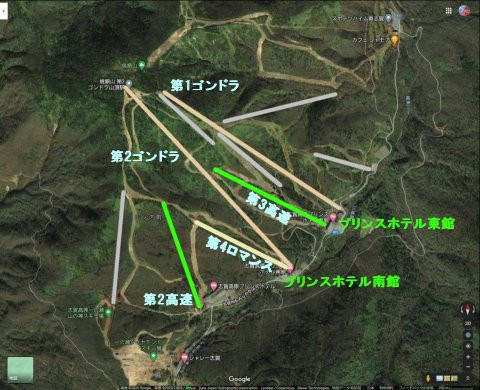

○33年目　2016シーズン

…この年は，衝撃の年で．

なんと．第1高速が物理的に撤去！！

これで，第1高速復活は無くなりました…（激涙）

さらに，1ロマBも撤去されました．

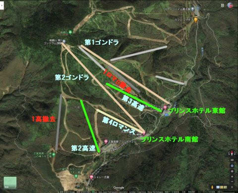

2015年の夏に，焼額に登山した時．

ちょうど1ロマB降り場の撤去工事を

やっていて．

「あぁ…1ロマAが撤去されてしばらく

　残っていた1ロマBも，ついに撤去か…」

と，寂しくなった思い出があります．

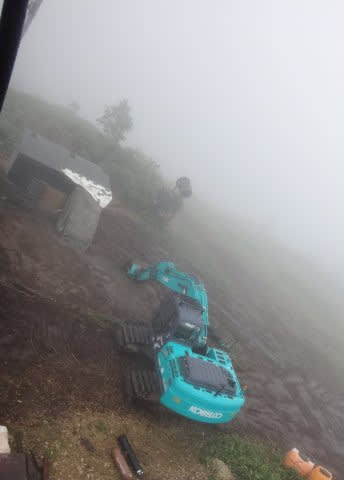

ただ，この年は，リフトは減ったものの．

焼額がGW営業を再開してくれて．

3月中旬から早朝営業をしてくれたことに，

喜びを全身で表した人も多かったかと…

そして．もう一つ．

記憶に残る激烈な雪不足だったこの年．

雪不足解消のため，10年以上休止していた

GSコースの人工降雪機を修理，復活させて，

これ以降2020シーズンまで，毎シーズン

GSコースに人工雪を打ってくれるようになり．

春営業が1ゴンのGSコースになったことに

関しては，喝采の拍手を送りたいところです…

まさか，10年以上野ざらしで放置されていた

人工降雪機を復活させるとは…っ！！

○34年目　2017シーズン

この年は，

5ロマが撤去

されました

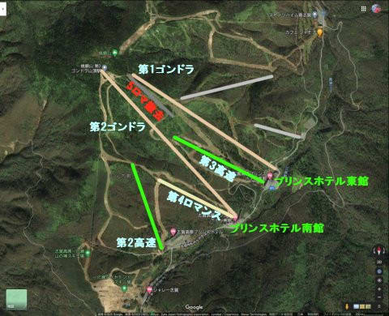

○35年目　2018シーズン

そして，この年．

ついに

3ロマも撤去…

このあたり，記憶があいまいですが．

2ロマ撤去

もこの年だったかな？（詳しい方，情報求む）

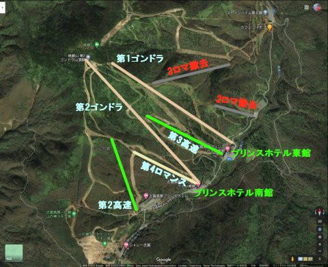

これにて，運転していないリフトは全て

撤去されてしまいました…

…そして，オリンピックコースから

ミドルコースに下りることができた

エキスパートコースも，確かこの年から

滑れなくなり．

2018年に，現在の運用体形が固まったのでした…

○36年目　2019シーズン～37年目　2020シーズン

ということで，

2018シーズンからこれまでは，

何の変化もなく終わったわけですが．

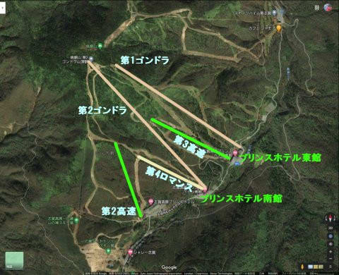

ピーク時から比べると．

リフトが寂しくなりましたね…

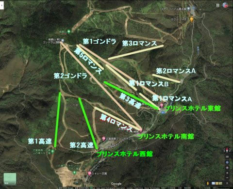

とはいえ．

コース自体は，ピーク時からほぼ減らずに

済んでいるのが救いかな…

ってなことで．

オープン時から現在までの，焼額の変遷を，

かなりいい加減と評判の私の記憶

に基づいて追いかけてみましたが，

いかがだったでしょうか…

とりあえず．

私としては．

これ以上，リフトやゴンドラが減ることなく

営業が続いてくれればいいな…

…と，願うばかりです．

バブルの頃の混雑は勘弁だけど．

もう少し，スキーヤーが増えてくれると

いいんだけどなぁ…

でも．

まさか，さらにコロナが追い打ちをかけて，

今よりも…

…

…いや．

考えない．

そんな恐ろしいことは，考えないぞっ！！

これ以上リフト・ゴンドラが減らないように．

みんな，焼額へ行こう！

（このいい加減でおそらく間違いだらけの歴史について，

正しい情報をお持ちの方の訂正情報，お待ちしています…）

## 💬 コメント一覧

### 💬 コメント by (m&t)
**タイトル**: Unknown
**投稿日**: 2020-10-02 00:51:28

Sさん

お久し振りです。スキー界の衰退が続いていますね。フェニックスが12月で事業終了!ハート&ファブリスも撤退!

悲しい限りです・・・。

### 💬 コメント by (しんちゃん)
**タイトル**: 読破
**投稿日**: 2020-10-02 01:31:33

ヤケビの歴史、楽しく拝見いたしました。全巻読破できました。

昔はリフトがたくさんあったんですね。それだけ人もたくさん来ていたんでしょうね。雪質もさぞかしよかったことでしょう。最近ではサラサラパウダーの日がホントに少なくなった気もします。

来るシーズンは、フレフレ冷え冷え踊りを踊らなくても済むよう祈っています。

### 💬 コメント by (Skier_S)
**タイトル**: 5回連載，読破お疲れ様でした
**投稿日**: 2020-10-02 02:06:48

＞m&tさま

お久しぶりです～！

え！Hartだけじゃなく，FABLICEも撤退！？？

…PHENIXも終わるとなると…

日本のスキー業界，大丈夫か心配になります（涙）

＞しんちゃんさま

昔はリフトいっぱいあったんですよ～！

でも，高速リフト掛かったら，誰もペアリフトに乗ろうと

しませんでしたので，ペアリフトが無くなるのは時間の

問題だろうなぁ…

とは思ってましたが（笑）．

とりあえず，次のシーズンは冷え冷えのGoodシーズンであることを願い，

今のうちから踊っておきましょう…

### 💬 コメント by (アリス)
**タイトル**: 焼額山全巻読ませていただきました
**投稿日**: 2020-10-02 10:19:07

Skier_S様

全巻楽しく読ませていただきました。

増設後いろいろあったんですね。

1ゴン初期はタマゴゴンドラ

蓮池のロープウェー老朽化

震災の影響

ゲートシステムの導入

焼額山にエキスパートコースがあったこと

どれも初めて知ることばかりです。

索道協会が今後の集客対策をするのであれば思い切った対策が必要でしょうね。

絶対的に必要なのは、若年層向けのコスパ変更だと思っています。

若年層に1回のスキーに5～6万円(交通費、宿泊費、食事、リフト代）の捻出は無理があります。

パルスゴンドラの建設は、日帰り客の増客を狙っているようですが、誰もが疑問視するところです。

### 💬 コメント by (加齢なるヒコーキ野郎)
**タイトル**: Unknown
**投稿日**: 2020-10-02 11:36:25

映画｢ 私を、スキーに連れてって｣中、矢野が池上と乗り合わせるリフトは、焼額山ロマンス線ですが、リフト搭乗中、内足について、レクチャーを行うシーンでは、渋峠のペアリフトに切り変わっています。あの頃が懐かしい❗

### 💬 コメント by (アツシ)
**タイトル**: Unknown
**投稿日**: 2020-10-02 21:15:48

ご無沙汰しております。

相変わらず、毎朝Skier_Sさんの新着記事を読み、一日のエネルギーを頂いています😁

焼額山、昔はこんなにリフトがあったのですね‼️何しろスキーにハマり出したのが2015年頃で、初めて志賀高原に行ったのが2016シーズンなものですから。第２高速、第３高速があるから第４ロマンスだと本気で思ってましたよ(笑)まさか1、2、3ロマンスがあったとは！現状、白樺コースへのアクセスが悪いので、おそらく白樺コースを回せる第１高速があって、廃止されたのだろうとは想像していましたが。

昨シーズンはコロナで私も大阪から出られずシーズン強制終了でしたが、早く収束して、皆が普通にスキー場に行けるようになってほしいですね‼️

### 💬 コメント by (Skier_S)
**タイトル**: 1-2回で終わらせるつもりが，6回も続くとは
**投稿日**: 2020-10-02 23:10:09

＞アリスさま

楽しんでもらえたなら良かったです…

あまりにもマニアックすぎて，読者を振り切ってしまうのでは

ないかと，心配していたので…

そうなんですよ．

歴史を振り返ると，焼額はオープン時と全く違うスキー場に

なっているのがお分かりいただけたかと…

しかし，志賀高原全体が，もう少し盛り上がってほしいのですが．

奥志賀や焼額が4月の早朝営業とか，

熊の湯・横手もシーズン延長などの努力をしているので，

あとは中央エリアがもう少し頑張ってほしい…

確かに，スキー1回に5-6万かかったら，普通の人は来れませんよね…

＞加齢なるヒコーキ野郎さま

あ，途中でリフトが変わっちゃってるんですね（笑）．

しかし，あの映画から数年間がスキーのピークでしたね…

＞アツシさま

お久しぶりです~！！

そうなんですよ，焼額，リフト・ゴンドラ合わせて11本もあったんですよ！

１，２，３ロマンスどころか，第5ロマンスまでありましたから…

しかし，1高の存在もご存知なかったのですね．

結構昔からいらっしゃってたように思ってました（笑）．

今シーズン，またゴンドラは乗車定員半分で営業するようです．

混みそうですね…

また昨年のように強制営業終了にならないよう祈るばかりです．

### 💬 コメント by (シュウヘイ)
**タイトル**: Unknown
**投稿日**: 2020-10-03 06:31:19

いつもブログ楽しく拝見しております。

焼額山は2年前のGW営業で初めて訪れたので、こんな歴史があったとはまったく知りませんでした。

今年はハイシーズンに行ってみたいですね。

でも、志賀高原は修学旅行の相次ぐキャンセルで経営が心配です。

### 💬 コメント by (ゆーき)
**タイトル**: Unknown
**投稿日**: 2020-10-03 19:04:37

春ナイターとか、復活希望ですね、

それより、

損益厳しい中、無理だろうけど、

コロナ対策で、

ゴンドラではなくらリフト増強で、

第一復活！

無理だろうけど。。

### 💬 コメント by (Skier_S)
**タイトル**: 最近焼額来るようになった方には驚きの内容だった！？？
**投稿日**: 2020-10-04 01:34:19

＞シュウヘイさま

コメントありがとうございます～！

2年前から焼額にいらっしゃるようになった方には，驚きの歴史だったと思います…

今度はトップシーズンにお越しを！

修学旅行も心配ですが，焼額プリンスは，インバウンドが来なくなって

大ごとになっているようです…

＞ゆーきさま

春ナイター，いいですねぇ…！！！

そして，1高復活も願いたいところ…

来シーズンもゴンドラは乗車定員制限するみたいだから，

すごい待ち時間なりそうです(涙)

### 💬 コメント by (led)
**タイトル**: Unknown
**投稿日**: 2021-03-28 14:33:00

ヤケビは子供リフトが無料なので、子供が小学生になってからこの6年くらい行っていて、第三高速の稼働率落ちてきたなぁとか、ゴンドラ乗っていて、あれ？まえあそこにリフトの柱あったよなぁとか思いながら、振り返ってみていたらこのページに辿り着きました。

こんなに奥志賀の方にコースやリフトがあったんですね。全盛期に滑ってみたかった。

ホテルが非常に快適なので、まだまだ行くと思いますが、このコロナ禍でも現状維持して頑張ってもらいたいです。

歴史辿れて面白かったです！

### 💬 コメント by (まさや)
**タイトル**: Unknown
**投稿日**: 2021-12-14 13:08:46

2000年から2008年まで奥志賀＆焼額山に毎日いてました。

非常に懐かしかったです。

2ロマにB線があったことには驚きましたが、他のリフトはすべて乗りました。

5ロマが動いた時には先輩に「もう無くなると思うから記念に乗っとけ」と言われたのが懐かしいです。

### 💬 コメント by (Skier_S)
**タイトル**: ＞ledさま
**投稿日**: 2021-12-15 01:49:57

すみません…コメントがあったのに全く気付きませんでした．

そうなんです．焼額はここ10年ちょいでかなりリフトが撤去されちゃったんですよ…

それをまとめてるページが無かったので，自分でまとめて見ました．

面白いと言ってもらえてよかったです！

### 💬 コメント by (Skier_S)
**タイトル**: ＞まさやさま
**投稿日**: 2021-12-15 01:52:11

え？？毎日ですか！！

それはすごい…

私も2ロマBは記憶にないです．記録上はあったようです…

5ロマ，私も乗る必要は一切なかったのですが，動いていたのがあまりにも珍しすぎて，

「もうこのまま動かずに廃止されるかも」

と思って乗ったのでした…

乗った理由が同じですね（笑）

