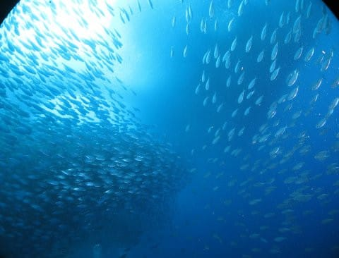

# 2019年8月，4度目のモアルボアル・小6の娘Cカード取得1周年！その22…2本目はアジ＆イワシの群れをおなか一杯楽しみました

📅 投稿日時: 2020-09-02 01:46:15

🏷️ カテゴリ: [ダイビング日記](ce3a7a8d424d112fce83ee85c81a0e344.md)

なんということか…

2020年はまだ始まったばかりというのに．

すでに世の中は全て，

9月という世界に突入してしまっていた

ようです…！

コロナウイルス騒ぎでバタバタしている

うちに．

いつものGWも，夏休みも無かったのに．

私以外のこの世のすべての人々はなぜか，

もう自分たちが9月の世界にいると

言っています！

信じない．

信じないぞ…っ！！

2020年が，もう2/3終わってしまったなんて，

ウソだ！

信じない！！

もし．

もう9月になってしまったなら．

もう，あと1か月ちょっとでYetiのオープン

じゃないですかっ！！！

…シーズンインまでにもう少し世界が落ち着いて

欲しかったんだけど．

今シーズン，果たして思う存分スキーが

楽しめるシーズンになるのやら…

と．

独り言を言った後で．

今日もいつものダイビング旅行記です．

では，どうぞ～！

ーー

ということで．

いつものハウスリーフのイワシの群れを

攻略しているわけですが…

やっぱりこのハウスリーフ，すごすぎて，

載せたい写真がいっぱいあって，1回で

載せきれない…

てなことで．

アジ玉を攻める！

この手前がアジ，向こうがイワシの

群れですが…

アジ玉に接近していきます…

ちなみに，この左側がアジ，

右側がイワシで．

イワシの小ささが分かるかと…

群れに突っ込むと…

当然，向こうに逃げ始めるわけ

ですが．

なんだか，知らぬ間に

完全に群れの中に巻き込まれた感…！

そして，追い越した先でまた

固まり始めますが…

今度はなぜかいきなり向きを変えて，

こっちに突っ込んできた！

完全に群れの中に巻き込まれた！！

って感じで．

しばらく群れの中に巻き込まれて

楽しんでましたが…

アジの群れは川のようになって，

自分から遠ざかっていきました…

そろそろ，ダイビングも終了の

時間．

深度を上げていくと，浅いところには

イワシの群れが水面まで連なっています…

このイワシたちを横目に，浅瀬に上がっていき…

そして，いつものショップ前のボート乗り場まで

泳いでいき…

船着き場に泊まっているボートに

一旦上がって，器材をボートに

おろしてから，下船！

本日も，大変天気が良い中．

超感動，大満足の午前中のダイビングが

終わったのでした…

いや．

やっぱり，いい．

モアルボアルのハウスリーフ，いいよ！！

## 💬 コメント一覧

### 💬 コメント by (西舘)
**タイトル**: Unknown
**投稿日**: 2020-09-02 05:49:33

イワシ、すっごいですね！

私も行ってみたくなりました。海外ダイビング（というか沖縄意外）潜ったこと無いんです。

### 💬 コメント by (Skier_S)
**タイトル**: ＞西舘さま
**投稿日**: 2020-09-02 23:30:36

いや，実物見るとすっごいですよ！

ぜひ，モアルボアルに行ってみてください…

沖縄より安くつくと思います．

