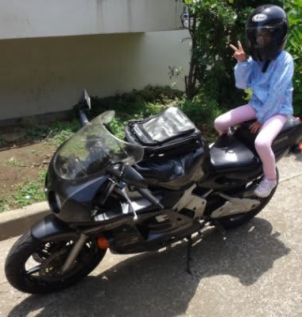
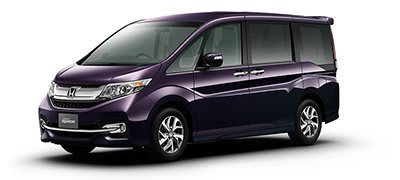
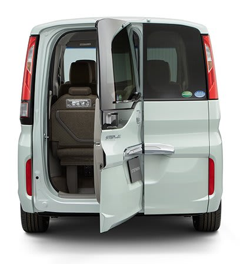

# ホンダの1.5Lダウンサイジングターボ，ステップワゴンに乗ってみた…試乗レポート

📅 投稿日時: 2015-07-03 01:08:58

🏷️ カテゴリ: [車試乗](c07dec5709d34bd74e1f6cb9c8291061b.md)

えー．

スキーシーズンが終わったので．

土日はまた娘とバイクに乗っておでかけしたり…

動物園に行ったり…

いろいろ出かけてるわけですが．

スキーシーズンが終わると．

私の車の試乗シーズンも始まるわけで．

今回．

1.5Lターボが搭載されたステップワゴン．

こいつに乗ってみました…

（ホンダHPより）

今回のステップワゴンですが．

エンジンは，1.5Lターボ一種類のみ．

2Lからのダウンサイジングエンジンとなります…

乗ってみたところ．

あー．中は広いですね．

2列目の足元にかなりのスペースをとっても，

3列目足元も十分広いです．

天井も高いので，セレナ・ノア・VOXYと比べても．

室内空間自体は，もっとも広く感じるかも…

3列目が床下収納なので，3列目を使わない時の

荷室の広さ感も十分で．

さらに．有名になった「ワクワクゲート」と呼ばれる

リアドアは面白いですな．

リアゲートの左側が，ドアみたいに横開きになるんですが．

3列目の左側を床下収納しておけば，ここから車に

乗り降りできるというところが，他の車にはない

目を引くポイント．

…けど．

3列目片方たたむか．

3列目両方ともたたんで，荷室に荷物置かないか…

の状態じゃないと使えないので．

実際に使い物になるのか，微妙な気がするんだが…．

あと，2列目はノア・VOXYみたいなロングスライド

ではないところも惜しいけど．

まぁ，一番後ろまで下げた時の足元空間は，

かなり広いので，これで十分かな…

ってことで．

運転席に座ってみますが．

内装の質感は…

うーむ．こんなものかな．

試乗したグレードはSPADAでしたが．

ステアリングの小ささが印象的．

視界の広さは，セレナ，ノア・ボクシーに

負けないよう頑張ってる感じで，三角窓も大きく．

えらいルーミー．

で．

走り出してみると…

グレードはスパーダだけど．かなり足は柔らかい！

滑らか，フラット感を感じる柔らかさで，

路面にあえて追随しない感じ．

路面のうねりや段差のいなし方，かなりやわらか．

でも，ブヨンブヨンではなく．

いわゆる「乗り心地の良さ」と一般に言われるような，

揺すられ感，段差乗り越え時の突き上げ感の少なさは．

このクラスのミニバンとしては，ピカイチではないかな？？

…おそらく，オデッセイアブソルートでかなり締めた足を

ひどく言われたので，対極に来たか？？

…という感じ．

街中をそこそこに走った感じでは，かなり滑らかな

フラット感が有るので，乗り心地はいい感じだけど．

やはり背が高いので，あまりコーナーを攻めたくなる

感じではないかな…

で．

肝心な1.5Lのエンジンは．

クルーズでは十分．

エンジン音は，かなり静か．

…ただ，車重が重めのミニバンってこともあり．

やはり急加速時はもう少しパワーがほしい感じ…

加速時に，要求するトルクが出るまで，ターボラグ＆CVT変速

ラグがある感じで．

アクセルを踏んだ瞬間に，ちょっと非力感を感じるのが惜しい．

アクセル開度がそれほど大きくない，街中では

「必要十分」という感じだけど．

やはり，ドカンと加速しようと，アクセルを大きく開けると．

「もう少し頑張れ！」

と，感じるところも…

とりあえず．

車重が重い，スライドドアの背高ミニバンなので．

2Lエンジンの先代でも，ちょっとトルク不足を感じるところも

あったところ．

やはり，「2L相当」の1.5Lターボエンジンでも，

もう少し，パワー感がほしいところかな～．

まぁ，山道を気持ちよく飛ばせる車でも

無い感じなので．

我が家の購入候補にはなりませんか…．

しかし．街乗りでは，必要十分なパワーと，

他社の同クラスミニバンを大きく引き離す

乗り心地を備えた車だし．

現在のセレナ，ノア・VOXY，ステップワゴンと．

このクラスが激戦区になって，かなり全体の

レベルが上がってきた感じがあるな～．

と思った，今回の試乗だったのでした…
