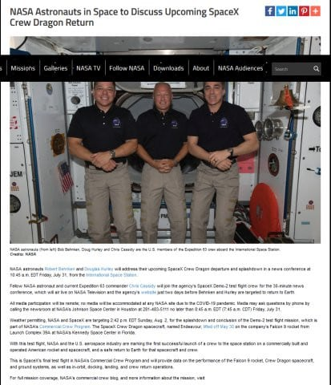
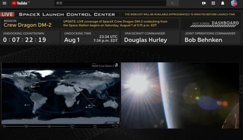

# 国際宇宙ステーションからのCrew Dragon帰還決定！日本時間8/2(日)朝6:15ライブスタート，8月3日(月)朝3:42ごろ着水予定

📅 投稿日時: 2020-08-02 00:52:31

🏷️ カテゴリ: [日記](cc4b5682fb7b8b144980957a978653fb0.md)

えー．

相変わらずマニアックなネタですいませんが．

昨日，ちょうど記事の出だしに大気圏突入の

パロディネタ（？）を書いたばかりの

ちょうどのタイミングで，

今度は本当の大気圏突入の話題です！

日本時間の5月30日にFalcon9で打ち上げられ，

5月31日に国際宇宙ステーション（ISS）に

ドッキングした，SpaceXの有人宇宙船，

Crew Dragon．

スペースシャトル引退後初の，約10年ぶりの

アメリカでの有人ミッションとなる，

このCrew Demo 2プログラムですが．

帰還日未定だったところ，いきなり昨日

[NASAからリリース](https://www.nasa.gov/press-release/nasa-astronauts-in-space-to-discuss-upcoming-spacex-crew-dragon-return)が出て…

（[NASA Media Advisory](https://www.nasa.gov/press-release/nasa-astronauts-in-space-to-discuss-upcoming-spacex-crew-dragon-return)より）

大気圏突入＆帰還予定日が発表されました！

なに？？

もう，8月1日午後にUndocking?

8月2日にSplashdown（着水）!??

もう，今日＆明日じゃないですか…！

詳細スケジュールを[ここ](https://www.nasa.gov/nasalive)からたどると…

8/1 

　5:15p.m EDT; LIVE start

　5:45p.m. EDT; hatch close

　7:34p.m. EDT; undocking

8/2

　2:42p.m EDT; splashdown　　 

とのことなので，日本時間で言うと，

8月2日(日)

　朝6:15　ライブ中継スタート

　　6:45　ハッチ閉鎖

　　8:34　Crew Dragon とISSのドッキング分離

8月3日(月）

　朝3:42　着水！

って感じですか…

すでに，コントロールセンターの各種画面は

[https://www.youtube.com/watch?v=4RF5y7jRV00](https://www.youtube.com/watch?v=4RF5y7jRV00)

で確認できます．

（[CosmoSapiens Youtubeチャンネル](https://www.youtube.com/watch?v=4RF5y7jRV00)より）

で，8月2日(日)朝6:15から，クルーの乗りこみやハッチクローズ，

ISSとの分離などのシーケンスがYoutubeの

[https://www.youtube.com/watch?v=13OkD0C_TWU](https://www.youtube.com/watch?v=13OkD0C_TWU)

で放映開始です！

まぁ，朝8:34のUndockが終わったら，あとは大気圏突入の

翌日の朝3時ごろまで，何もイベントは無いですね…

(追記）

大気圏突入～Splashdownの中継は，日本時間の

8月2日と3日の境目の深夜くらいから，

[https://www.youtube.com/watch?v=tSJIQftoxeU](https://www.youtube.com/watch?v=tSJIQftoxeU)

で見ることができます．

突入前のイベントは，

2:50頃；　帰還カプセルとトランクの切り離し (Trunk Separation)

2:55頃；　降下のための噴射（Deorbit Burn)

ですね…

（ここまで追記）

大気圏突入は，Splashdownの10分前くらいから．

あとは一気に降下して，着水4分ほど前に

ドラッグシュートをデプロイ，

その1分後にメインパラシュートをデプロイ，

メインパラシュートデプロイ後，約3分で着水です…

ちなみに，同じ宇宙船で，昨年4月に，無人で行ったテストの

着水が

[https://www.youtube.com/watch?v=1yn2u3q5wyQ](https://www.youtube.com/watch?v=1yn2u3q5wyQ)

で確認できます．

山場は，飛行機からカプセルが確認できた

1時間7分のあたりからでしょうか…

ということで．

あと数時間でISSから切り離されるCrew Dragon.

無事，地球へ戻ってきますように…！

PS.

　5月30日に行われた，Crew Demo2の打ち上げは[ここ](https://www.youtube.com/watch?v=xY96v0OIcK4)，

　ドッキングは[ここ](https://www.youtube.com/watch?v=AIyonw6LEOs&t=34503s)から動画が見れます
