# 2020/11/23(祝)3連休最終日のイエティ速報レポート＆ゲレンデ状況動画…雪はちょっと溶け気味．リフト待ちはそれほどひどくないよ

📅 投稿日時: 2020-11-24 01:58:53

本日は一日冷え込んで，終日人工雪が

打てたらしい志賀高原．

ライブカメラを見ると，横手，熊の湯，一の瀬が

一斉に全力で降雪機を動かしてましたね…

…でも．

横手山は早々に，24日も営業しないと

宣言しちゃってますが(涙）

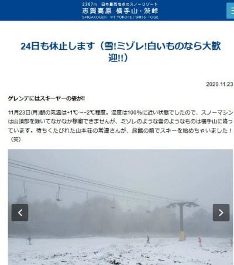

([横手山スキー場ホームページ](https://yokoteyama2307.com/news/11249/)より）

とりあえず．

標高の高い志賀高原なら，明日24日も一日

人工降雪機が動かせて．

25日朝ぐらいまでは人工雪を打ち続け

られそう…！

その後．

25日の昼間は気温が上がるので人工降雪は厳しそう

26日はきわどいところ．朝は打てても，昼間はギリギリ人工降雪いけるかどうか…という気温．

27日はダメです．人工降雪無理です(涙)

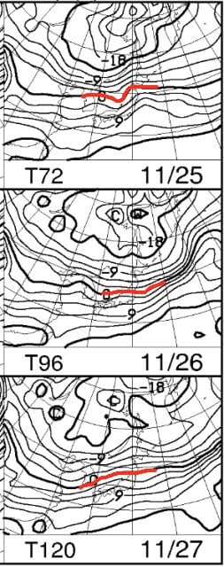

あぁ…どうやら，27日の週末までに．

ドサドサ雪が積もることは無いし．

さらに人工降雪が打てるのは24日と

26日の朝，あとは運がよければ26日の昼間…

という程なので．

27，28日の週末．

横手はオープンできたとしても，

熊の湯は微妙…

という昨日の予想は変わらず（涙）．

…ただ．

その後．28日以降．

850hpa気温傾向を見てみると…

来る．

何かが，来る！

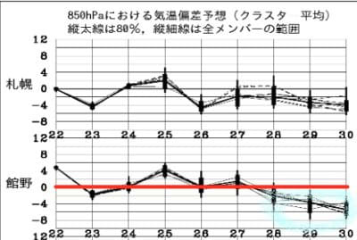

28，29，30日の850hpa気温図を

見てみると．

…ををを！

3日連続で，赤い0℃線は本州の南側

まで南下してるし，

30日，志賀高原には-6℃線が！！！

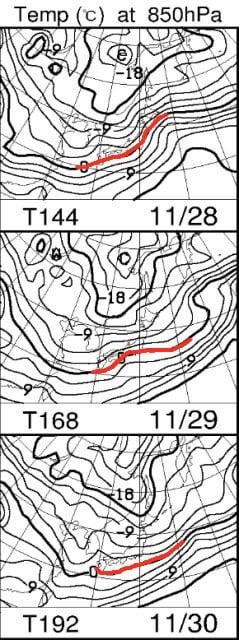

…これは．

冷える．

28日以降，冷える！！

…ふふふふ．

ようやく，私の冷え冷え踊りが効いてきた

ようだな…っ！！！←遅すぎるよ

とりあえず，12月5日の週末にかけては

ちょっと期待が持てるかな…

…というところで．

本題へ．

3連休最終日の本日もYetiに行ってきたので，

いつもの速報レポート＆コース状況動画です！

えー．

本日朝イチは，太陽ギラギラの

晴天でスタート！

本日は祝日なので，10時ぴったりの

ゲレンデオープンのシマシマを堪能！

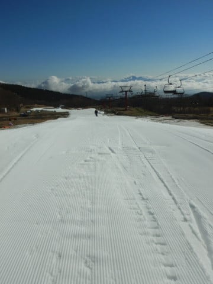

…だけど，気温が高くて雪がゆるゆるで，

スピードがの乗らない…（涙）

朝10時オープンと遅い時間スタートなので．

いつもの朝の数本の快感ガラガラバーンも

なく，すぐにリフト待ちが伸びていきます…

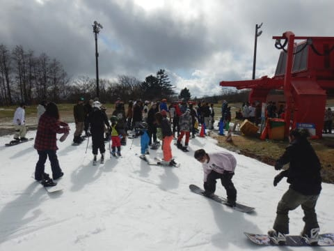

が，営業開始30分でクワッド・ペアの

リフト2本体制になったので，

待ち時間は最大で5分ちょい．

午後になると人がちょっと減り，

この程度の3分待ちくらいに

待ち時間が短くなり．

3連休としてはかなり空いてたかな！

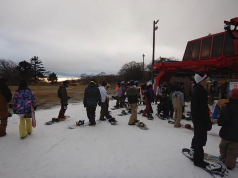

…が．

2本のリフトでコースに人が供給されるので．

ゲレンデ混雑はいつも通りの感じ…

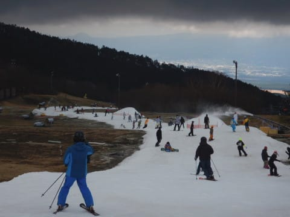

そして，朝は晴天だったけど，

昼過ぎには曇り空になっただけじゃなく．

時折ガスも流れてくることも…

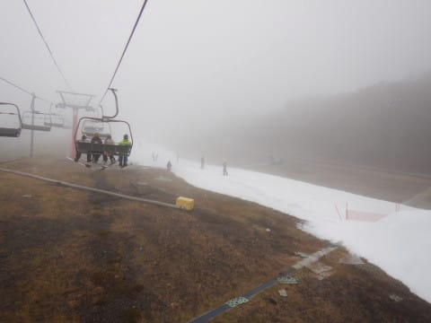

さらに，

午前中の高温＆日差しで，

コースはごく一部，雪が薄いところも

出てきました…

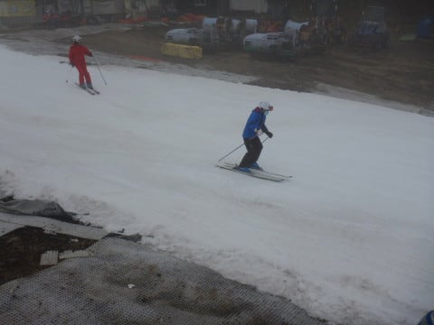

そんな状況にもめげずに，ナイターまで

繰り出しますが．

夜も気温がそんなに冷えたわけじゃなく，

ナイターも雪は緩めで，コースがすぐに

荒れちゃいます…(涙）

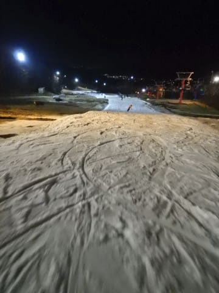

で，一昨日の土曜ほどじゃなかったものの．

午後6時にはそこそこのリフト待ちの列が

伸びてきちゃったので，6時半ごろに

退散したのでした…

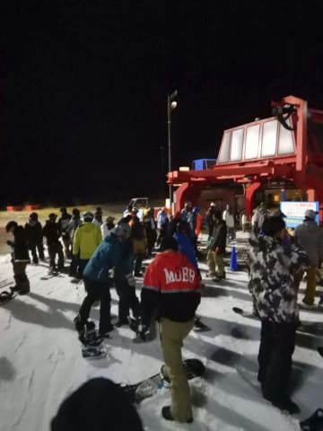

ってなことで．

Yeti 速報モード定番，コース動画も

つけておきます．

幅は広がってるけど，ところどころ

雪が薄くなってきているのが分かる

かと…

とりあえず，明日また詳細レポート

やります～！！

## 💬 コメント一覧

### 💬 コメント by (ほっぽ)
**タイトル**: Unknown
**投稿日**: 2020-11-24 19:24:47

Sさん

昨夜はSさんとyamaさんの後ろ姿とプラドちゃんを見かけました。

残念ながら追い付けず、滑る姿を拝観して終わってしまいました。

次回は志賀高原でお会いできますように。

### 💬 コメント by (Unknown)
**タイトル**: 特報
**投稿日**: 2020-11-24 22:15:47

https://twitter.com/Kumanoyu_ski/status/1331161489063903233

### 💬 コメント by (Skier_S)
**タイトル**: 熊の湯オープンするとは…
**投稿日**: 2020-11-25 04:51:04

＞ほっぽさま

後ろ姿，見られてましたか(笑)．

ナイター開始時から滑ってなかったのですか？

とりあえず，熊の湯もオープンするし．これでもう今シーズン，

私はYetiに行かずに済みそうかな…？

＞Unknownさま

いやーーー．

すごいですね．

この状況でオープンさせる熊の湯の人工降雪の経験＆ノウハウは

すごい…

