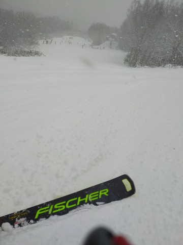

# 2022/12/18(日)の志賀高原焼額山スキー場速報レポート！…雪降りのち曇り＆小雪．朝の積雪は5cm程度(涙)．でも，クリスマス寒波が来る！

📅 投稿日時: 2022-12-19 04:25:18

🏷️ カテゴリ: [2023スキー滑走日記](cd943df30cfcc3d0896469e2ff98720cd.md)

ってなことで．

昨晩は2時間半睡眠だったにも関わらず，

また12時過ぎまで起きていてしまい．

睡眠時間6時間ちょい（涙）

それなのに，今日もついついラストリフト

までしっかり滑ってしまったので，帰宅は

いつも通りの夜遅く…

そこから月曜締め切りの仕事をやっつけて，

こんな時間になったSkier_Sです（泣）

それでもBlogは書く！！

えらい！！←もはや何のために書いているのか分からなくなってきてないか？

ってなことで．

雪が降るという予想だった本日ですが．

志賀高原も，今日は我慢できないくらい

寒い激冷えデーだったんですが…

やはり西風というのが効いて．

志賀高原朝は5cm弱，日中も5cmほどの

積雪にとどまり（涙）

金曜の予想の

18日(日)：朝は5-10cmほど積雪！

（略）

　終日雪が降ったり止んだり，

　昼間にも5~10cm積もるか．

という積雪予想の，どちらも少ないほうに

なってしまいました（泣）

うーん．

積雪0ではなく，積もってはくれたものの．

焼額は，ゴンドラを動かすにはまだまだ雪が

足りなさそうな状況です…（涙）

果たして次の週末までに，ゴンドラが動く

くらいの積雪量があるのか…？

というところを見てみると．

19，20日も冷えそうで，新潟の海沿いは

すごい雪が積もりそうだけど…

またこの2日とも志賀高原殺しの西風

なので．

積もっても，せいぜい1日あたり5cm程度かな…（泣）

しかし．

1週間予想図を見てみると…

うむ？

水色でマークした23日以降．

今回の18，19日の激冷えと

同じくらい冷えてますね…！

そして，地上天気図でも．

23日以降は冬型の西高東低の

縦縞線の天気図が続くよ！！

さらに．

[FXXN519](https://www.hbc.co.jp/tecweather/FXXN519.pdf)の一番下の，

500hpa高度線の緯度分布予測を見ると．

水色で括った部分．

冷え冷え空気である網掛けの5400m

高度線が，北緯35度（35N)より南に

下がってきてます！！

超冷え冷えデーだった本日18日と同じレベル

にまで下がってるので…23日以降は

冷えます！！

そして．

上の図で赤く括った，夏の空気を示す

5880m高度線．

12月18日以降はこいつがこの図から

消え去ってくれて，やっと冬らしい感じに

なってきました…

ってなことで．

来る．

23日から来る！！

クリスマス寒波がやってきます！！！

…今の天気図だと，23日以降はそれほど

ひどい西風にならなさそうなので…

志賀高原にも積もってくれることを期待！！

（でも，23日からようやく積もり始めても，

24日の土曜に間に合わないかも…）

という感じで．

とりあえず23日以降の冷え込みに期待して．

本題である今日の志賀高原焼額山の速報レポートをば…

まず．

さっきも書いたように．

今日の朝8時半の営業開始段階では，

5cmほどの積雪でスタートした本日．

降り始めが明け方だったので，

かなりの降りにもかかわらず，

朝までの積雪がわずか5cmなのが

惜しい…

降り始めが午前3時から4時くらいと

遅かったので，積雪がそれほどなかった

ようです（泣）

でも，5cmとはいえ新雪が人工雪の

上に乗っていたので．

午前中はバーンも滑りやすく．

さらに午前中はかなり強い雪が降り

続け…

昼間も5cm程度コースの上に乗り，

わずかずつ雪のコンディションは

良くなっている気がします…

しかし．

雪降りで激寒のこんな日にもかかわらず．

コース上の人口密度は高め（泣）

第2高速側の唐松コースは，昨日の殺人コロコロが

ちょっと残っていて，殺人コロコロと新雪と

硬い人工降雪バーンが混ざっている感じで．

バーン状況が良くないものあり，第2高速は

ほぼ待ち時間なく乗れたものの．

第4ロマンス側のサウスコースの方が

雪がいいので…

第4ロマンスはリフト待ちがちょっと

ありました

そして．

天気は，午前中は雪の降りは強かったものの．

午後になると弱まり，一瞬青空も

顔を出す程度で，積雪はそれほどなし（泣）

…でも，終日マイナス5℃を上回らない

冷え冷えで．

人工降雪の下地が出て来てないところは，

雪質は良かったですね～

でも．

雪質も悪くなく，さらに午後になったら

リフト待ちはほぼなくなったものの．

コース上の人口密度は，終日比較的

高めだったのがちょいと惜しかったかな…

ってな感じで．

今日も残念ながら，かなり冷えたものの

それほど雪が積もらず．

ゴンドラが動くまでにはまだ積雪が

足りない感じの志賀高原だったのでした…

また明日，詳細レポートやります！

## 💬 コメント一覧

### 💬 コメント by (Hide)
**タイトル**: Unknown
**投稿日**: 2022-12-19 07:47:21

S 様

おひさしぶりでございます。

やはり超人的な更新時間です（驚）

私は年末からしか行けないのでウズウズしてます。

お見かけしたら、お久しぶりにご挨拶させて頂きます。

### 💬 コメント by (レインボー改めブラボー75)
**タイトル**: Unknown
**投稿日**: 2022-12-19 18:27:49

月曜日の志賀高原情報

朝の上林-6℃、蓮池なんと-12℃。シーズン最高低温です？。

曇り空に薄日がさして、風もさほどなく、意外と平気に過ごせました。

４ロマと2高だけしか乗れないけど、2ゴンの試運転がずっと。なんか夢を持たせてくれます。明日から開いてエス様が悔しがると、私はとっても幸せ！(最低男ですね)

４ロマ(サウスコース)は圧雪完璧、まさにパーフェクトの仕上がりです。

2高(唐松コース)は固めで所々えぐれもあり、最後の急斜面はかなりのコロコロで、私のような老人にはちょっと。

気持ち良く滑るお勧めは、通称「ムッチーコース」。2高で降りてサウスに向かうコースです。高速で降りてサウスに入るのがとっても楽しいようで、密度か低ければ最高かと。

長岡では1mの積雪で雪掻きが大変で休みになった会社もあるとか。志賀高原に来れば雪掻きなんてしなくてすむのに。

ああ、エスよ志賀に雪を与えたまえ！

### 💬 コメント by (レインボー改めブラボー75)
**タイトル**: Unknown
**投稿日**: 2022-12-20 16:35:38

火曜日の志賀高原情報

朝の上林-3℃　蓮池-7℃。曇ったり晴れ間が見えたり、ときおり小雪が舞ったりの、スキー日和。

今日はずっとムッチーコースばかり。４ロマに乗って唐松滑って、また４ロマへ。このコースの利点は、2高から唐松への狭い連絡路を通らなくて済むこと。

朗報がひとつ。一ゴンが試運転やってくれてましたよ。

でもベテランの話では、「もう二雪降らないと動かないと思う」

私が昨日二ゴン試運転で明日への期待なんてことを書いたら、休みをとって参上してくれたア◯スさん。ごめんなさいね。

それから私事ですが嬉しいことがひとつ。一昨日の朝にソールウォークを片方落としてしまい、諦めて発注したのですが、今日出てきました。どなたかわかりませんが本当にありがとうございます。出費がなくなったことよりも、善意が嬉しくて！

### 💬 コメント by (アリス)
**タイトル**: Unknown
**投稿日**: 2022-12-20 17:13:58

S様

こんばんは😃🌃

本日初滑りでした🎵

朝一の四ロマに並んだら、目の前にブラボーさんが、、、、

ご無沙汰さしておりました🎵

残念ながら2ゴンの運転はありませんでしたが、

初日に1000mの2コースをストレスなく、替わる変わる滑走できましたから満足です☀️

ブラボーさん、素晴らしい出来事ですね🎵

志賀高原のお客様は、皆様いい人なんです。

私も数年前に、ファミリーのリフトから落とした携帯が数日後に手元に届きました☺️

明日もヤケビです☀️

