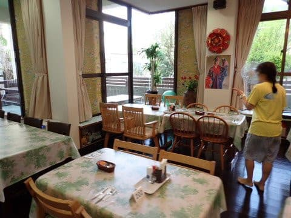
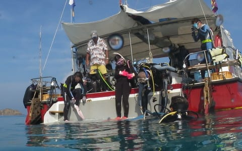

# 2023年8月，座間味で親子3世代ダイビング！その4…ダイビング初日の朝，晴天でいい感じ！

📅 投稿日時: 2023-09-13 05:13:27

🏷️ カテゴリ: [ダイビング日記](ce3a7a8d424d112fce83ee85c81a0e344.md)

えー．

相変わらずいろいろご無体な日々を

過ごしていて．

またバタバタと夜中までいろいろやっていた

こともあり…

昨日は記事を下書きのまま投稿し忘れて

ました…（涙）

で，朝9時近くに投稿したので，昨日の記事を

読んでない方は読んでやってください～！

ってなことで本題へ．

昨日は久々の徒然スキーヤー日記でしたが．

本日も，夏モード．

[前回の続き](e6b47d5e9790e7970739ccc33b112b493.md)の，徒然ダイビング日記に戻ります…

ーーー

ということで．

昨晩は早めにぐっすり寝て．

翌朝起きて，旅行二日目が始まりますが…

ダイビング初日の本日は，平和な

晴天でスタート！

…いや．

貸し切りのテラス，いいですね～…

ということで，朝7時から朝食タイム！

ペンション星砂さん，夕食は止めたけど

朝食は食べられます…

朝食，4年ぶりですがボリュームたっぷりの

満足朝食なのは変わらず！

安心しました…

ご飯を食べたら，8時15分に船に集合なので．

急ぎダイビングの準備！

昨晩，組み立てる前に寝てしまったので，

慌てて水中カメラの準備をして…

久しぶりのマイカメラ，組み立て完了！

一応，カメラやレンズは除湿ボックスに

入れて保管していたけど…

さて．

4年の眠りから覚めて，水没することなく

無事動いてくれるかな…？

そして．

娘と妻の分のカメラも準備して．

さらに，ダイビングコンピュータも

準備します．

今回，わが父親のダイコンが壊れた

（というか，電池交換不可の古い

　ダイコンの電池切れ）

ということで，父親に貸すために

22年前のMaresのダイコンも持ってきたので，

なぜかダイコンが4台も…

右から2番目のMaresの古いダイコン，

単4電池で動くし頑丈なので，父親から

譲ってもらって最初は愛用していたの

ですが…20年以上昔のモデルが

今でも無事に動くのがすごい…

そして，今また父親のもとに戻っていきます(笑)．

で．

8時過ぎにウェットスーツに着替えたら…

港まで5分ほどの道を歩いていきます．

そして，港についたら…

見えてきました，久しぶりのティンガーラ号！

こいつも最後に乗ったのは4年前…

リフレッシュ直後に乗りましたが．

それから変わってませんね～．

全然古さを感じさせない，ピカピカに

整備された船です！

ってなことで．

久しぶりのティンガーラ号に乗船したら…

直ちに1本目のポイントに出発！

ダイビング器材は，ショップが事前に

宿から運んでくれていて，すでに

セッティングしてくれていたので…

娘は久しぶりのセッティングをせずに

すんだけど．

娘はセッティング，絶対忘れてるよな…

そして．

出港後わずか10分ほどで，ポイントへ到着！

座間味島真向いの，安慶名敷島．

その島のビーチ前のポイントです…

いや．

海がきれい…！！

透明度も高そう…！！

早く潜りたい！！

慌ただしく，ダイビングの準備を始めますが…

私にとっても4年ぶりなら，娘にとっても

4年ぶり．

小学生以来のダイビング．

ちょっと準備に手間取ったようだけど，

おじいちゃんの隣でタンクを背負って…

いざ，エントリー！

…って，これ，我が父親か…

そして，娘もエントリーして…

ついに，家族3世代が海の中にそろって，

ダイビングスタートです！

（[続く](e8e1c56db0ad819ac11263269dead8611.md)）

## 💬 コメント一覧

### 💬 コメント by (西舘)
**タイトル**: Unknown
**投稿日**: 2023-09-13 08:52:55

Sさんのお父様、お母様が凄過ぎて、早く続きが読みたいです。

台風の合間でしたっけ、恵まれましたね。

ご無体に耐えてることへの天からのご褒美かも。

### 💬 コメント by (Skier_S)
**タイトル**: ＞西舘さま
**投稿日**: 2023-09-14 01:10:30

台風の合間でちょうどべた凪のいいタイミングでした～！

とりあえず，私をスキーヤーに育て上げた両親で，

私のことを「運動神経がない」と思っている親なので…

我が家の標準はかなり一般からずれてます（笑）

### 💬 コメント by (mae)
**タイトル**: Unknown
**投稿日**: 2023-09-17 19:29:55

お父さんと三世代一緒に潜れるなんて素晴らしいですね。

昨年夏、阿嘉島に滞在して潜り、家族にもこれにて引退宣言しました。

家族３人なら3ダイブ、宿泊込みで一日だけで10万円コースですよね。

とても今の私の経済状態じゃ家族でのダイビングは出来ません。😭

30年以上前のアラジンのダイコンを4台今でも持ってますが全部電池切れです😥

### 💬 コメント by (Skier_S)
**タイトル**: ＞maeさま
**投稿日**: 2023-09-18 02:31:57

え！？？

ダイビング引退宣言ですか！？？

それは残念…

しかし，ダイビングにお金がかかることは間違いないです．

娘も大人料金になり，さらにダイビングフィーが3人分かかるようになると…

1回家族でダイビング遠征に行くと，私の1シーズンのスキー費用（道具代除く）くらいかかっちゃいますから（涙）

もう，昔のようにモルジブやパラオには行けないですね．

今後は，フィリピン（モアルボアル）か座間味の民宿泊まりのリピートになりそうです．

