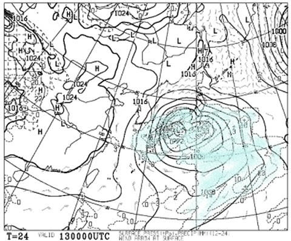

# 緊急事態宣言が出てるけど，まだ志賀高原のスキーシーズンは続く！今週一週間の志賀高原スキー場の天気は？

📅 投稿日時: 2020-04-13 00:20:58

🏷️ カテゴリ: [スキー天気予想](c6554f5c3c106093b511a8daae23757e8.md)

ということで．

まだまだスキーシーズンが続いている志賀高原ですが．

本日の志賀高原は…

朝は雲が多かったものの，

誰かの「曇り空」という予想より，

むしろ晴れに近い天気で…

だもんで．

放射冷却が入ったからか，

誰かの「朝は-2~3℃」という予想より

低めの，-4℃をちょっと下回る，

この時期としては冷え冷えの朝！

（でも，-3℃の予想からズレたのは1℃だけ！…と，大きく外してないアピール）

あさイチはしっかり締まった新雪に，

うっすら1-2cmの新雪が積もったバーン

コンディションで，エッジがガッツリ効いて

スピードが出せる，4月としてはかなり

快適なバーンだったようで…

でも，完全曇りではなく，日が射した分，

雪が緩んでしまい．

昼前には，全面ザクザクの雪に

なっちゃいました…（涙）

ただ，日差しのいいバーンで一部

滑りが悪くなった以外は，

午後もそこそこ滑る雪で．

…そして，午後2時ごろには曇りだし，

一の瀬方面では雪がぱらついてきました…！

ってな感じで．

4月の中旬に入っているということを

考えると，ちょっと昼間はザクザクした

雪にはなったものの．

板が埋まっていくようなザブザブ雪でもなく，

かなりいいコンディションで滑れた，

今日一日だったようです…！

…しかし．

1，2月のころはとても想像できなかったけど．

これ，ホントにGWまで雪がもちそうな気配に

なってきましたね…

…果たして．

これからも奇跡の4月が続き，

GWまで雪がもつのか？？

もともと，ただでさえスキーに行く人が

ガクッと減る4月中旬で，さらに

そろそろ読者の皆さんも，緊急事態宣言による

強制シーズン中断になった人も多く．

「スキー場の天気？おいらには関係ないよ…」

って方も多いと思いますが．

GW明けの緊急事態宣言終了を信じながら，

それまで雪がもちそうかどうか，

これから一週間の天気を見てみましょう…

まず，13日（月）の朝9時の地上天気図を見ると…

やっぱり，台風並みの低気圧が本州を

直撃しますね（涙）

13日は，暴風雨になりそうな気配…（泣）

激烈な風で，スキー場の営業はヤバそうな感じ．

そして．13日(月)の朝9時の850hpa図を

見てみると．

金曜深夜の予想だと，0℃線は志賀より

結構北に上がる予想だったのが，

赤い0℃線，ギリギリ志賀にかかるかどうか…

というところになってます．

…これは，朝は志賀は雪になってるかも？

そして，同じ13日の夜9時には…

なんと．志賀高原より南に0℃線が下がるので．

この日は雨になるのは午前中のしばらくの間で，

朝と午後は雪降り（というより，吹雪）かも？？

で，続く14日(火)の850hpa図ですが…

うむ．

この日は赤い0℃線は志賀より南…

というより，太平洋側まで南下？？

それどころか，水色の-3℃線が志賀より

南に下がってますので．

14日の火曜日は，「真冬か！？？」

という天気になりそうです…！！

そして，14日(火)の地上天気図を見ると…

日本海側に水色の降水域がかかってますね…

13日夕方から14日朝にかけて，

志賀高原ではそこそこの雪が積もりそう…っ！！

この時期になっても雪が積もるとは…

やはり今年の4月は，奇跡の4月かも？

で．

続いて，15日(水)の850hpa気温図ですが…

うーむ．

さすがにこの日は，0℃線は志賀より北まで

上がっちゃってますね…

でも，この時期，普通ならもっと北上

しているところ．

平年に比べれば冷えてると言えますね．

そしてこの日の地用天気図は…

うーむ．

高気圧が近づいているので，

晴れそうかな…

で．

その後の16日(木)の850hpa図を見てみると．

をを！また0℃線が志賀近くまで下がってます！

地上天気図は，この日も高気圧に覆われているので．

16日は晴れそうですね…

ただ，昼間の気温はプラスに

振れそうなので，この時期としては

マシだけど，ちょっと雪は緩みそう…

そして，17日(金)の850hpa図ですが．

この日は赤い0℃線はちょっと志賀より

北にまで上がりますね…

とはいえ，この時期としてはかなり

南にいる方ですが(笑)．

で，地上天気図は…

網掛けの降水域が志賀高原に

近づいてますが．

まだ志賀高原にはかかってないので，

晴れ⇒曇り，という天気でしょうか．

うーむ．でも，翌日の18日(土)は

雨になる可能性が高いかも…

ってなことで．

まとめると．

13日(月)：朝から雨．早朝は雪かもしれないけど，

　基本的に限りなくみぞれに近い雪で，

　午前中には雨になる．

　かなり強い南風が吹き付け，ゴンドラどころか

　リフトの営業もヤバいかも．

　気温はせいぜい+2~3℃とそれほど上がらないが，

　雨はそこそこ強く降りそうな，暴風雨．

　午後になると気温が冷え，雨から雪になり，

　吹雪っぽい感じに．

　かなり強い吹雪になる．

14日(火)：夜通し雪が降り続け，この日も朝は

　強めの北風でスタート．

　奥志賀ゴンドラはヤバそうな感じ．

　運がよければ朝の積雪は10cm近くあるかも？

　あさイチの気温は-5℃と冷え冷え．

　ガリガリの下地に新雪が乗ったバーン

　コンディション．

　朝には雪は弱まり，昼までには止む．

　昼間の気温もそれほど上がらず，

　真冬っぽい一日．

　ガリガリ下地と重いモサモサ雪が

　ミックスになり，ちょっと滑りにくいかも…

15日(水)：朝は晴れてそう！朝は-3℃程度かな？

　昨日まで積もった雪が圧雪されて，朝イチは

　この時期としてはかなりいい感じの圧雪！

　ただ，日が射しそうなうえに，昼間は+4℃

　くらいまで気温が上がるので，日が当たる

　バーンは昼前には板の滑りが悪い雪に

　なりそう…

　日が当たらないバーンも，昼間は春スキーっ

　ぽいしっとりと重い雪になっていく．

16日(木)：この日は朝から晴れ！終日晴れに

　なりそうな一日．

　朝の気温はマイナスなので，朝イチはカリカリ

　した感じの硬めのバーン．

　ただ，日が射すので，日が当たるバーンは

　朝早め，日が当たらないバーンも昼前には

　緩み始め，ザクザクした雪になっていく…

　とはいえ，昼間も最高気温は+3℃くらいで，

　この時期としては気温が低めなので

　ザブザブして板が潜っていくようなひどい

　雪にはならず．

　むしろ夕方日が陰ると，雪が固まって

　硬くなっていくほどの冷え込み．

17日(金)：この日も朝は晴れ！

　朝の気温はしっかり氷点下に冷え込み，

　バーンはガチガチに硬くなってそう．

　ただ，気温はプラスに振れるので，

　日が当たっているバーンは

　朝のうちに緩む．

　午後になると日が陰りそうなので，

　張り付くほどひどい雪にはならないと

　信じたい．

　

18日(土）は…まだ分からないけど，

　雨がパラパラ降るかも（ちょい涙）

　山頂でギリギリみぞれかな？

ってな感じでしょうか．

普段の4月中旬なら，数日は+10℃を超える

春の日が続いて，雪がドロドロになっちゃうけど．

これから1週間は，平年より冷えた日が続くので，

ゲレンデコンディションは比較的

いい感じで保たれそうです…

…

…緊急事態宣言で，滑りに行けないのは

悔しいけど．

これでGW以降に期待が持てるな！！

PS.　これからしばらく，週末のスキーレポートが

無いので，

水曜深夜：週末までの天気予想，

日曜深夜：次の週末前までの天気予想…

という形で，週2回天気予想していこうと思います！

（予想に変化があれば，それ以外にも予想記事を書くかも）

## 💬 コメント一覧

### 💬 コメント by (いちと)
**タイトル**: Unknown
**投稿日**: 2020-04-13 14:28:51

毎日拝見してます

スキーのレポートがないので、面白さが半半減 →間違いではありませんよ 

してます、辛いっす

師匠！←勝手に言いますが

教えてほしいのですが、スキー板といつやつは回数なのか？年数のどちらで劣化がすすむのでしょうか？ 両方とは言わないで下さい

また、カービングの角度で小回りがしやすさが分かるのにはどのくらいのレベルになれば分かるものでしょうか？ わたくしめは、自称、永遠の二級、コブ斜面は3ターンまで絵になる男、ゴルフ100前後ってやつです

５年使ってますが、年間、15日程度しか使ってません

買い換えようかと考えています

### 💬 コメント by (ほっぽ)
**タイトル**: 天気予報
**投稿日**: 2020-04-13 22:00:20

Ｓさん

自粛中の身で、特派員からのレポートと天気予報、ありがとうございます。

今夜は蓮池以降、かなり降っているようですね。

今更感がありますが。(^^;

天気予報大変助かっています。

これからの時期、気温によっては雨ですからね。

これからも応援していますので、ムリの無い範囲で続けて下さいね。

### 💬 コメント by (Skier_S)
**タイトル**: 明日は春と思えないグッドコンディション！？？
**投稿日**: 2020-04-14 02:01:44

＞いちとさま

半半減って…1/4ってことでしょうか（涙）

スキーに行けないので，面白いことを書くネタが無いのがツライところです（泣）

で，スキー板の劣化は，どれだけ滑ったかによります．

経時劣化ではなく，使用することによって劣化していきます．

それも，激しく滑って板をたわませたり開放したり…

を繰り返すと劣化する感じなので，ターン回数でヘタるといった方がいいかも．

細かく回るショートの板の方が，ロング板よりヘタリが早い気がします．

あと，ハイスピードで激しくたわませると板は痛みます．

板を長持ちさせるには，ゆっくりおとなしく滑れば

いいんです！！←その代り，楽しさが半減

カービングで小回りのしやすさが分かるのは…

うーむ．結構レベルが高いかもしれません．

でも，緩斜面だったら，レールターンを縮めていけば

それっぽい動きになっていくのかも？？

ちなみに，年間15日程度だったら…トータル80日ほどですか．

滑り方によりますが，そろそろ買い替えを検討しても良いころかも…

（私の場合は，早い板だと滑走日数50日もたずに死んでいきます）

＞ほっぽさま

スキーレポートができないと，なかなか辛いです．

スキー場に行って面白いネタを拾ってくることも

できませんし…

まぁ，なんとか毎日更新を続けていくので，引き続き読んでやってください…

### 💬 コメント by (いちと)
**タイトル**: Unknown
**投稿日**: 2020-04-14 07:50:49

ありがとうございます

では、今年の売れ残りを狙います！

### 💬 コメント by (Skier_S)
**タイトル**: ＞いちとさま
**投稿日**: 2020-04-15 01:53:14

型落ちが一番コストパフォーマンス高いと思います…

ぜひ物欲選手権に完敗してください（笑）

