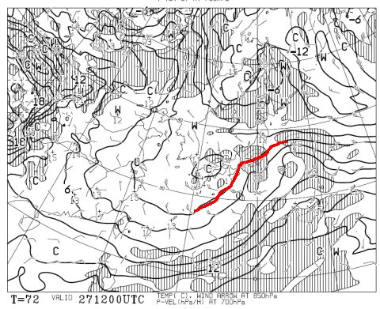
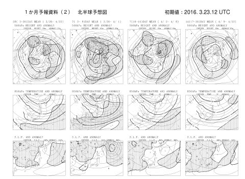
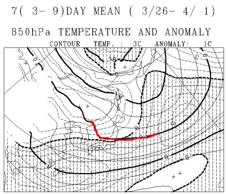
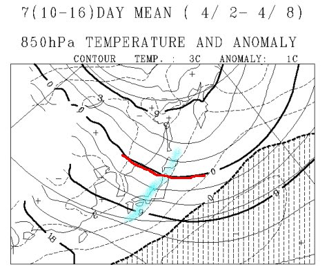
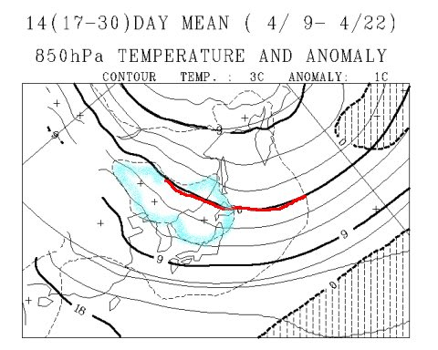
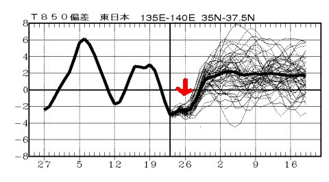

# GWまでスキー場の雪はもつのか？？一か月予想天気図から，4月が冷えるのかどうか読み解いてみた…が…

📅 投稿日時: 2016-03-25 01:29:05

えー．

志賀高原では，本日木曜．

[ボチボチ雪が積もった](https://www.facebook.com/yakebitaiyama/videos/vb.116999658395389/959385324156814/?type=2&theater)ようですね…

これから，金曜の朝にかけて．

またさらに多少の積雪の積み増しがあります！

＃…っていっても，最大10cm程度ですが…

まぁ，この時期にとっては，恵みの雪ですね～っ！！！

…ただし．

金曜一日降り続けるほどではなく．

朝のうちに止んじゃいそうな感じなのが，

ちと残念ではありますが…

その後，金曜の朝に雪が止んで以降，

土日はほとんど積雪はなさそうです（涙）

…まぁ．

とはいえ．

金曜朝までに積もった雪がいいので．

土曜朝はかなりいいコンディションという予想は

変わらずですよ～！！！

＃午後は下地のアイスバーンが出てくるかもしれないけど

あ，そうそう．

日曜27日の850hpa気温図ですが…

なんとっ！

0℃線は志賀高原より南の予想に変わりましたっ！！！

これで，日曜に雨が降る可能性はほぼ0になりました．

良かった～っ！！

この週末は，いい感じの冷え冷え週末になりそうです！

＃これで，土日に雪が降ってくれれば…（残念）

で．

冷え冷えの今週末が終わったら．

なんと．

もう4月に突入ですね～．．．

ってことで．

この4月は冷えるのか！？？

自然はいろいろ帳尻を合わせて，

これまで降らずにどこかに溜まっていた雪が，

ドサドサ降るような4月になるのか？？

…ってあたりを．

一か月予想図を見て，占ってみましょう…

これまで何度か出てきた，FCVX12を見てみるわけですが…

この図から，3月26日～4月1日の，850hpa気温図を

取り出してみると…

ふむ．赤線で描いた0℃線，まだ志賀高原近辺にいて．

そして，志賀高原は大体網掛けの平年より気温が低い領域と，

網掛けがない平年より気温が高い領域のちょうど境目．

…なので，大体平年並みの気温になりそう．

まぁ，この時期は安心かな．

そして，4月2日～4月8日の図を見てみると…

げげげ！！

なんだこりゃ！！

赤く印した0℃線は東北北部まで上がっちゃってるどころか…

志賀高原は，水色で描いた平年比+2度のエリアに

入ってますが？？

一週間平均が平年比+2度って…

これは．

また，異常高温レベルなんですが！！？？

4月になっても，異常高温が来るってこと…？？（激涙）

あまりにもひどい4月上旬の予想に涙を流しつつ，

続く4月9日～4月22日の2週間の予想を見てみると…

…

…

…！！？？

この2週間も．

また，水色で示した，

平年比+2度エリアが志賀高原を襲っているっ！！（泣）．

な…なんてこったっ！！！！！

もう，0℃線は北海道へ行ってるし…（悲）．

…

って感じで．

4月に，雪は全く期待できない予想なんですけど…（涙）．

で．

850hpa気温の，今後の予想を見てみると…

赤く矢印でマークした，冷え冷え週末の今週末の26日近辺．

このあたりで，平年比-2度となっている以外は…

それ以降．

ずーーーーーーっと，平年比+2度くらいになりそうな

予想が続いているんですけどっ！！？？

…なんてこった…（頬を伝わる涙）．

…このままの予想だと．

4月も異常高温の一か月になり．

GWのスキーはかなりの危機に陥りそうな感じです．

あぁ…

ダメだ…

ダメだよ…

…そうです．

この予想が外れるよう．

スキーヤーのみんなの願いを集結するのだ！

来週から一か月間．

久しぶりに．

情熱的に．

止まることなく．

休むことなく．

強く念じながら，

踊り続けるしかありませんっ！！

エクストリームハイパー冷え冷え踊り～GWまで雪がもつことを念じて～をっ！！

＃4月に入ったら，もうスキーはいいやって人がほとんどで，

＃踊りに参加する人が著しく減りそうな気がするのだが…

## 💬 コメント一覧

### 💬 コメント by (まいる)
**タイトル**: 今週は冷えますが
**投稿日**: 2016-03-25 21:08:57

Sさん、お疲れ様です(^^)v

今週は冷えるし雪が降るようで、よいコンディションで、ボードの草テクに出れそうです。

それ以降の週は冷え冷え踊りかなぁ・・(-_-;)

### 💬 コメント by (takac)
**タイトル**: 一の瀬にいます
**投稿日**: 2016-03-25 22:53:46

今日の午後、一の瀬に来ました。

ナイター冷え冷えです！！（-10°c）

が… 星空がキレイ…。

### 💬 コメント by (Skier_S)
**タイトル**: 最後の冷え冷え週末かな？
**投稿日**: 2016-03-25 23:24:42

＞まいるさま

草テク，頑張ってください…

今週末が最後の冷え冷え週末にならないよう，

来週以降は情熱的に踊り続けてください（笑）

＞takacさま

ナイターいい感じですか！

明日の朝イチも最高だと思います！

早朝はいいだろうなぁ…

早朝に行くためには，睡眠時間が2時間を

切ってしまうので，私は残念ながら通常営業

からですが…（涙）．

明日は昼間は焼額ぐるぐるしてます～！

