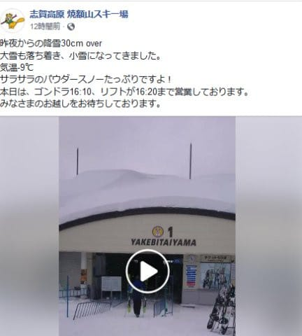
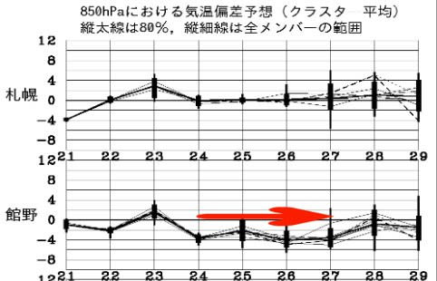

# この正月休み，新しいスキーウェアをデビューさせたのだが

📅 投稿日時: 2019-01-23 01:57:35

🏷️ カテゴリ: [日記](cc4b5682fb7b8b144980957a978653fb0.md)

うーむ．

スキー場レポートが無いと，スキーネタをいっぱい

書かねばならず，めんどくさいので．

やっぱり，毎週志賀高原に行かないと！

と，改めて思っている，Skier_Sです．

とりあえず．

今朝も志賀高原は新雪が30cmほど積もったようですが．

（[焼額山FB](https://www.facebook.com/yakebitaiyama/posts/2009150785846924)より）

日，月，火とそこそこ積もったし．

23日水曜は晴れそうだけど．

水曜夜から木曜一日中，また雪が降りそうな

感じ…

そして．

24日以降，26日まで．

平年比2～4℃低い気温が続きそうで．

この週末，また冷え冷え雪降りに

なりそうです…

まぁ，暖冬が危惧されていた今シーズンにしては．

今のところ，割といいペースで降ってくれてるのでは

無いでしょうか．

…そうです．

それもこれも，みんな私の祈りのおかげ…っ！！（ドス）←読者に刺された音

…し

…しつれいしまし…た…（血を流しながら）

と，とりあえず．

本題の，この正月休みのネタへ…

えー．

この正月休み．

[物欲選手権に敗れた結果](eb4bda6045599e99f977e557f6cd2763c.md)として入手した，

ニューウェアをデビューさせたのですが．

大体いつも焼額で会っている人たちとは，

スキーウェアが制服みたいなものだから．

ウェアを見て

「あ，○○さんだ！」

と認識するわけで…

だから，まったく同じウェアの他人に間違えて

ついて行ったり，声をかけそうになったりすることもある

そのくらい，スキー場では誰かをウェアで

判別するわけなので．

「…ウェアを変えても，みんな私と

認識してくれるのかな？」

というのが気になるところ．

それで．

ゴンドラ乗り場でさりげなく立っていると．

何人かはニューウェアの私に気づきましたが．

気づかずスルーする人も数名…

私も，今シーズンウェアが変わった他の方に

気づかず，豪快にスルーしたことが数回

あったけど．

…やはり，スキー場ではウェアで個人識別

してるんだなぁ…

ということを痛感．

焼額のリフトスタッフにも．

何も言わずにリフトに乗っていたら．

最初は「？」という感じの人もいましたが．

大体1-2回乗っていたら

「あ，ウェア変えたんですね！」

とほとんどの人に気づいてもらえました…

スキー場ではゴーグル＆フェイスマスクで

顔が完全に隠れているんだけど．

板やらゴーグルやらで識別してるんでしょうねぇ…

ただ．

リフト乗り場なんかでは，滑りを見ないから，

私だと認識するまでに時間がかかったけど．

…新しいウェアで奥志賀高原を滑っていた時．

私がウェアを変えたことを知らない某氏が，

かなり遠くのリフトの上から私に手を

振っていたので．

…ウェアを変えても，滑りを見れば

一瞬で私だとばれるようです．

まぁ，私の滑りは癖があるようですから（涙）

ということで．

この正月休みから，

私のウェアは変わっています．

だもんで．

前のウェアを手掛かりに私を探した場合．

違う人に声をかけてしまうことになりますので，

ご注意ください…

## 💬 コメント一覧

### 💬 コメント by (Seeker.NT)
**タイトル**: Renewal
**投稿日**: 2019-01-23 03:42:35

赤いブーツと相まってかっこ良かったですよ。

私も先々週からウェア上下とポールを更新しました。メットも派手な色のものを購入てステッカーでデコしましたが、未だ鮫印のメットを継続使用してます。些細な事ですが、どのタイミングで下ろそうかなと思案中です。

### 💬 コメント by (naoちゃんねる)
**タイトル**: 祝 ニューウェア
**投稿日**: 2019-01-23 15:45:39

ゴンドラ降り場で豪快にスルーした者です(笑)

いやーblogで同系色のニューウェアになると知っていて、それでもゴーグルで顔が隠れてると気付かなったです。

あの後、娘が「Sさんウェア変えたんだね」と言っていました。「前のウェア、ボロボロだったもんね…」とも言っていました(笑)

女性はファッションに敏感なようです…

### 💬 コメント by (若杉勲71)
**タイトル**: 志賀高原に
**投稿日**: 2019-01-23 20:47:32

今日は昨日の新雪を踏んで、ふかふかの圧雪バーンでした。ニゴンから奥志賀、バス、一ノ瀬、高ま、ニシタテ、卵ゴンドラ、高ま、一ノ瀬と、しっかり遠足をして、今日も虹、じゃない、２時きっかりに２ゴンに帰った、レインボークラブ員でした。

### 💬 コメント by (若杉勲71)
**タイトル**: 志賀高原情報
**投稿日**: 2019-01-23 20:52:20

奥志賀で久々にgokuさんを見かけたんですが、すれ違いに終わってしまいました。誰も途中でゆっくり止まらないので、ゴンドラで一緒するしかないのかなあ。

### 💬 コメント by (べー)
**タイトル**: Unknown
**投稿日**: 2019-01-23 23:41:55

実は３日の昼前に１ゴン麓駅舎前で同行者を待っていたら赤いブーツにSX、そしてウェアはあの色。

これは間違いなくSkier_Sさんだーと認識したのですが瞬間移動で駅舎内へ…(笑)

でもNewウェアですか…Newも同色系なら間違いないかなぁ？

### 💬 コメント by (しんちゃん)
**タイトル**: 似合ってる～♪
**投稿日**: 2019-01-23 23:51:43

ＮＥＷウエア、すごく発色いいですね(^^♪

Ｓ様同様、ウエアが毛羽だってきたので、そろそろ変えたいなと思いつつ、展示会で物色していてＳ様のＮＥＷウエアと同じメーカーのが結構いいなと思っていたところでした。

今シーズン、皆さんのウエア更新率が高く、皆さんのＮＥＷウエアの着心地などを参考にしたいと思います。

### 💬 コメント by (Skier_S)
**タイトル**: 久しぶりのニューウェア！
**投稿日**: 2019-01-24 01:31:28

＞Seeker.NTさま

あ，ニューウェア買われたんですね！

でも，ウェアを変えたら，私はSeeker.NTさんを認識できなくて，

豪快にスルーしてしまうかもしれません…

その際は呼び止めてください(笑)

＞naoチャンネルさま

ウェア変えたら，やっぱり気づかないですよね，普通は…

しかし，前のウエアはボロボロだと認識されていたんですね…

実際にその通りですが(笑)．

でも，20000mゴールド常連の方は，ウエアを着ている時間もハンパないので，

みんな私よりボロボロのウエアを着ている気がします．

私のウエア，20000mゴールドメンバーの中ではまだ

マシな方だったのでは…と思っているのですが(笑)

＞若杉さま

今日も2時上がりだったんですね(笑)．

さすがレインボークラブ…

そして，20000mゴールドな方は基本コース途中で

止まらないので．

捕まえにくいですよね…

＞べーさま

あら．

発見されていましたか…！

色の系統は同じですが，色味が結構違うので，

前のウェアと印象はかなり変わったかと．

次に発見したら，ぜひ声をかけてください～！

私はゴンドラの乗り降りが異常に速いので，

タイミングが難しいようですが(笑)

＞しんちゃんさま

新しいウェアは，いろんな意味で輝いて見えますよね…

前のウェアがぼろかったですから．．．．

とりあえず，ニューウェアは使い勝手はいいです．

防寒性能は前のウェアとあんまり変わらないかな…

