# 4月13日の志賀高原ゲレンデ状況詳細…4月というのに晴天，雪質もGoodですね～！

📅 投稿日時: 2014-04-15 01:58:10

🏷️ カテゴリ: [2014スキー滑走日記](c992167609b6415052179ee69ea1ea7d8.md)

ってことで．

昨日速報した，日曜の志賀高原のゲレンデ状況の

詳細をば…

えー．

先日，速報したように．

土曜はナイターまで滑ったというのに．

日曜朝．

なぜか気がつくと．

6時半の早朝営業開始時に．

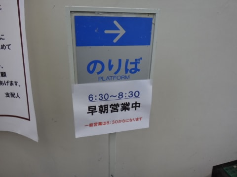

焼額第2ゴンドラの早朝営業スタート待ちの列に

並んでいる自分を発見したのでした…

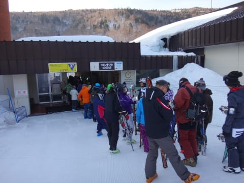

うーむ．

人として終わってるかもしれないけど．

私はスキー猿ってことで．

人じゃないから．

良しとしておこう．←よくわからん理論だ

…ということで．

早朝のゴンドラで，山頂へ登ると．

気温は，マイナス2度．

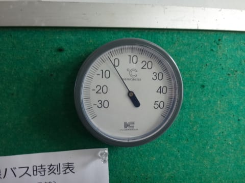

この時期としては標準的な冷え込みかな～．

早朝のゲレンデは…

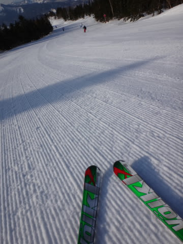

うほほほほほほほっ！

シマシマっ！

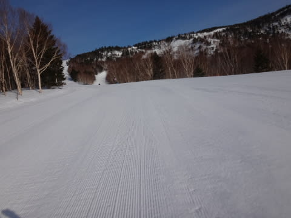

うはははははっ！

ガラガラっ！

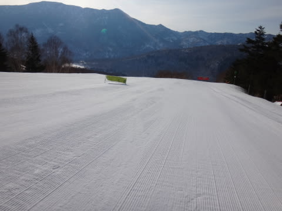

わははははっ！

雪質はアイスバーンなれど，エッジがしっかり効く

官能ハイスピードのロングターンしたい放題，

やりたい放題，楽しみたい放題の

自由落下バーン！！！

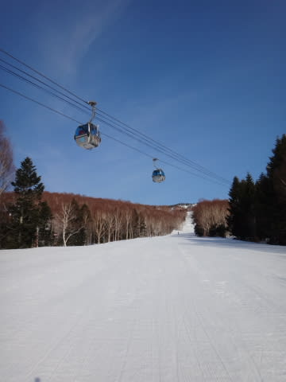

ゴンドラも，1本目は営業開始前から列が

ついていて，3分ほど待ったものの．

そのあとは…

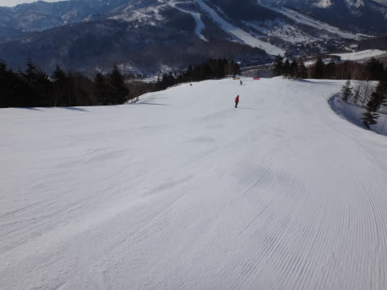

人がいない快適バーン！

…これは．

6時半～8時半の2時間，1500円払う価値はあるっ！！

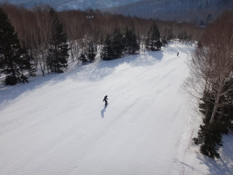

8時半以降の通常営業開始以降も，

まだまだ雪は緩まず．

表面が，ホントに気持ちよくエッジが食い込む硬さの

しっかり硬いバーンで．

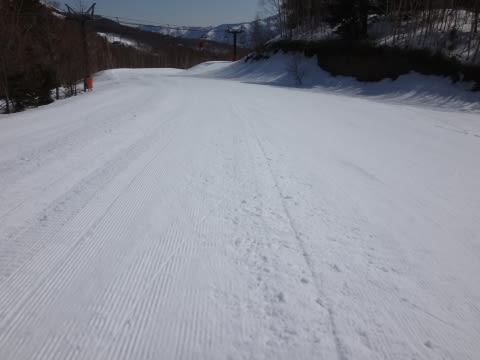

ええの？

こんなに楽しくて，ええのんか？

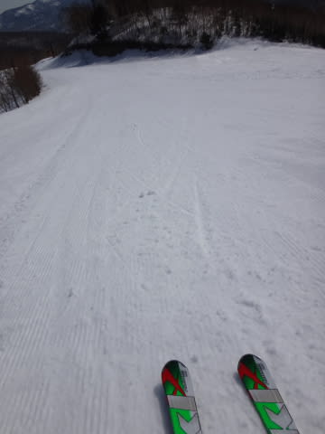

…って感じだったけど．

9時半ごろには，ちょいと人が増えてきたかな～

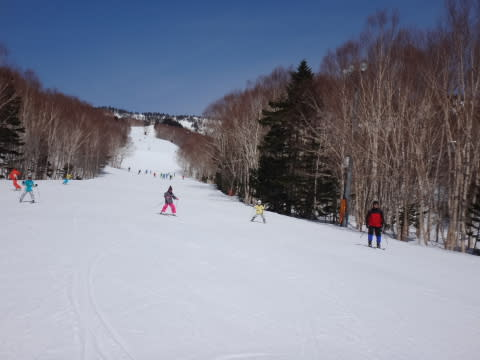

まぁ，ゴンドラ待ちはほとんどないから，

まだ許せます．

で．

この日も，土曜と同じく…

昼間もすっきり晴天というのに…

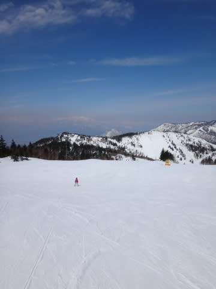

昼間も気温が上がらず．

12時頃でも，こんなに雪質がいいんですがっ！？？

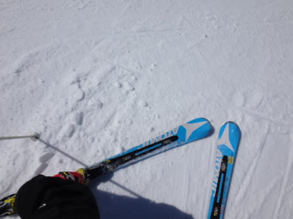

昼からは，私にしては珍しく，寺子屋まで

出てみましたが…

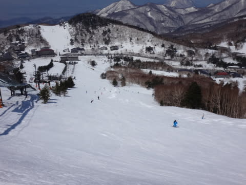

あんだ，これはっ！

なんだ～！この雪質の良さはっ！！

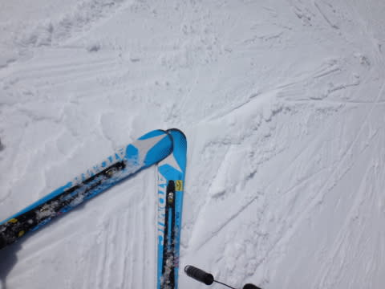

4月中旬の，快晴の日が射す午後に，

こんなに雪が良いとはっ！

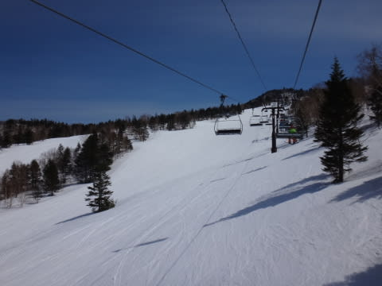

この時間で，気持ちよいロングターンができるとはっ！！

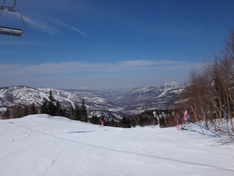

おそるべし，志賀高原！！

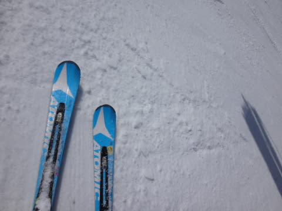

…午後3時ごろに焼額に戻ると…

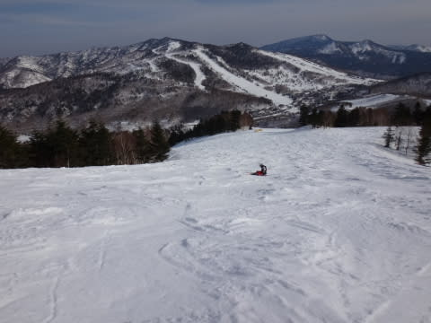

さすがに焼額のゲレンデは，ちょっと荒れてたけど．

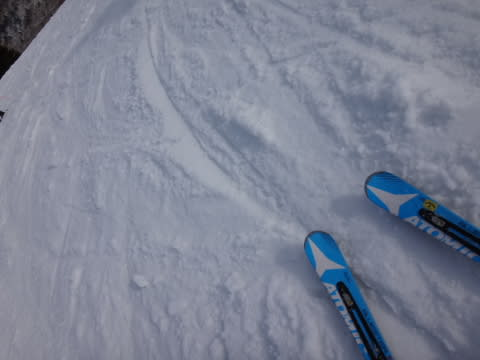

普段なら，雪がドボドボになっちゃうこの時期．

まだザラメ程度の悪化具合でおさまっているとは

恵まれてますね～．

[…まぁ，先週があまりにもありえないほど良すぎた](ea5fd77e4ebf604e6328fdb3a568eafb1.md)ので，

それと比べてしまうと

「ああ，春だなぁ」

って感じだけど．

…でも．

普通のこの時期と比べると，

晴天ピカピカの天気というのに，結構いい雪で滑れて．

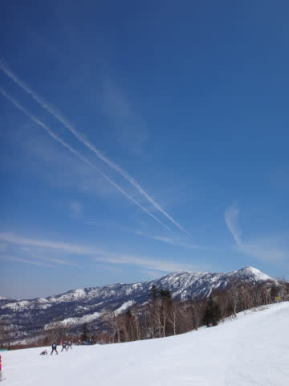

恵まれた週末だったな！

ってことで．

志賀高原．

まだまだ余裕で滑れますよ～！

## 💬 コメント一覧

### 💬 コメント by (Sora)
**タイトル**: 仕まおうか迷っている私
**投稿日**: 2014-04-15 21:50:39

晴天下、ガンガンスピードが出る締まったバーン、爽快ですよねー。私も、まだ人間並みにですが（笑）、先週末楽しませていただきました。

GWが終わるまでに、雪が降るということは、確率的にあるのでしょうか。

### 💬 コメント by (Skier_S)
**タイトル**: Soraさま
**投稿日**: 2014-04-16 00:57:38

志賀高原は，GWまで雪が降る可能性が

ありますよ～

例えば，去年のGWは

5月2日

http://blog.goo.ne.jp/tsakamot2001/e/55eaee1b2e2ac9d3c0b49e053fccf5d2

4月27日

http://blog.goo.ne.jp/tsakamot2001/e/d87ecc584671a2c396ada52e71fdf5a5

とか，

あるいはおととしは，5月中旬の

5月12，13日

http://blog.goo.ne.jp/tsakamot2001/e/3bae2b782961d95b4b24cde5cf7154e7

とか…

まぁ，これは良すぎる年の例ですけど．

GWに雪が積もっても不思議じゃないのが，

志賀高原ですよ～！

### 💬 コメント by (Sora)
**タイトル**: いつでも夢を
**投稿日**: 2014-04-16 11:49:01

ありがとうございました。

降るときは、あるのですねー。

ではスキー道具、スタッドレス、一応スタンバイさせておきます。

SkierSさんの、日ごろの行いもよろしくお願いします（笑）。

### 💬 コメント by (Skier_S)
**タイトル**: Soraさま
**投稿日**: 2014-04-17 00:26:30

日ごろの行いはいつもいいから，大丈夫です！（嘘）

…でも，この週末，日曜は残念ながら雨になりそう…

また，GWに期待ですね！

