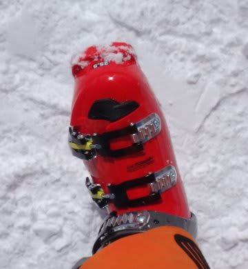

# ATOMIC Redster PRO 130と Volkl Platinum CDの相性が…

📅 投稿日時: 2014-05-15 01:48:40

🏷️ カテゴリ: [スキー雑談](c1f9d2cb7478308da16419928ea3945e9.md)

最近．

一見嘘と思えない，それっぽい嘘をいっぱい

つきまくっているので．

時たま「[シャープって，シャープペンシルを作った人が
起こした会社だよ](http://www.sharp.co.jp/corporate/info/outline/)」とか，本当のことを言っても．

全く信じてもらえなかった，Skier_Sです．

さてさて．

今シーズン，[全く予期せず新しいブーツを買って](e4eb8b62d644e240a6080cac72ad69416.md)．

しばらく滑ってみたわけですが．

…このブーツ，やはり欠点もあるわけで．

まず，一つ目は．

[ここ](e49ba60ca83abf037c6421d52c585d288.md)でも書いたように．

…なんだか，私の大回りマシン，Volokl Platinum CDとの

相性が．

強烈に悪いんですよね…

板が耐え切れずにずれていく感じ…

（略）

…VOLKL Platinum CDって，こんなに柔らかい板

だったっけ？

ブーツの押さえに耐え切れず，グリップを失っていく

板だったっけ？…って感じます．

って書きましたが．

…この理由がなんとなく分かってきました．

ATMOICブーツを履いた後．

SALMONブーツに戻して，VOLOKLを履くと．

張りが強くて，グリップもしっかりしていて．

しっかりと板のトップとテールを

使える感じ．

谷回りで板のトップから切れ込んでいき，

仕上げでテールに向かって抜けていく…

という滑りができ．

やっぱこの板，いい板だわ～

…って，思います．

で…．

ATOMICのブーツに戻して滑ると．

張りもグリップも弱く，

テールを押さえても，板のテールが弱くグリップせずに

逃げていく感じで．

トップを押さえてもトップから切れ込む感じが弱いという…

うーむ？？

ブーツを履き替えつつ何度か滑って気づいたんですが．

これって．

…ATOMICのブーツを履いた時の，この感覚って．

板のプレートを弱くした時と同じ感じだわ…

どーやらATOMICのブーツ．

これまで履いていた，SALOMONブーツと比べて．

ブーツソールがかなり柔らかいみたいなんですよね．

で．VOLKL Platinum CD．ある程度のソールの

硬さがあるブーツと合わせることを想定してるのか？

ブーツソールが硬いSALOMONと組み合わせると，

しっかりとしたグリップとフレックスが出るけども．

ソールが柔らかいブーツと組み合わせると，センター部分が

たわみすぎちゃうようで…．

…VOLKLの板．

SALOMONブーツとの組み合わせでは，GWの早朝

アイスバーンでも，すごく気持ちいいグリップで，

快楽の大回り性能を発揮してくれる，いい板なんだけど

…ATOMICブーツとの相性が悪いとなると．

…悪いとなると

…

…

いや．

いやいやいや．

買わないぞ！

新しい大回りの板なんて，

買わないぞ～っ！！！！

## 💬 コメント一覧

### 💬 コメント by (れお)
**タイトル**: 買っちゃいましょう
**投稿日**: 2014-05-15 09:01:58

買っちゃいましょう!!(笑)

第３回選手権を楽しみにしてます♪

### 💬 コメント by (たむらぱん)
**タイトル**: Unknown
**投稿日**: 2014-05-15 12:03:24

これからは板とブーツの2台持ちが流行るんですね(震え声

### 💬 コメント by (Skier_S)
**タイトル**: 買わない，買わないぞ～（棒読みで）
**投稿日**: 2014-05-16 01:15:54

＞れおさま

買いません，買わないです．買わないつもりです…

…今のところは（ぼそ）．

＞たむらぱんさま

流行る！

流行ります．

ブーツ2足持ちっ！！！

もう，来シーズンは，大ブームのはずですよ！

### 💬 コメント by (ひろりん)
**タイトル**: Unknown
**投稿日**: 2014-05-16 15:38:12

貴方のような方が低迷するスキー産業を

支えているのだと思います|電柱|ー￣）

板2セット以上持ち込みはあるけど

ブーツ2足以上は今までなかったなぁ( ==)トオイメ

### 💬 コメント by (Skier_S)
**タイトル**: ひろりんさま
**投稿日**: 2014-05-16 22:39:44

そうです．

私がスキー業界を支えていますっ！（きっぱり）

…スキー業界にとって，最もおいしいカモでしょうね…

私は（笑）．

とりあえず，

ひろりんさまも，これからの大ブームに

乗り遅れないよう，ぜひブーツ2足持ちを（爆）

