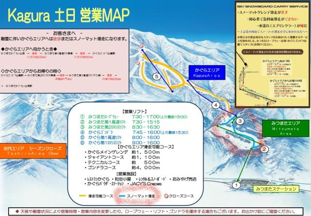

# 2019シーズンのスキー板，試乗レポート第8回…VOLKL編その2

📅 投稿日時: 2018-05-11 01:06:41

えー．

かぐらスキー場ですが．

みつまたエリアの雪が無くなり，

ついにスノーマットに

なっちゃったようですね…（涙）

（[かぐらスキー場HP](http://www.princehotels.co.jp/ski/kagura/files/pdf/20180512kagura_map.pdf)より引用）

さすがにここしばらくの雨続きで

やられちゃいましたか…（泣）

Pislab滑ると，板が痛むんで．←シャレじゃない

うーむ．

もう少し雪がもってほしかった…

しかし，このマップを見ると．

まだテクニカルとジャイアントが滑れるようですが…

ジャイアントはまだしも，テクニカルは

ホントに滑れるのかな？？？

ってな感じで．

雪が減ったと言いながら．

まだ5月中旬も，かぐらは滑れるようなので．

まだまだスキーシーズンは続きますよ～！

だもんで．

GWで中断していたスキー試乗レポート，

行きますよ～！

本日は，フォルクル編です．

では，どうぞ～！

ーーー

○VOLKL RACETIGER GS DEMO 175cm

基礎大回り用

これは，今年のPlatinum GDの後継に当たるのかな…？

DEMOシリーズの大回りトップモデルです．

この板も，SL DEMO同様，トップを抑えなくてもすっと

谷回りに入っていく，ロッカー板っぽい味わい．

…ってか，この板もやはりトップロッカーのようで．

大回り板なのに，結構軽快．

板について落ちて行けば，縦に長く落としていく

谷回りができます．

山回りではガッツリグリップ系ではないけど，

傾けていくとしっかりグリップして回っていきます．

強く圧をかける感じではなく，乗っていくだけで

回っていく，比較的気楽に乗れる板．

ものすごいトップスピードでガッツリ大回り，

というより，それほど力を入れなくても気持ちよく

グリップした，縦長の弧が描けるし．

荒れた斜面でも振動が少なく，

比較的楽に滑っていけるので．

基礎大回りというより，大回りベースの

クルーズ板として良いかも…

## 💬 コメント一覧

### 💬 コメント by (タカ)
**タイトル**: 勘違い
**投稿日**: 2018-05-12 01:00:58

来期用板のシリーズはいつも参考にしてます。子供の頃、フォルクルをボルクと読んでいました恥。ただ今年はSX買ったから来期は買わない。太板とか絶対買わないんだから❗

### 💬 コメント by (Skier_S)
**タイトル**: タカさま
**投稿日**: 2018-05-12 04:29:31

あ，昔はみんなフォルクルじゃなくボルクルと呼んでませんでしたっけ？

正式呼称を英語発音のボルクルから，

ドイツ発音に合わせたフォルクルにしたのが

マーカーフォルクルジャパンが日本向けに

板を取り扱いだした15年ほど前だった気が…

…すいません．うろ覚えですが…

で．

太板買うんですね（笑）．

ぜひ，一緒に物欲選手権で大敗しましょう！！（悪魔の誘い）

### 💬 コメント by (ikkun)
**タイトル**: Unknown
**投稿日**: 2020-05-28 09:23:31

おはようございます☺️

試乗レポート……やはり繋がりました(^^)参考にさせて頂いた試乗報告でしたね～(笑)  ありがたきm(__)m

### 💬 コメント by (ikkun)
**タイトル**: Unknown
**投稿日**: 2022-02-15 10:31:26

おはようございます

ちなみにこれを20年に5万台で購入( *´艸｀)繋がりました❗ありがとうございましたm(__)m

### 💬 コメント by (Skier_S)
**タイトル**: ＞ikkunさま
**投稿日**: 2022-02-16 01:45:06

この板買われてたんですね．

レポート通りの板だったでしょうか…？

