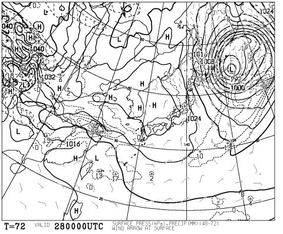
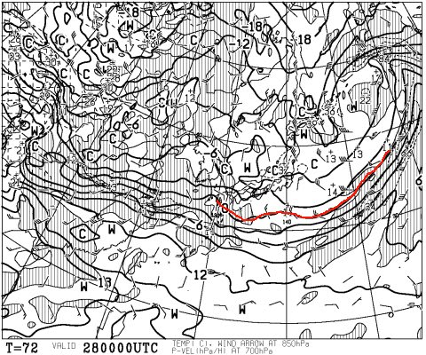
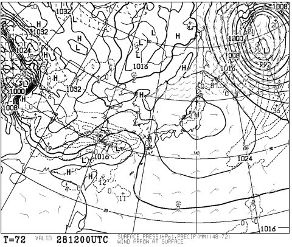
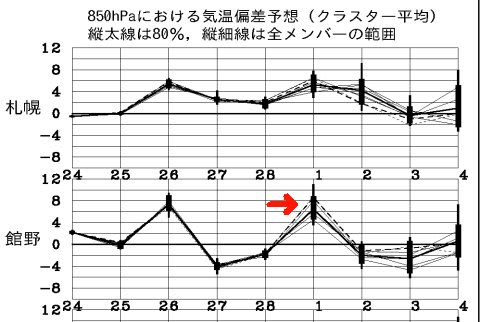
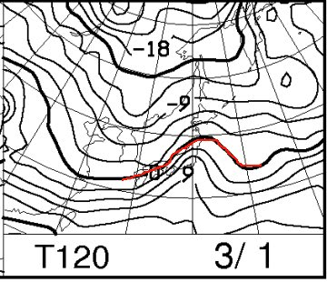
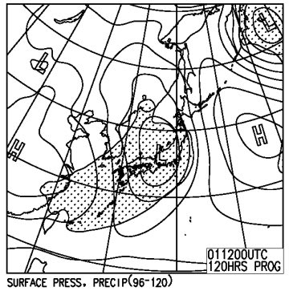

# 恒例！今週末の志賀高原の天気は…土曜は良さそうだけど，日曜は…雨？

📅 投稿日時: 2015-02-26 01:58:32

🏷️ カテゴリ: [スキー天気予想](c6554f5c3c106093b511a8daae23757e8.md)

えー．

どうやら，26日夕方の雨は，降ってもぽつぽつ…て感じで．

それほどひどい雨にならずに済みそうな今日この頃．

皆様いかがお過ごしでしょうか．

ってことで，

やっぱり，金曜日27日は．

冷えて，いい雪が積もりそうですよ～！！

で，28日土曜日の朝の地上天気図ですが…

ふーむ．

まだ，かすかな冬型が残ってる感じなので．

これは，朝のうちは雪が降るかな？

で，850hpa気温図を見ると…

0℃線はかなり南に下がっていて．

ふむ．

志賀高原，朝はマイナス10℃近くまで冷えてくれそうなので．

土曜朝は，冷えた新雪が積もってるかな～！

で．

土曜午後の天気図はこんな感じで．

午後はすっぽり高気圧に覆われるので，

これは…土曜の午後は，晴れるよっ！

朝から降っている雪が，いつごろ止むのかは見切りが難しいけど…

まぁ，昼には雪も止み，日が射し始めるかな～．

ってことで．

土曜の朝は冷えた新雪が積もり，

午後は晴れ…という，理想的パターンではないか！？？

なんとなく，土曜はいい感じっぽいですな～っ！！

＃午後はコブコブになるかもしれないけど

…だが．

喜ぶのは早いのだ．

…問題は，次の日曜なのだ．

矢印で記した，日曜日の気温だけど…

あんだ，これは！？？

なんだか，一気に気温が上がりそうなのだけど…（涙）

土曜より，8度くらい上がりそう…

日曜の850hpa図を見ると…

あーー．

なんだか．

ダメな感じ…（泣）．

0℃線は志賀より北まで上がっちゃってる…

さらに，地上天気図を見ると．

低気圧がすっぽりと…

降水域の網掛けが，志賀高原にもかかってます…

これは．

残念ながら．

強い南風が吹いて，気温が上がる，22日の日曜と同じパターン．

…また，この日曜も，[あの悪夢](e6e5d80eb98831048b21352e1b0e0ab94.md)が繰り返されるのか…？？

日曜日，降り始めがいつになるか，まだ見切りは難しいけど．

降れば雨（涙）．

運が良ければ，22日みたいに夕方まで降らずに済んでくれそうだけど．

低気圧は，22日よりかなり南側を通過するので，

うーむ．

あまり幸運は期待できないか…

…運が悪ければ…

昼ごろには，雨…か？？

…

…

ふ，不吉なことは，考えないことにしよう…

ってことなので．

まとめると．

土曜：朝は冷え冷えの雪が降っていて，圧雪バーンもうっすら

　　新雪が積もってるでしょう．

　　非圧雪バーンは，ブーツパフ程度のパウダーかな…

　　午前中に雪は止み，昼前から雲が切れ始め，午後はすっかり晴れ！

　　ピカピカ晴天なのに気温が低く，いい雪質で，いい感じの午後でしょう！

　　…でも，人が多ければ．午後は柔らかい雪が蹴散らされた，

　　ちょっと荒れたバーンになるかな…

日曜：朝は雲が多いけど…運が良ければ，まだ日が射すかな？

　　南風が強くなり，ゴンドラは減速運転の可能性が…

　　だんだん雲が増えていき，どこかのタイミングで雨が

　　降り始める…

　　運が良ければ夕方まで降らずにもち，

　　運が悪ければ，昼すぎごろからぽつぽつ降り始める…

って感じですか．

…土曜は良さそうだけど．

日曜は…うーん．微妙…

とりあえず．

日曜日，日ごろの行いが悪い人がゲレンデに来ないように．

みんな，必死に祈るのだ…っ！！←そーゆーことを祈るのね？？？
