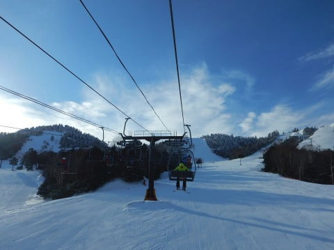
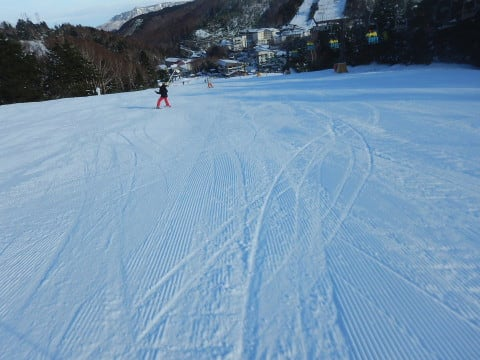
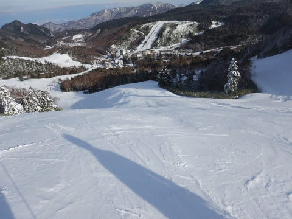
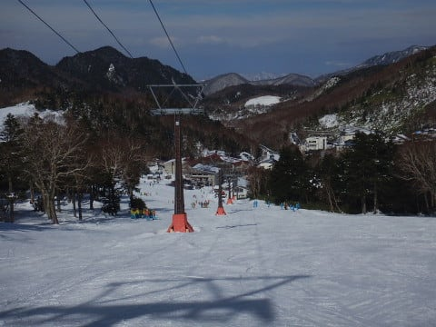
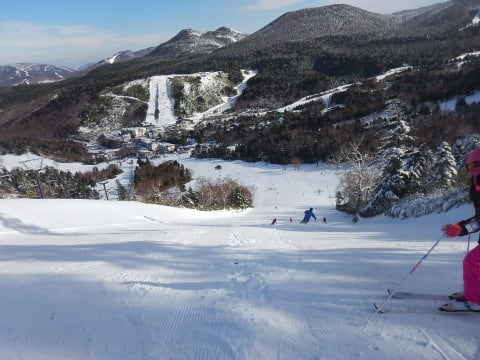
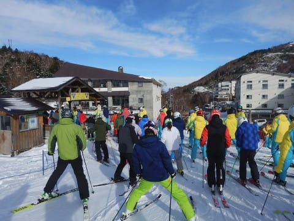
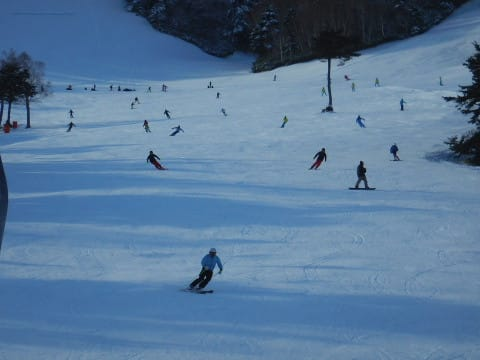
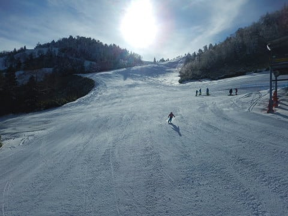

# 11月26日（日）の熊の湯速報モード…かなり広範囲滑れていい感じ！そんなに混まなかったよ．

📅 投稿日時: 2017-11-27 01:20:28

って感じで．

かぐら→アサマ→熊の湯という，

スキー場はしごツアーの最終日の本日．

熊の湯へ行ってきたわけですが．

…はい．

そうです．

今日も帰宅は深夜です（涙）．

なんだか．

昨晩アサマから帰ってきて．

今朝は朝4時前に家を出た気がするのだが…

帰宅は深夜12時近くという．

うーん．

今日もヘビーな一日だった←ヘビーな毎日があなたの普通なのでは？…というツッコミをしている人多数

…だもんで，本日は．

日曜夜定番の，速報モードにて…

えー．

まず．

今日の朝は…

すっきり晴天っ！！

そして，第2緩斜面が，リフト下含め

幅いっぱい滑れるどころか…

うむ．

馬の背も普通に滑れるじゃないか！

…それどころか．

第3クワッド下の下半分．

第3緩斜面も滑れるの？？？

いやいやいや．

なに？

それだけじゃない？？

第4イベントコースもOK？？

なんと．

予想より広い範囲が滑れるじゃないですか…！！

タイミングによっては，多少

リフト待ちがあったものの．

SAJの団体さんと重ならなければ，

それほどの混雑もなく．

バーンの幅も広く，滑れるコースも多いので，

ゲレンデも人が適度に分散して，

好きなラインを気ままに滑れる感じで．

いや…

これは，昨日のアサマより，ずっと

快適ではないですかっ！！！

ってことで．

天気は良く．

雪もエッジがしっかり効く締まった

圧雪で，スピードが出るのにエッジが効くし．

いやーーーー！

もう，今日は超気持ちよかった！！

これはもう，トップシーズン並み．

恵まれてる．

この11月，恵まれている…

とりあえず．

このご無体3日間でちょっと疲れ気味なので．

…いや．

何度も言いますが．

私も人間ですので，疲れるんです．

いや…そこ，驚くところじゃないですから．

ってわけですから．

今日はこの程度で．

明日また，詳細レポートやります…←だから，これでも十分詳細な気が…

では，おやすみなさい～！

## 💬 コメント一覧

### 💬 コメント by (michi)
**タイトル**: Unknown
**投稿日**: 2017-11-27 17:16:52

3日間の移動距離など凄いのにＳさんだとだんだん普通に感じてきますね（笑）

自分も毎週、某Ｓ玉県とN野県を行き来してますが、夜中到着はキツいので早めに移動してます。

移動時間は3時間未満ですが、、、

今年は雪が速くて良さそうですね。

自分は来週、初滑り予定です。行けたらヤケビに行きます。お会い出来たらご挨拶致します(^^)

### 💬 コメント by (Goku)
**タイトル**: お疲れさまでした～
**投稿日**: 2017-11-27 20:44:13

昨日はお疲れさまでした。

天気も雪も良く、娘さんも最高の初滑りだったのでは！

午後の部も楽しめましたか？

来週はいよいよ焼額山オープン、長い様で短い５ヶ月間のスタートですね。

では、また来週！いや毎週か（笑）

### 💬 コメント by (まうちゅう)
**タイトル**: Unknown
**投稿日**: 2017-11-27 21:01:51

まさかの日帰り３連荘！？

かと思いましたが途中に１泊と聞いて安心しました。

### 💬 コメント by (しんちゃん)
**タイトル**: やっと晴れ
**投稿日**: 2017-11-27 22:51:11

３連チャンお疲れ様でした。

志賀に行ってやっと晴れたのでは。

しかも広くなったゲレンデで、好きなラインも描けて、よかったですね♪

### 💬 コメント by (Skier_S)
**タイトル**: 熊の湯，良かったですよ～！
**投稿日**: 2017-11-28 06:16:19

＞michiさま

移動時間3時間未満ですか…

うらやましいです．

私にとっては気楽に行ける距離ですね．

この週末はヤケビですか！

私も焼額滑ってる予定ですので，

またお会いしましょう～！！！

＞Gokuさま

昨日はお世話になりました！

娘と滑ってもらって，ありがとうございました．

最高の天気，最高の雪で

娘もなかなか帰りたがらず，

いつもの「まだ滑りたい～！！」

が出ました（笑）

午後の部も楽しめました！

充実の一日でした…

＞まうちゅうさま

私も最初，日帰り3連チャンの予定でしたが…

さすがに死ぬと思い，途中に一泊入れました（笑）

元々は26日は滑る予定がなかったのですが．

あまりのコンディションの良さについつい…

でも，最高の一日でしたね！

＞しんちゃんさま

トップシーズンでもそうそうない，

天気よし，雪よしの一日でしたよ！

そちらの初滑りはいつですか？？

ぜひ，Goodコンディションの志賀高原へお越しください～！

