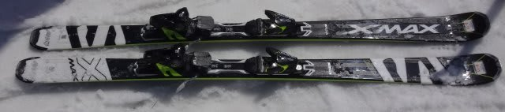
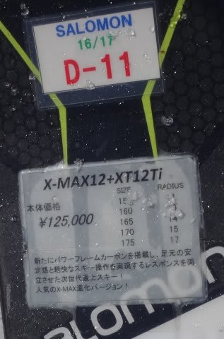
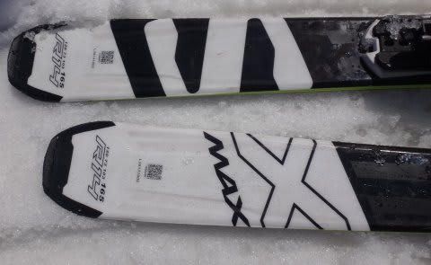

# 2017シーズンモデル，スキー試乗レポート第17回…SALOMON編その5

📅 投稿日時: 2016-06-10 01:56:47

🏷️ カテゴリ: [スキー板試乗](c0bd8048615710cee890e403a36cc9a2b.md)

あー．

やっぱり，今週末でスキーシーズンが終わりそうな

感じの，Skier_Sです．

うーむ．

月山も，今週月曜で沢コースが終わり．

本日，リフトも夏山リフトへの切り替え工事が

終わったようで．

しかし．

[大斜面も下部が切れて滑り降りれなくなって，
下山はリフト乗車必須となってしまった](http://ameblo.jp/gas3staff/entry-12168814641.html)という説が…っ！！！

なんてこったっ！！！

例年より，2週間以上早い気がするのですがっ！！？？？

こんな早くに月山のリフトが終わりになってしまうとは…

とりあえず，

このBlogの冬モードもラストスパートです（涙）．

まぁ，試乗レポートは，残り4-5回ありそうですが．

どうやら，SALOMONとATOMICに偏ってしまう感が有る，

私の試乗レポート．

これで，SALOMON編は最後の板になります．

…ってか，一の瀬に続き，2回目の試乗ですが．

サロモンのX-MAXです．

では，どうぞ～！

○SALOMON X-MAX X12 165cm (2回目)

基礎オールラウンド．

今回，かなり固いバーンで履いてみましたが．

最初，トップ荷重で滑ると．

あれ？？ふらふらして安定感無いかな？

と思ったけど…

荷重ポイントをずらして，かなりテール荷重すると

しっかりグリップして切れていきます．

トップを抑えるとグリップせずにふらふらするので…

荷重ポイントは明確にテールです．

谷回りでも，荷重ポイントは土踏まずまで

戻すかどうか．ターンのすべての局面において

くるぶしより後ろだけを使っていく板のように感じます．

このように，テール荷重を意識していくと，

しっかりグリップして楽に回っていきます．

傾けば傾いただけ，まさにオートマチックに

回っていきます．

165cmだと，板なりに滑るとミドルっぽい感じです．

R=14ってのもあり，カービングだけでギンギンに

小回りで切れていく…という感じではないです．

テール荷重で乗っていけば，基本的にエッジに乗った

オートマチックカービングで回っていけるのですが．

板が軽いので，動かそうと思えばターンのどの局面からでも

自由に動かしていけます．

それで，楽に小回りに入れます．

おそらく，コブでも滑りやすいんじゃないかな～．

ということで．

ガンガンに本気で攻める…

という感じの板ではないけど，

そこそこのスピード耐性，ミドル～小回りまで行けて，

コブも行けそう…

というオールラウンド性がある，

乗りやす板だなぁ…と思いました．
