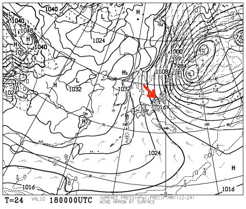
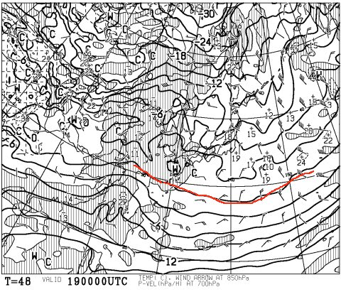
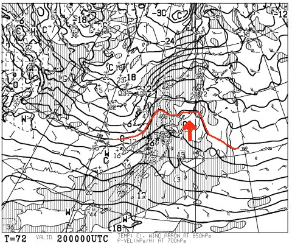
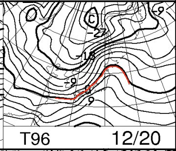
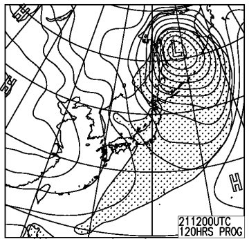
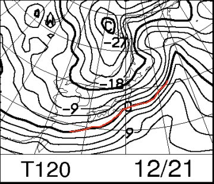

# 定例！今週末の志賀高原の天気は…？

📅 投稿日時: 2014-12-18 01:12:13

えー．

今日は，かなりの強風になったけど．

志賀高原は，一部のリフトをのぞいて

ちゃんと動いたみたいで…

で．

志賀高原には雪が積もらない，完全な西風パターンだったので．

志賀は，雪の積み増しはそんなにないかな？

と，思ったけど．

500hpaで-36度級の寒気の勢いは半端でなく．

北アルプスを越えて，志賀まで雪雲が届いて．

そこそこ積もってくれたみたいですね～

とりあえず．

18日も地上天気図はこんな見事な縦じまで．

風向きも矢印に示したような北西の風なので．

志賀高原もガンガン降り続けます．

今週末．志賀高原は全面オープンしそうですね～！！

我がホームゲレンデ，焼額も．

[19日からの第1ゴンドラ運転，
20日からの第3高速運転が決まり](https://www.facebook.com/yakebitaiyama/photos/a.533933973368620.1073741847.116999658395389/724671794294836/?type=1&theater)．

今週末から，全リフトの運転スタートです！（ぱちぱちぱち）

いやー．

今週末が楽しみですね～

ってことで．

今週末の志賀高原の天気ですが…

…

…

…

…

うむ…？？

これは…

…週末の前日は，ですね．

こんな感じで．

金曜日，19日の850hpa気温図なんですが．

0度線が，沖縄や小笠原近辺まで下がっているという，

ありえないくらいすごいむちゃくちゃ冷えるのに…

なぜ．

一日あけて，土曜日20日になると…

なぜ．

なぜ．

こんな風に，北陸より北まで0度線が上がるかな～（涙）

で．

この日はみごとに矢印のような南風．

午前中は降らずにもちそうな気配ですが．

午後から，降ります．

…何かが…

運が良ければ，雪．

運が悪ければ……

…とりあえず．

この日，空から降ってくるのは液体ではないことを祈りましょう…

20日は，夜9時までこんな感じで．

0度線は，志賀高原より北にあります…（涙）

まぁ，日が傾く夕方からは，間違いなく雪になるとは思いますが．

かなり重い，湿った雪が降り，

夜に寒冷前線が通過し，冷えた雪に変わりそう．

日曜の地上天気図は，こんな感じで冬型に戻り…

そして，0度線も太平洋まで下がってくれて．

まぁ，雪がチラチラ舞う，そこそこ冷えた一日になるでしょうか…

ってことで．

まとめると．

土曜日：朝のうちは晴れ．前日の積雪は無く，朝イチはきれいな

　　快適圧雪．

　　朝のうちは冷えているけど，昼間はこの時期としては

　　気温が上がり，山頂でも0℃を超えてくるかも．

　　午前中はそこそこ快適に滑れるだろうけど，

　　昼近くから雲が増え始め，昼過ぎには何かが降り始める．

　　みなさんの日ごろの行いが良ければ雪（湿った重い雪だけど…）

　　日ごろの行いが悪ければ，みぞれ～雨．

　　降り始めはぽつぽつと降り，夕方に向かって降りが強まる．

　　夕方からは間違いなく雪．夜からは冷えた雪が降る．

日曜日：土曜夜からの積雪が多少あり，朝イチは圧雪の上に，

　　うっすら新雪状態．

　　この日は，チラチラ雪が舞ったりやんだり．午後は日が射す

　　タイミングもあるかな？

　　気温は平年並みで，朝は山頂でマイナス5度以下，昼間も

　　0℃以下．

　　前日が雨だと，下地に氷のコロコロが発生するかも…

　　前日が雪になってくれれば，まぁいい雪で過ごせる

　　一日になってくれるかな．

って感じで．

土曜日．

土曜日が，勝負です．

この日，雨にならないことを祈るばかり…

土曜の天気がどうなりそうか．

また，直前に予想します…

さぁ．

これからの皆さんの日ごろの行いが，

試されるのだ！←自分の日ごろの行いでしょ（自己突込み）

## 💬 コメント一覧

### 💬 コメント by (フナ)
**タイトル**: Unknown
**投稿日**: 2014-12-18 23:37:20

天気予報お疲れ様です！

とても当たるので非常に参考になります♪

土曜が勝負ですか！

日曜に長野に日帰りで向かう予定です(^^)

年末年始の休みが近づいてきたので更にテンション上がりますね(笑)

### 💬 コメント by (Skier_S)
**タイトル**: フナさま
**投稿日**: 2014-12-19 01:16:29

私の天気予想は，志賀高原に著しく特化してますので（笑）

参考になりますかどうか…

土曜，午後にパラパラ雨が降るかどうか…

今のところ，雨になっても，そんなに強い降りにはならないと

思ってはいるのですが．

日曜は，朝から冷え込んで小雪がちらつきます．

…前日，雨だったら氷のコロコロが出てくること請け合いですので，

ぜひ，土曜は何とか雪のまま乗り切ってほしいところ…

日曜，楽しんできてください！

