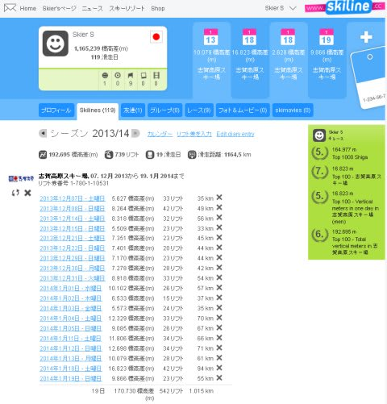
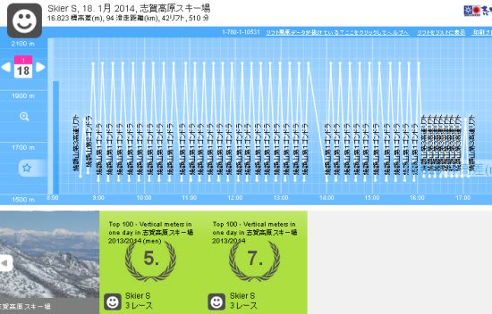
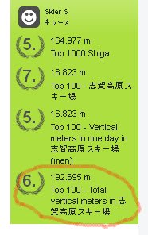
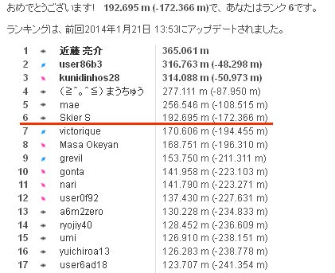

# この土曜日がいかに恵まれていたか…Skilineの結果を見てみる

📅 投稿日時: 2014-01-22 02:13:52

🏷️ カテゴリ: [スキー雑談](c1f9d2cb7478308da16419928ea3945e9.md)

ってわけで．

えー．

このBlogにときどき出てくる，[Skiline](eb2a0029115b8205c8168295e2d9d49ef.md)ですけど．

こーゆー感じで，リフト券を登録すれば，いつどれだけ滑ったかの

記録を見ることができる，スグレモノなわけですが．

晴天ガラガラの[超ラッキーデーだった土曜日](e6f4b74a3b3e55e9ea34946df9edfac2a.md)．

いかに恵まれていたかが．

Skilineの記録を見ると分かりますね～．

…見てのとおり，ほぼ正確に13分間隔でゴンドラを回しているので．

いかにゴンドラを待たずに済んだか，

コースががらがらで，滑ってる途中に止まらずに済んだか，

…ってのが，よく分かりますよね！

いやー．

このSkilineを見れば，いかに幸せな一日だったか分かろうと

いうもの…←いかにSkier_Sがバカかというのが分かるのでは？？

しかし．

この日の滑走標高差，16823m．

…志賀高原の一日滑走標高差，これで7位なのか…(男子で5位)

上には上がいるんだなぁ…

これ以上滑れるって，ホントに人間か？？という疑問を呈したいところ．

＃多分，人型スキーロボットじゃないかな

ってゆーか．

こんな感じで，私の志賀高原の今シーズンの積算滑走標高差，6位なんですけど，

私より上位の人間って…

こんな感じで，ものすごい大差がついてます．

私より下位は，結構僅差なんですが…

私より上位にいるのはいったい，どーゆー人たちなんでしょうか…

すごいと言うより，もう人間離れしてますね(笑）．

うーん．

世の中，おかしな人もいるもんだ←お前が言うなっ！！

## 💬 コメント一覧

### 💬 コメント by (ひろりん)
**タイトル**: Unknown
**投稿日**: 2014-01-22 16:38:41

おひさしぶりです。

相変わらずノコギリですね＞＞Skiline

自分なんか休憩が2回、しかも長いという。。。

リフト、ゴンドラ待ち時間が長いとほっとする低体力者です↓↓↓

今シーズンはサンバレーから高天原までを滑走し、一ノ瀬から先には行かないようにしています。異常体力者がいると聞いてますので（爆）

というか仲間がついてこれないんですけどね（汗）

### 💬 コメント by (Goku)
**タイトル**: Unknown
**投稿日**: 2014-01-22 18:51:33

うん、うん、分かりますよ！

このskilineを見ればいかに素晴らしかったかが・・・

う・う・う・う・う・羨まし過ぎる～！

１位のあの方は間違いなくロボットでしょ！でなければ影武者がいるかも(笑)

トータル３位の方は志賀高原フリークで有名な「○に～さん」ですね。

でも、Ｓさんも焼額山では相当な有名人だと思いますよ(笑)

### 💬 コメント by (Skier_S)
**タイトル**: 幸せでしたよ～
**投稿日**: 2014-01-23 01:54:59

>ひろりんさま

をを！お久しぶりですっ！

焼額には近づかないんですね（笑）

私は，リフト待ちが長いのはダメです…

もう，待ち時間無くぐるぐるがシアワセです～

ゴンドラ乗車時間の6分間が休憩時間です（^^

>Gokuさま

うははははは．

すばらしい一日でしたよ～っ！！

普通なら夕方はコースが荒れて

滑走時間が長くなるところ，

最後までコースが荒れなかったので，

全く同じペースでぐるぐるし続けられました…

私もほとんどロボット化してたと思います（笑）．

