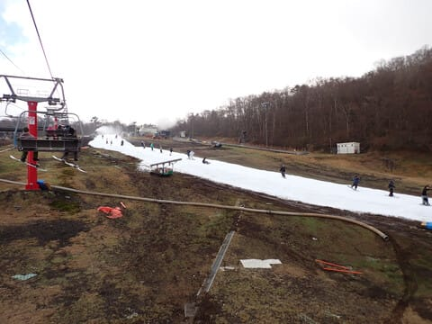
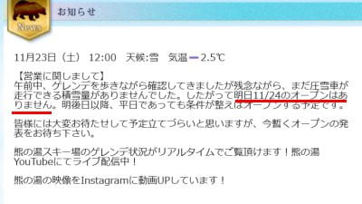
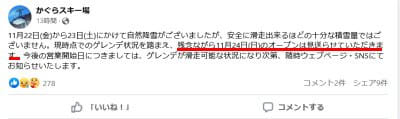
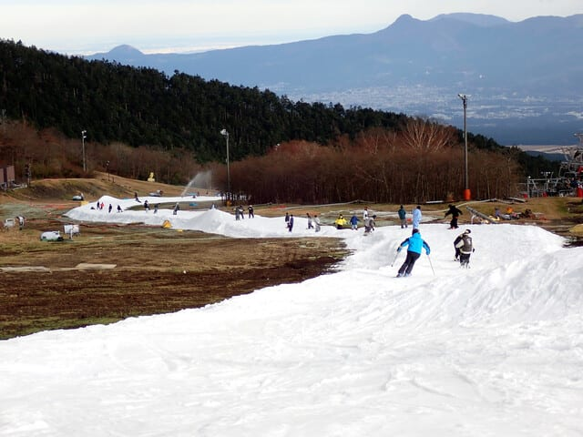
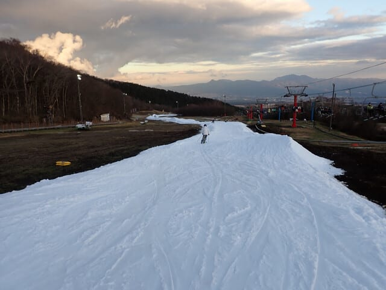
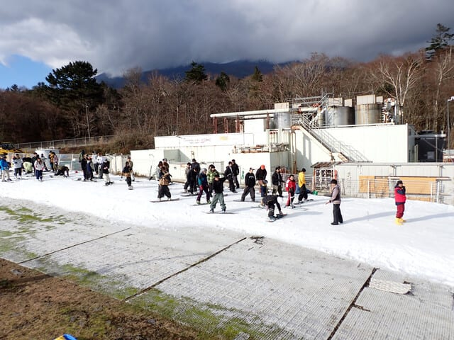
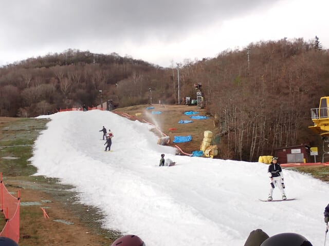
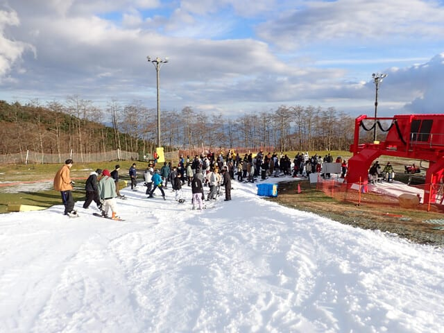
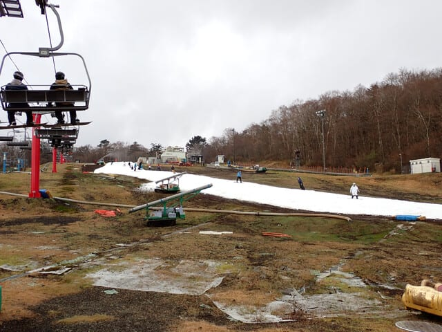

# 2024/11/23(土)のイエティ滑走速報レポート！…リフト待ち5分，コース上の人口密度は高め．雪の厚みはあるけど狭めで混雑気味のゲレンデ

📅 投稿日時: 2024-11-24 02:03:50

えー．

ということで．

本日もいつも通り，イエティで滑ってきましたが…

今日も夜帰宅で，帰宅後いろいろやらねば

ならぬ仕事があり．

睡眠2時間半でイエティに行ったのに，

もうこんな時間…(涙)

なので，今日のイエティ，帰宅日恒例の

速報モードにて…！

…の前に．

やはり本日，志賀高原では10cm～20cmの

雪が積もり，人工降雪機がフル稼働

したようですが…

でも，まだオープンできるほどの積雪には

ならず．

熊の湯は，まだ圧雪車が走れる積雪量じゃ

ない…ということで，24日のオープンは

諦めたようです（泣）

（[熊の湯スキー場ホームページ](https://www.kumanoyu.co.jp/lift/)より）

横手山も，まだオープン日未定の案内がそのまま

なので…

昨日，運が良ければ24日にオープン！…と思ってた，

横手・熊の湯ともに24日（日）のオープンは

無くなりました…（泣）

かぐらスキー場も，まだ積雪が足りず24日

オープンは見送りです（涙）

（[かぐらスキー場Facebook](https://www.facebook.com/snowkagura/posts/pfbid022yb7x9qkpUGYSEyoH3hNz13N88gQpHPr68Zp6AeXN3nGyQZLcGFSEqtXy2erN21rl?ref=embed_page)より）

うーん…

一応この冷え込みは，25日の朝までは

続いてくれるけど．

その後26，27日は激烈高温の南風＆荒れ荒れ

暴風雨になりそうな予想なので…

ここでまた雪がやられちゃいそうで，

今オープンできないようなら，次の週末の

オープンも結構ギリギリかも…（泣）

まぁ，高温は28日午前中には終わり，

その後また冬型に入ってくれそうですが．

次の冷え込みは今回より弱く，雪も少なそう…

うーん．

何とかこの高温期間を乗り越えてほしい…

ということで．

ここまでが長くなりましたが，

本日は，さっくりイエティの速報レポート．

詳細は明日レポートします…！

とりあえず．

今日は今シーズン一番の混雑でした…

あさイチだけすいていたけど，

開始30分も経つとコース上の人口密度は

かなり高く，今日は一日コース上は

こんな感じの人口密度

コース幅は先週に比べれば多少広がりましたが…

まだ追い抜きするのは辛い幅なので，

基本的に，前の人についてゆっくり滑るしか

無い感じのゲレンデ幅でした…

コース上の最後の落ち込みの一時ストップは

今日も継続で．

スタートの人数制限は1時半から2時半までの

短時間だけやってました…

午後には斜度があるところは結構凸凹

してきましたが，

雪の厚みは十分確保されているので，コース

上に土が出てるところはなかったです！

…石ころを踏む心配はないけど，硫安で

エッジがさびるので，新しい板は

履いていかないほうが無難かな…

リフト待ちはこの程度．

午前は平均5分，午後は5-7分程度の

リフト待ちで．

まぁ，軽井沢よりはマシかもしれないけど，

結構待ったし…

あ，天気は終日曇り，ごくたまに日が射す

感じですが，結構寒かったです．

ちゃんと冬の格好をしていくことをお勧め

します…

ってな感じで．

明日も寒いし，混むと思いますが．

晴れそうだから，日が射すと暖かいかな．

とりあえず．

明日また詳細レポートやります～！

今日はもう寝る…

おやすみなさい…
