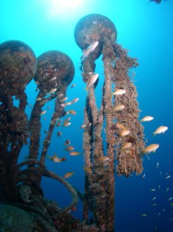
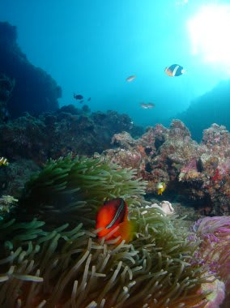

# 初の子連れダイビング旅行記＠2009年　プロローグ2

📅 投稿日時: 2012-07-11 00:50:22

というところで．

前回の続き．

初めての子連れダイビング．

一体何処に行くべきか…という悩みですが．

久米島は，わざわざ那覇から飛行機を乗り継いでまで

「もう一回行きたい」と思わせる何かがないので，落選．

宮古島は，この時期だと下地島西側のポイントがメインで，

1本ごとに戻ってくるスタイルじゃないので却下．

石垣も，1本ごとに戻ってくるスタイルじゃないので却下．

…本島しか残らないですね．

しかし，本島って言ってもどこ？

那覇近辺だと，1本ごとにショップやホテルに戻ってくるのは

不可能…

となると，残るは恩名か本部ですね．

いろいろ調査の結果，恩名の某ホテルは，ダイビングショップも

併設されており，ホテル前の桟橋からすぐボートが出て，

各ポイントまでボートで5～10分とのこと．

…ここしかないな．消去法で行くと．

というわけで，恩名の某ホテルに4泊し，

中3日のダイビングツアーへ行くことに決定！

…でも，恩名近辺のポイントって，昔潜ったことあるけど，

印象に薄いんだよな～

っていうより，はっきり言って，そんなにいい印象残ってない

気がするんだけど…

まぁ，今回は「子供を連れてダイビングができるのか否か？？」

の練習だし，妻は3年ぶりのダイビングで，感覚を取り戻すのが

精一杯だろうし，まぁ，いいか！

と，そのホテルが組み込まれている激安ツアーを必死で探し，

とりあえず予約を入れたのだった…

さて．

子供は3時間の飛行機に耐えられるのか？

母親がダイビングに行っている間におお泣きしてしまわないか？

ホテルでの食事，子供が食べられるものがあるのか？

慣れない環境で子供がどうしようもなく機嫌が悪くなって

泣き続けないか？

うちの妻はタンクを背負うのを忘れてエントリーしたり，レギュとゲージを

間違えてくわえて潜ったりしないのか？？？

不安いっぱいで出発の日を待ったのでした．

＃あ，あいかわらず長いプロローグだ…
