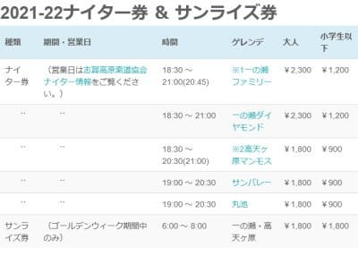

# 志賀高原中央エリアの2022シーズンスキーマップが出てたけど…やっぱり西舘中級コースは復活せず（涙）

📅 投稿日時: 2021-09-11 23:29:05

えー．

志賀高原中央エリアのホームページを見ると．

さりげなく，2022シーズンの情報がいくつか

アップデートされてました…

まずは中央エリア限定リフト券料金．

エリア限定券で，一日券5000円！！！

ただ，12月27日までは3900円，

4月以降の春料金は4100円と安いですが…

（[志賀高原中央エリアホームページ](http://shigakogen.co.jp/highlight/896-2)より）

これ，去年の料金と比べると．

どれも100円ずつ値上がりしてますね（涙）

そして，ナイター＆早朝券は…

これは去年と同じ価格ですね．

（[志賀高原中央エリアホームページ](http://shigakogen.co.jp/highlight/896-2)より）

一応，サンバレーと丸池のナイター料金も

載ってるので，サンバレーと丸池ナイター，

まだ廃止されないみたいですね…

ただ，昨シーズン同様正月のみの

営業なんでしょうけど…（涙）

で．

リフト券料金だけじゃなく．

ゲレンデマップも2022シーズン版に

なってました！

（[志賀高原中央エリアホームページ](http://shigakogen.co.jp/wp-content/uploads/2021/09/2021-22%E3%82%B9%E3%82%AD%E3%83%BC%E5%A0%B4MAP%EF%BC%881MB%EF%BC%89.pdf)より，以下同様）

当然，志賀高原マニアは昨年度との違いを

目を皿のようにして（皿のようにって…どんな目だ？）

見比べるわけですが．

うーん．

違いがわからん…

昨シーズンとは差がなさそうですが．

確か，ゴンドラになったはずのこの発哺

クワッド．こいつも変更がなく，ゴンドラマークが

ついてないということは…

冬のシーズンはゴンドラ搬器を使わず，

クワッド搬器を使うのか？？

…と，思ったけど．

右肩のリフト一覧を見ると．

ちゃんとブナ平ゴンドラって

表記になってますね…！

地図の絵を描き替えるのがめんど

くさかったのかな？

そして．

不評が続くブナ平下の七曲り．

ここは相変わらずぐにゃぐにゃ迂回路の

ままだし…

2019年の台風で崩れた西舘中級コース．

ここはやはり復活せず，地図から消えた

ままになってます…

完全に復旧を諦めたのでしょうか…（泣）

ってなことで．

直してほしいところは残念ながら

直っておらず．

発哺クワッドがブナ平ゴンドラに変わった

以外，リフトもコースも2021シーズンと

全く変わらないようですね．

まぁ，この状況下で，リフトを1本も減らさず

維持してくれたのはありがたいことですが．

リフトは地図に残ったけど，昨シーズンみたいに

一の瀬ファミリー第3クワッドは営業しない

とか，

西舘は午後から営業

とかが無いように祈るばかり…

あと．

タンネの森は修学旅行生が来る日のみ営業

とか，

寺小屋は週末のみ営業

とか．

そのほか，恐ろしいシナリオも考え着くけど．

そんなことが起きないよう，

この冬は，みんなで大挙して志賀高原へ

繰り出しましょう…！！

## 💬 コメント一覧

### 💬 コメント by (Goku)
**タイトル**: Unknown
**投稿日**: 2021-09-12 11:48:20

ブナ平のゴンドラ化より、西館の斜面を治す方にお金を掛けてほしかった(-_-;)

### 💬 コメント by (ゴン太＠SALLOT CLUB)
**タイトル**: 株主の意向により・・・
**投稿日**: 2021-09-12 20:54:26

ブナ平ゴンドラ、

河原小屋乗り場のゴンドラ保管スペースに、屋根は

設置されていますが雪の吹込みは懸念され、従来の

リフトの高さにゴンドラを付け替えているので、

地面からの設置高さが短く、雪が多く降った朝には

直ぐ運行開始できるか懸念されているようです。

グリーンシーズンの集客（パルスゴンドラーブナ平

ゴンドラ－タマゴン）という大義の下、実は株主

（日本ケーブル）の在庫ｏｒ引き取りゴンドラの

有効活用が目的のような気がしてなりません。

東館山レストランも、日本ケーブルの子会社が

運営するようですし。

### 💬 コメント by (Skier_S)
**タイトル**: 私はサンバレーとダイヤナイター復活してほしい
**投稿日**: 2021-09-13 03:28:06

＞Gokuさま

西舘中級コース，このまま永久に放棄になりそうですね…(涙０

＞ゴン太さま

確かに…ブナ平ゴンドラ，積雪があったら運転開始遅れそうですね．

そもそもあの搬器，東館ゴンドラと同じ型なので，風にも弱そう…

しかし，東館ゴンドラとブナ平ゴンドラが同じ型なのは，日ケーが絡んでいるからなんですね．

でもまだ日ケーはシェアトップでスキー索道続けてるからいいけど，

スキーから実質撤退している東京索道の焼額第3クワッド，部品がないという危機的状況は

ヤバいです．

確か，東京索道も日ケーの資本が入ったんでしたっけ？

