# 2020シーズンモデルのスキー板，試乗レポート…OGASAKA編その1

📅 投稿日時: 2019-04-10 01:20:14

🏷️ カテゴリ: [スキー板試乗](c0bd8048615710cee890e403a36cc9a2b.md)

えー．

なんということか．

本日も，志賀高原には10cmほどの

積雪があったようで．

…それも，かなり寒くて．

冷え冷えの，軽めの雪だったようです…

で．

明日10日（水）は．

早朝から降り始め，終日降りそうです…

一応，雪が降ります．

朝のうちは冷えたいい感じですが．

昼間は，麓ではちょっとみぞれっぽい，

重い雪になりそうだけど…

でも．

10日の夜にはまたかなり冷え始めて．

雪は11日（木）の朝まで降り続けます．

10日早朝から11日朝にかけて．

志賀高原の積雪はトータル20～30cmは

積もりそうなんですが…！？？？

そして．

そのまま13日（土）の午前中までは

冷えてくれそうで．

土曜は晴れそうなので．

土曜日の朝は，この時期としては

いいコンディションで滑れそうな予感…！

…ただ，昼間は日が射すので，ちょっと

しっとりした雪になりそうだけど…

でも．

日曜は気温はいつも通りに戻り，

普通の春スキーになりそうな感じかな（涙）

…まぁ．

また週末の詳細な天気予想は明日にまた

やりますので，しばしお待ちを…

ってなわけで．

もう試乗から2週間経ってしまいましたが．

ようやっと，2020シーズンモデルのスキー板の

試乗レポート，第2回目です．

今回はオガサカ編！

それも，OGASAKA TC-SSのプレート違い2機種の

乗り比べという，マニアックなレポート．

試乗コンディションは，[こちら](e8b23c39b6c482e1e3a537e4644d9d484.md)を参考に．

では，どうぞ～！

○OGASAKA TC-SS GR585N 165cm

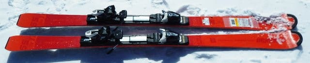

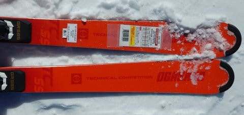

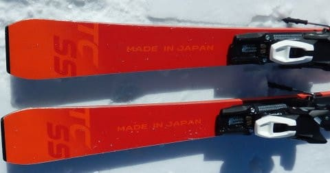

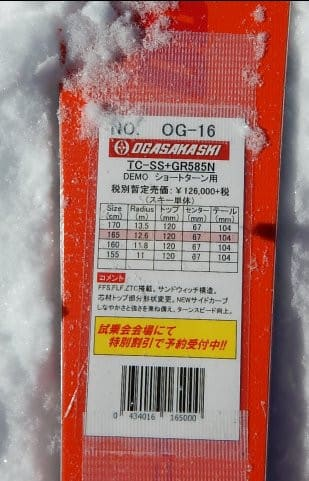

基礎小回り用

OGASAKAの技術選レベルのトップレベルの

基礎板である，TCシリーズの小回り版，

TC-SSですが．

プレートが3種類から選択でき．

こちらは，一番強いGR585プレートを

つけた板になります．

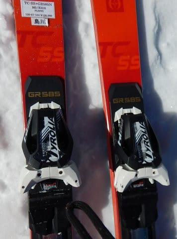

滑ってみたところ…

今年のTC-SAに比べ．

かなり硬くなった気が…

それも，メタルが入ってばね感が

強くなったというよりも，

コアがしっかり硬く，簡単にはたわまない

ような強さが出ています．

結構張りの強い，サンドイッチ構造の

SL板っぽい感じ．

今シーズンのTC-SAは，ターンに入ると

すっとたわんで，たわみに乗って

ギュイーンと小さい半径で回って

いく板でしたが．

この板はプレートが強いというのもあり，

普通のスピード域でサイドカーブなりに

滑ると，板はそれほどたわまず．

ミドルターンか，それより大きめの

回転半径で滑っていく感じ．

私程度の普通の脚力，技術レベルだと．

この板では，ピュアなカービング小回り

に入れられません．

頑張ってもせいぜいミドルターンっぽい感じ．

小回りをしたいときは，ズラシを使った

小回りになっていきます．

ズラしの小回りもやりにくくは無いのですが．

…でも，それはこの板の使い方とは

違うのかな～．

ただ，この日はかなり雪が締まっていて，

いい感じで飛ばしていけたのですが．

すごいハイスピードでもまったく

安定感を失うことなく，

ハイスピードのキレキレなカービング

中回りで斜面を降りていけました…．

私のメインマシンのSXに比べても，

高速の安定性はバツグン．

かなりのハイスピードマシーンで，

大回りもイケちゃいます．

…ただし．

私の技術レベルでは．

この板でカービング小回りをするのは

よっぽどコンディションが良くないと

無理かな～．

かなり体力・技術力がある人が，

本格的に攻めるための板で．

私程度が普段のゲレンデ履きとして使うには，

ちょっと手ごわすぎると思いました…

○OGASAKA TC-SS FL585 165cm

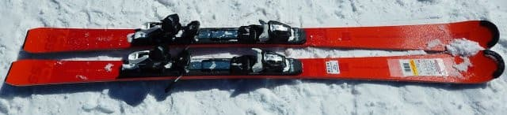

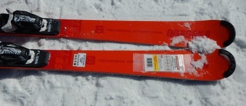

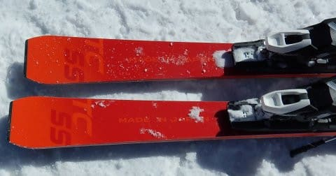

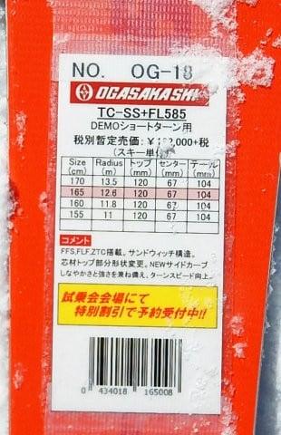

基礎小回り用

先ほどの板と，モデルも長さも同じですが．

プレートが，強いGRプレートから，

ちょいと柔らかめのFLプレートに変わった

モノです．

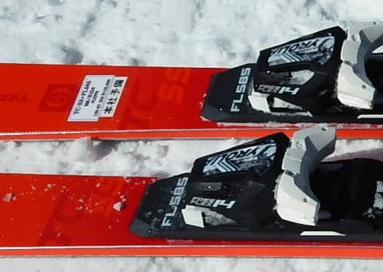

今回の試乗板は，ビンディングも

さっきの板と全く同じものでした．

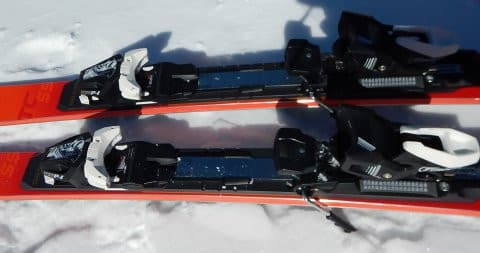

ってなことで．

滑ってみると…

あら！！！

プレートの違いで，これは結構違う！！

板のフレックスが，GRプレートよりかなり

扱いやすく感じます！

この日の硬めに締まった斜面を，

スピードを出して落としていくと．

ガッツリ板がグリップし，いい感じでたわんで，

板がすっと回っていきます．

身体の反対側に板が抜けて行ったら．

後は谷回りで落差を取って行けば，

板がまたグリップしてすっと回っていく…

という．

かなり快感度の高い，落差を大きく取った

小回りができます．

プレートはGRより柔らかいけど，

それでも割と強めの板で．

かなりのスピードで落ちて行っても，

板のブレやずれ，不安定さを感じる

ことは無く．

ガッツリと強いグリップ力があるので．

このFLプレートのモデルでも，

高速安定性は十分高く感じます．

FLプレートでも，私の普段履きのSXより

張りが強く感じるくらい．

高速での反応がかなりいいので．

かなりスピードを上げて滑りたくなる

板でした…

これだけ締まったハイスピード斜面を

かっ飛ばしても，まったく不満を

感じないし，大回りも十分引っ張れるので．

私にとっては弱いFLプレートで十分．

このプレートでも，柔らかめの雪だと

ちょっともてあますかも…

オールラウンドに使うことを考えると．

一番弱いFM-600プレートでもいいかな？

うーむ．固めの雪では，FLプレートが

最高なんだけどなぁ…

この日のアサマは雪が終日

緩まなかったので．

柔らかい雪だとどんな感じか．

ちょっと試してみたかったな～．

ってなことで．

来シーズンのTC-SS．

今シーズンのTC-SAより，かなり強い板に

なった感じを受けたのでした…
