# 4月8，9日の週末の志賀高原スキー場の天気は…久々に冷える週末！土日とも雪がぱらつく．下地は硬そうだけど，日曜はちょっと雪が積もるか？

📅 投稿日時: 2023-04-07 03:00:13

えー．

どうやら水曜夜から木曜朝にかけて，

志賀高原では雨が降ったようですね…（涙）

雨のせいで…

また雪が解けちゃってて．

2日前の記事の同じ場所の写真と見比べると，

土のエリアが確実に大きくなってます…（泣）

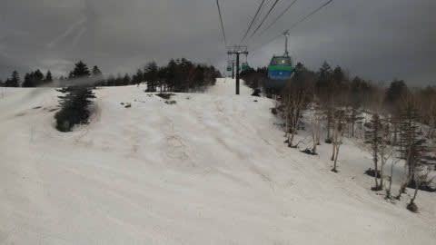

とりあえず，雨は朝には止んでくれた

みたいですが．

そのせいで，ゲレンデも昨晩圧雪された

シマシマが雨で融けて，あさイチでも

ちょっと残念な感じの汚れた雪面で…

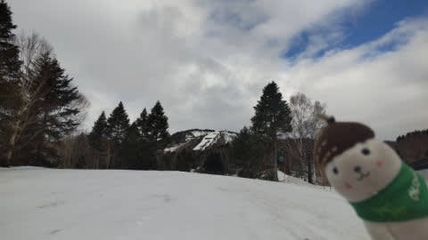

気温も朝から＋3℃と高く，

朝から雪はユルユルだったみたいです…（泣）

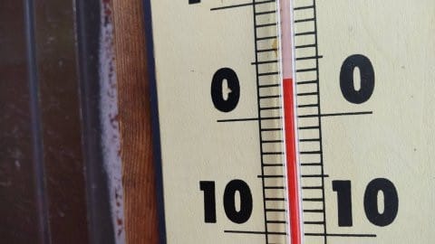

まぁ，奥志賀は風が強くてゴンドラが動か

なかったみたいですから，まだ焼額の

ゴンドラが動いてくれただけ良かったのかな…

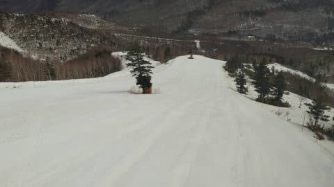

ただ，第2ゴンドラ側から第1ゴンドラ側への

連絡通路．

雪がかなり減ってきて，来週くらいが

ギリギリかも…

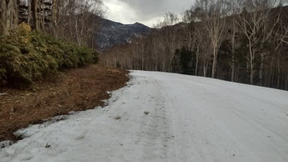

高天ヶ原も，クワッドは終わったものの．

かなり雪が寂しくなってきましたね…

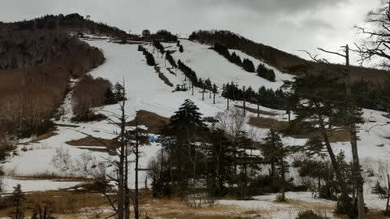

…ってなことで．

この高温が今週末も続くのか？？

と，天気図を見てみるわけですが．

まずは7日，金曜の850hpa図は…

うぎゃーー！赤い0℃線は北海道よりずっと

北にまで上がっているどころか…

志賀高原に近づいているのは，水色の

＋9℃線！！？？

これはダメだ…気温が高すぎる…（激涙）

朝から雪はザブザブですね（泣）

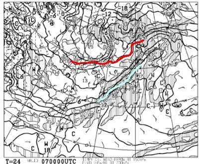

そして，地上天気図を見ると．

降水域が日本を覆っているので…

降る，ということですね．

この気温なら，降るのは確実に液体です（泣）

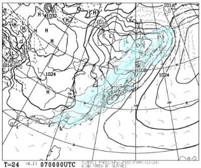

で，8日の土曜の850hpa図を見ると．

うーむ．

こちらは，＋3℃線がギリギリ志賀にかかる程度．

ギリギリ降れば固体．雪になる気温ですね…

で，午後に向かって冷えます！

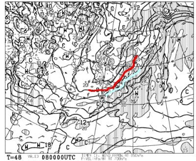

そして地上天気図は…

降水域がかすかに志賀にかかっているので．

朝から雪がぱらついて…

朝のうちはみぞれっぽい，ウェアに着くと

濡れちゃう雪だけど，

午後に向かって冷えるので，昼まえくらい

からは冷えた雪になっていくかな？

終日雪がぱらつきそう．

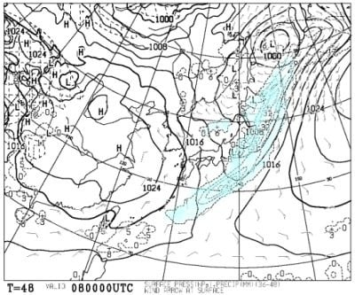

そして，9日の日曜の850hpa図を見ると．

をををを！！！

この日は冷える!冷えるよ！！

水色の－3℃線が志賀よりかなり南に

あるので…

これは，朝は－5℃以下まで冷えます！

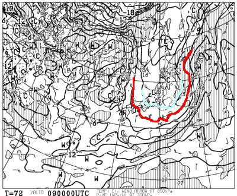

地上天気図を見ると，

久しぶりに寒気の吹き出しっぽい感じの

雲が日本海側に見られるので…

おそらく，朝は積雪がありそう…！

多ければ10cmくらい積もるかも？

積もってくれると最高，積もらなきゃ硬い

アイスバーンですね…

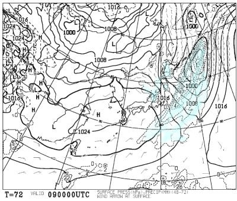

ってなことで．

まとめると．

7日(金)：朝から曇り~パラパラと雨降り．

　バーンは朝から緩め．雨を吸った重い

　滑りにくい雪．

　夕方~夜に雨が強く降る．

8日(土)：朝から曇り~終日わずかに雪がちらつく

　早朝の気温は0℃以下，かなり硬めのバーン．

　気温がだんだん下がっていくので，

　バーンは緩まず硬いまま．

　急斜面はツルツルアイスバーンになっていく．

　雪が数cmでも積もってくれれば，

　緩斜面は結構いい感じの雪に．

　さもなくば，全面アイスバーン祭りに．

9日(日)：朝は雪がぱらつく．

　朝から気温は低く－5℃以下．

　運がよければ朝までに10cmほど積もって

　楽しいけど…

　運が悪ければ積雪1－2cmで，ガチガチ

　アイスバーンが隠れずちょっと怖い．

　この日は終日冷えて，午後は気温が

　上がるけど，山頂では0℃くらいまでしか

　上がらないかな？

　ガチガチバーンだと緩まなさそうなので，

　新雪が積もることを祈りたい…

ってな感じでしょうか．

久しぶりに冷える週末だけど．

7日夕方~夜に，かなり強い雨が降るので…

雨を吸った雪が，8日朝の冷え込みで

ガチガチになりそう．

8日朝から雪になるけど…

積もってくれるかどうかは微妙．

積もってくれれば最高シマシマでシアワセ，

積もらなければ絶叫アイスバーン

という両極端な感じです…

ガチガチアイスバーンを

滑ることになるのか，

柔らかな圧雪の上を滑れるのかは，

これからの皆さんの日ごろの行いによりますので．

皆様，これから週末にかけて，品行方正に

過ごしていただくよう，よろしくお願いします…
