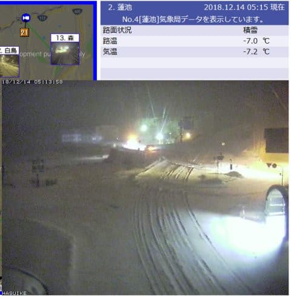
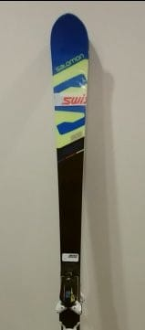
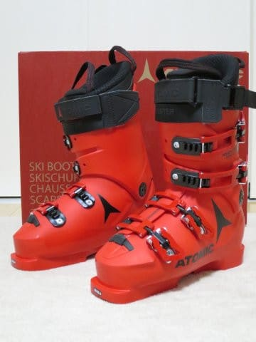

# 第8回物欲選手権！その3

📅 投稿日時: 2018-12-14 05:37:31

ってなわけで．

水曜日の予想通り．

13日深夜から14日朝にかけて積雪があり．

14日朝5時現在の志賀高原．

10cmほど積雪があるように見えますね…！

（[北信建設事務所HP](http://www.q0.ws302.smilestart.ne.jp/index.htm)より）

予想通り，今日は昼間も降り続けるはず…っ！！

そして，焼額は本日，14日金曜日より，

第2高速が運転開始です！（ぱちぱちぱち）

うーむ．

このまま積もって，土曜にはゴンドラが動いてくれると

いいなぁ…（望み薄）

ってことで．

久しぶりのいいニュースのあとは．

…皆様お待たせしました．

第8回物欲選手権の続き，その3です…

[その1](ea2109ba25f451ea3cb1d5d935d899b91.md)，[その2](e0191fb936cdf7d9e150b75a80adc5860.md)はこちらから．

では，どうぞ～！

---

アナウンサー　「ということで，

　第8回 スキーヤーの物欲を刺激する街神田に来て，

　物欲にまみれたスキーヤーが買い物をせずに

　我慢できるか選手権．

　どうやらまだ終わらずに続いているようですが…

　ただでさえ，いつものシーズンより高い

　最新モデルのブーツという買い物をしたというのに，

　Skier_S選手の物欲はまだ留まるところを知らないと

　いうのでしょうか？？

　さらにSkier_S選手の神田の徘徊は続きます！」

解説　「Skier_S選手は，ブーツは当たり

　出しをしないと履けないので．

　買ったブーツの当たり出しの作業が

　終わるまでの待ち時間，

　神田の他の店をぶらつくことにした

　ようですよ…」

アナウンサー　「さらに神田で時間つぶし！

　…これは危険です！

　待ち時間の間，ASPEN，フソウスポーツと，

　お店をはしごしているようですが…」

解説　「どうやら，ウェアを探しているようですね．

　彼の今来ているウェアも，もう3シーズン

　着ているので．

　かなり汚れているどころか，穴が開いてきていると

　いう話です」

アナウンサー　「…スキーウェアに穴が開くって…

　そこまで着続けるものなんでしょうか…？」

解説　「彼の場合，シーズン70日も着ますから…

　それで3シーズンも着れば，200日近く着てる

　わけですから．」

アナウンサー　「それは，買わざるを

　得ない状況ですね…

　さらなる大敗が待っているんでしょうか！？」

解説　「ただ，家と車を買ったので．

　もう1シーズン我慢しよう…と思っているよう

　な情報も入っているんですけど．

　昨シーズンに9999円で買ったウェアのパンツも，

　安物だったせいか，いつも破れる

　脛の部分が1シーズンでかなり擦れて，

　危ない状況になってきているようで…」

アナウンサー　「ウェアのジャケットが3シーズン，

　パンツが1シーズンで穴が開くって…

　一体どんな使い方をしているん

　でしょうか…？？

　ありえない消耗の早さですね…」

解説　「まぁ，彼はウェアも板も，

　毎週毎週朝から晩まで半端なく

　酷使しますから…

　とはいうものの，Skier_S選手の

　ウェアの選定基準はかなり厳しく．

　胸ポケット二つ，背中ポケットがあり，

　内ポケットもそこそこの容量が必要な上に，

　ハンドゲーターとパウダーガードが

　着いていて，

　さらに色が決まっていて．

　最新モデルの高いものは買わない，という

　非常に複雑な基準があるようなので．

　これらのすべてを満たし，サイズがぴったりの

　ウエアなんて，そうそう出ないので…」

アナウンサー　「なるほど…それで，Skier_S選手は，

　シーズン70日も滑るのに，なかなかウェアを

　買い替えないわけなんですね…！」

解説　「そんなウェアが出てくることはめったに

　ないですから…

　今回も無駄足で終わるんじゃないでしょうか」

アナウンサー　「という話があったばかりですが．

　あっさりとその条件に合うウェアが

　見つかったようですね…」

解説　「え…？」

アナウンサー　「そして，こんな条件に一致する物は

　めったに出ないと，大喜びで速攻で

　購入しているようなんですが…」

解説　「……え？？」

アナウンサー　「数シーズンぶりに条件に合うウェアが

　見つかったので，瞬殺で購入してしまいました…！」

解説　「…なんと…

　車と家を買ったので節約，というのは，

　どこに行ったのか…」

アナウンサー　「さらに．ウェアを買ったこの店では．

　展示品のゴーグルがかなり安く売っていたようで…

　それもウェアと一緒に買うからもっと安くしろと

　値切っているんですけど…」

解説　「さらにゴーグルまで…」

アナウンサー　「ゴーグルが4000円という

　破格値になったようで．

　なんと．ゴーグルも買っています！

　もう，まみれています！

　物欲まみれです！

　今年は節制しなくてはという自制心は，

　一体どこに行ってしまったのか！？？」

解説　「ダメですね．Skier_S選手の物欲リミッターが

　外れたようですね」

アナウンサー　「もともと物欲リミッターなどと

　いうものがあったのかどうか疑問ですが…

　どうやらもはや，銀河系を飲み込むほどの

　巨大さを誇る，Skier_S選手の物欲を

　止められるものは，もうありません！」

解説　「…そして，まだお店巡りを続けているんですが…」

アナウンサー　「何件かお店を巡ってますが…

　今度は板です！板を探しています！」

解説　「これだけ散在した上に，板を本気で

　買うつもりなんでしょうか…！？」

アナウンサー　「どうやら，大回りの板です．

　大回りの板を探しているようです！

　SALOMONのX-Raceが2シーズン経って，

　次は3シーズン目なので…

　大回りの板を探しています！」

解説　「型落ちのX-raceを探しているようですが…

　型落ちのX-raceは，大回り用の175cmがもう

　神田中のどこを探しても残ってないようですね…

　さすがにここまで散在して，さらに板は

　ないと思いたいところ」

アナウンサー　「型落ちのX-race SWのP69プレート付き，

　175cmか180cmというピンポイントで探して

　いるようですが，

　さすがに神田を隅から隅まで探しまくっても，

　そんな板はなかったようです」

解説　「いや，これで板まで買っちゃったら，

　ブーツ，ウェア，板という，大物3点セット

　コンプリートですからね…

　さすがに家と車を買った年に，大物3点セット

　コンプリートはないでしょう…」

アナウンサー　「おっと，最後の石井スポーツで．

　X-Race SWではないですが．

　昨年モデルのX-Race Masterが残っていたようです」

解説　「でも，この板は，型落ちでも10万を超えますから…

　物欲大魔王のSkier_S選手も，さすがに

　そこはためらっていますね．

　さすがに自制心が効いているようです」

アナウンサー　「ダメもとで，ビンディング別で

　売ってくれないかきいているようですね…」

解説　「X-race SWは，ビンディングがZビンディングなので．

　Zビンディングを持っていないSkier_S選手．

　この板なら，ビンディングセットで買わなくては

　ならないところ．

　X-race MasterはSkier_S選手が大量に持っている

　Xビンディングなので，

　ビンディング抜きでいいということになりますが…

　普通はこの板，ビンディング抜きでは

　売りませんから…」

アナウンサー　「さすがに店員さん，ビンディング抜きでの

　販売は断ってますね……」

解説　「それでも，Skier_S選手．

　あきらめずに粘っているところが，

　諦めが悪いというか，なんというか…

　…

　おっと．店の奥から偉い人が出てきましたよ」

アナウンサー　「…偉い人から，ビンディング抜きでの

　販売にOKが出たようです…っ！

　そして．

　Skier_S選手．

　またもや瞬殺です！！！

　買いました！

　板も…

　板も買いました！

　なんということでしょう～！

　節制しなくてはいけない，車と家を買った年に．

　板とブーツとウェアという．

　大物3点セットのコンプリートを行ってしまいました！」

解説　「X-race SWの型落ちをビンディング込みで

　買うよりも，X-race Masterをビンディング抜きで

　買う方が安くて．

　結果的により高いモデルを安く買えたということに

　喜んでいるようですが…

　まさか，まさかの大物3点セットコンプリートとは…」

アナウンサー　「やはり，彼は神です！

　物欲の神です！

　こんな状況に置いて，3点セットコンプリート＋ゴーグルという．

　信じられない散財を，見事にやって見せました！」

解説　「だから，そこは見事と褒めるところ

　じゃないですから…」

アナウンサー「ということで，

　14時間のフライトを終えての海外出張からの

　帰宅途中に，

　神田を隅から隅まで歩いて3点セットを見事に

　買いそろえるという，

　見事な負けっぷりを見せたところで．

　　第8回 スキーヤーの物欲を刺激する街神田に来て，

　物欲にまみれたスキーヤーが買い物をせずに

　我慢できるか選手権　

　を終えたいと思います．

　では，第9回の選手権でお会いしましょう！」

解説　「どこまで続くんだ，この選手権…」

---

てなことで．

なんだかいろいろ買っちゃった…

## 💬 コメント一覧

### 💬 コメント by (若杉勲71)
**タイトル**: Unknown
**投稿日**: 2018-12-14 06:36:14

週末だけで年間70日ですか。しかも時間が半端ない。すごすぎます。

昨日の野沢ですが、長坂ゴンドラの中間駅から上は滑れます。やまびこは真ん中のコースは

クローズでしたが、ボーダーが滑ってました。スカイラインもクローズでしたが雪はありそうに見えました。積雪は40から50。

でもやっぱり不要な板で滑ったほうが良さそう。雪質は重く、しっかり踏んで滑ろうと思うと疲れます。帰りに食べた須賀川ソバは、10段階の3でがっかり？

きは２高です。ワクワク！

### 💬 コメント by (サトシ父)
**タイトル**: 期待を裏切らない…
**投稿日**: 2018-12-14 10:16:00

やっぱりでしたね、流石です。私も先週会社帰りにブラブラしてきましたがかなり危ないところでした。グッと我慢してSさんいつもお店(多分)でワックスだけ購入。平日3%引きがウレシかった。週末はヤケビでご挨拶できればと

### 💬 コメント by (はなげ親分)
**タイトル**: やっぱり❗️
**投稿日**: 2018-12-14 11:53:34

プロジェクトXとZの後では前の額が大き過ぎ、ブーツ・ウェア・板など大した金額に思えなくなるのが怖い・・・

### 💬 コメント by (Skier_S)
**タイトル**: 予想通り，大敗です
**投稿日**: 2018-12-14 23:37:21

＞若杉さま

野沢，積雪40～50っていい感じですね…

志賀は今週末もファミリーはクワッドが動かないようで．

高天ヶ原もトリプルのみの様子…（涙）

もう少し積もってほしいですね～！

＞サトシ父さま

いや…

神田，危険な街すぎます（笑）．

今週末は，土日ともヤケビをグルグルしてます！

ぜひお会いしましょう～！

＞はなげ親分さま

…まさにご指摘の通り．

金銭感覚がマヒしていました．

「家を百万円単位で値切ったんだし…」

という，謎の免罪符？を自分に唱えていました（笑）

