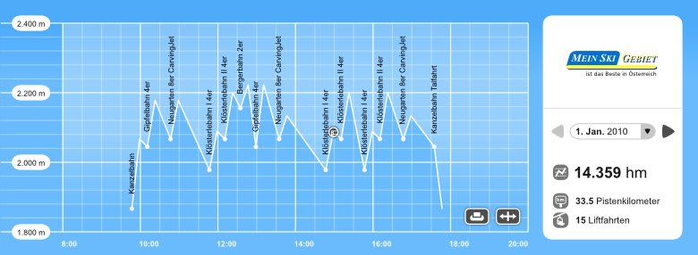

# 志賀高原のゲートシステムが来年変更

📅 投稿日時: 2011-03-08 00:46:04

🏷️ カテゴリ: [スキー雑談](c1f9d2cb7478308da16419928ea3945e9.md)

えーっと．

志賀高原マニアの方はご存知かと思うのですが．

これまで，志賀高原で使っていたICゲートシステム．

アンテナの感度が悪かったり，混んでるときに上手く

ゲートを通らないと，ゲートが閉まって

「このチケットはまだ利用期限が来ていません」

と，通れなくなってしまったり…

いろいろ不満が多かったですが．

来シーズン，新しいゲートに変わります．

[志賀高原ウインターガイドブック](http://www.shigakogen-ski.com/index.php)の，50，51ページ目に

載ってますので，ご覧あれ．

見たところ，機械自体は丸沼にあるのに似た感じに見えますが…

とりあえず，これまでみたいにアンテナにカードを密着

させなくても，身に着けていれば反応するらしいですし，

パタパタゲートではなく，くるくる回るバーを押して

通りぬけるタイプのため，通過する前にゲートが

閉じてしまう心配も無いですね～．

これで，志賀高原のゲートの不満はかなり解消されるかな？？

しかし．

しかし．

しかーーーし．

すごいのはこれだけじゃない．

[このウェブページ](http://www.skiline.cc/aboutSkiline)に英語で説明がありますが…

なんと．リフト券のIDを入力すれば，滑った時間と

滑走標高差のグラフがインターネットで確認できるという，

SKILINEという面白い機能がついてます！！

こんな感じで，一日の滑走標高差，滑走距離，リフト乗車回数の

ログが確認できます…

シーズン券を持っていれば，1シーズンの滑走ログが

すべて見られるってことかな？？

うーん．

私の持ってる[こいつ](e764f37b2c20923a0b722f930137c0e5e.md)より便利ではないかっ！？

とりあえず．

ゲートが新しくなることより．

このログ機能が気になるところ…

ヨーロッパでは結構普及しているようですが，

日本では始めての導入のようですね．

シーズン最高滑走標高差チャレンジとかやったら面白いかも…
