# 7月2日（日）月山速報モード…天気はガスのちくもり．昨晩の大雨で雪が減ったよ（涙）．大斜面は今週で終わりですね…

📅 投稿日時: 2017-07-03 01:11:33

ということで．

ついさっき帰宅しましたよ．

月山から約500kmの道のりを…．

というわけで．

今日も夜遅いので．

詳細レポートは明日やるとして．

本日は，今日の月山の様子，速報モードにて…

えー．

昨晩の月山近辺．

夜中に豪雨に見舞われたものの…

朝は雨も上がり，麓では太陽が！

…そう．麓では太陽が出ていたんだけど．

月山まで登ると．

路面は乾いているものの…

太陽はガスに隠されてしまい．

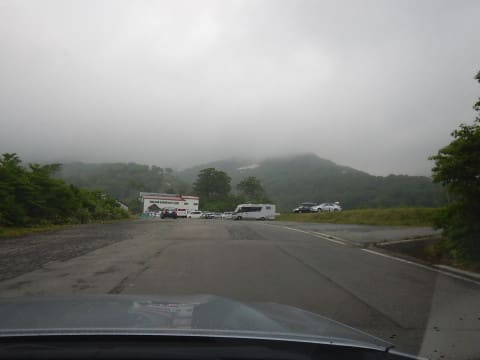

月山山頂はガスの中…（涙）．

まぁ，雨が降ってないだけマシか…

と，リフトに乗りますが．

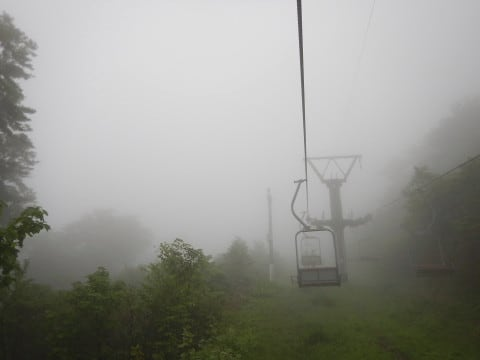

リフト降り場近辺に近づくと，

予想通りのガス＆風（泣）．

そして，山頂のゲレンデに着きましたが…

全く見えませんね（涙）．

これは，月山に来たことのない人は

遭難可能なレベルです…

しかし．

トラバースラインを抜けて，大斜面に

出ると…

をを！

視界が開けたよ！

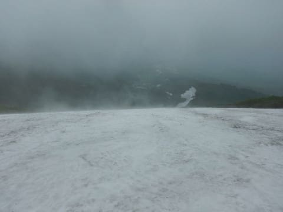

下から見るとこんな様子で．

大斜面は見えるけど，そこから上が

ガスに隠れている感じで．

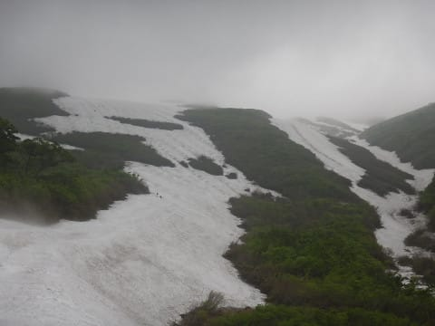

大斜面がクリアに見えるだけ，ラッキー！

大斜面は，あまり人が滑らないので．

コブはちょいと浅めになってます…

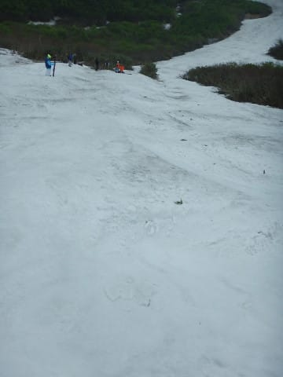

さらに，朝イチは雪が踏まれておらず．

ガリガリした雪で，ちと滑りにくかったけど…

昼ごろには雪が踏まれて滑りやすくなったかな～．

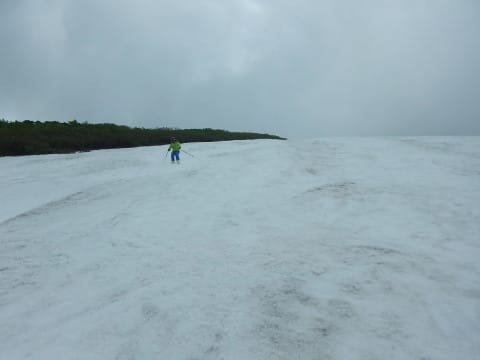

ただし．

昨晩の大雨の影響で．

大斜面のボトルネックが，

結構細くなっちゃってます…（泣）．

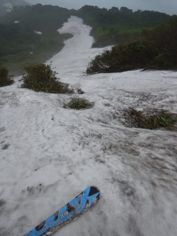

そして，藪漕ぎの距離も，

昨日の1.5倍以上に伸びてる気が…（涙）．

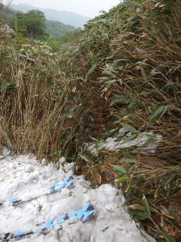

（この藪を超えないと滑れない…）

ってことで．

リフトから大斜面にでるトラバースラインも

こんな感じで笹薮がぱらぱらと顔を出しはじめ，

そろそろ切れそうだし．

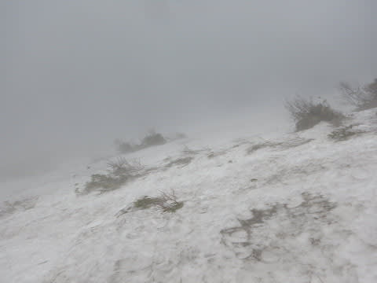

大斜面を滑れるのも，おそらく今週で終わり．

来週は無理でしょうね…

…って感じで．

昨日よりもゲレンデコンディションは

悪化してしまった月山ですが．←いや，この時期でゲレンデコンディションが

日々良くなっていったら怖いから

午後になると，ガスも上がりはじめ．

ちょっと視界が良くなってきましたよ～！

ガスに覆われていたTバー斜面が見えるように！

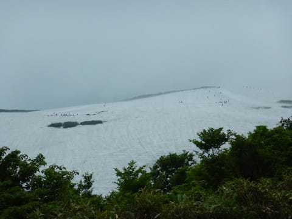

…でも．

Tバーの距離がかなり短いのがお分かりかと…

しかし，

Tバーは相変わらず混んでますね…

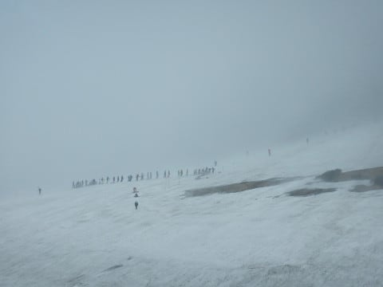

リフトは全く待ち時間0なんですけどね…

という感じで．

ゲレンデは寂しくなってしまい．

終わりげな月山でしたが．

大斜面はガスることなく，視界は良かったし．

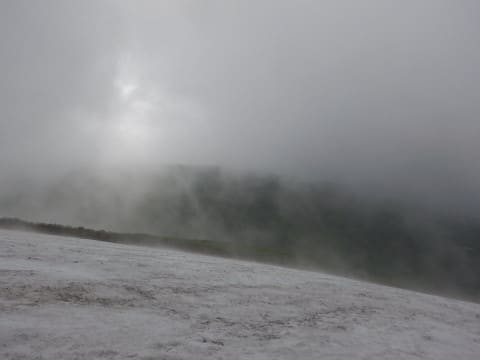

昼ごろには時々薄日も射すくらいだったので．

Skier_S的には楽しめた，今日の月山だったのでした…

ってことで．

詳細レポートは，また明日！
