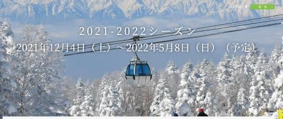
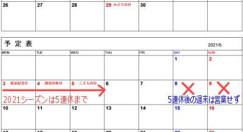
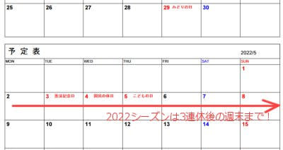
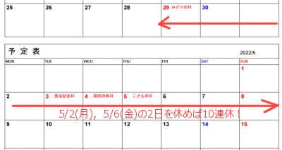

# え？来シーズンの2022シーズン，焼額はGW5月8日まで営業するって！？？？

📅 投稿日時: 2021-08-12 00:50:44

🏷️ カテゴリ: [日記](cc4b5682fb7b8b144980957a978653fb0.md)

えー．

一応，スキーヤー日記を名乗るからには，

時々スキーネタを入れなくてはならない義務

があるこのBlog．←コロナが無かった普段の年は，

夏モードはひたすらダイビング日記だったけど？？

今年も，夏だけどなんとか定期的に

スキーネタを差し込もうという

涙ぐましい努力により．

今日は山登りレポートじゃなく，ちゃんと

スキー情報の記事です～！

ってなことで．

本日，定例の焼額山スキー場ホームページを

見に行ったところ…

をををを！！！

トップページに，

2022シーズンの営業予定が出てるよ！！

（[焼額山スキー場ホームページ](https://www.princehotels.co.jp/ski/shiga/winter/)より）

ふむ．

来るシーズンのオープンは，12月4日（土）ですか…

12月の第1土曜オープンという定番ルールは，

来シーズンも守られるようですね．

そして．

なんと．

営業終了が2022年5月8日（日）と．

これは…例年よりちょっと伸びてまよ！！

これ，カレンダーを見ないと良く分からない

と思うのですが．

2021シーズンは，5連休で営業が終わり，

その後の週末は営業しなかったのですが…

2022シーズンは，

3連休後の週末も営業してくれる

ということです！

今年の5月5日営業終了から，

来年は5月8日営業終了と，

3日営業が伸びます！！

すばらしい…っ！！！

…ただ．

危惧がいくつかあるのですが…

まず．

危惧その１

来シーズン，5月5日以降も営業できる

ほど雪がたくさん積もってくれるのか？

…まぁ．

これは自然相手だから．

雪が残ってくれるのを祈るばかり

なんですが…

気になるのはむしろこっち．

危惧その2

志賀高原の共通シーズン券の有効期限が

5月5日までだったりしないかな…？

ちょっとこっちの方が心配…

もし，そうなったら．

残り3日間，ヤケビ限定券を買うのかな？？

…改めて来シーズンのGWのカレンダーを

見ると．

5月の2日と6日の2日間を休めば10連休…

このうち，結構な日数ヤケビ早朝を

滑るだろうし．

さらに，4月からの早朝や，

シーズン中に何日かヤケビナイターに

行く分も合わせると．

志賀高原シーズン券とヤケビ限定シーズン券の

シーズン券2枚持ち

という，同じスキー場で使えるシーズン券を

2枚持つというヤバいパターンが魅力的に

感じてしまう自分がいる…

危険だ．

これは，危険だ…

## 💬 コメント一覧

### 💬 コメント by (m&t t)
**タイトル**: Unknown
**投稿日**: 2021-08-12 13:04:36

Sさんなら当然２枚持ちでしょう

今まで持っていなかった方が不思議です

### 💬 コメント by (はなげ親分)
**タイトル**: Unknown
**投稿日**: 2021-08-12 20:14:35

2枚持ち・・・

悪魔のささやきですね

やばいっ！

ダークサイドに落ちそう

### 💬 コメント by (naoちゃんねる)
**タイトル**: Unknown
**投稿日**: 2021-08-12 20:43:11

GWの次の土日まで営業予定とは、ヤケビやる気ですね！！早朝営業が、またGSに戻ってくれると尚嬉しいです…

しかし2枚持ちとなると、早朝もナイターもたくさん滑らないと損とばかりに、早朝開始後の土曜の朝、寝ずに早朝ヤケビに来るＳさんが見えます（笑）

### 💬 コメント by (ikkun)
**タイトル**: Unknown
**投稿日**: 2021-08-13 12:34:00

おはようさんと？こんちは(笑)大変な雨ですね？ あやつと雨情報でイライラで知り合いレストランに逃げ込んだ今です(笑) まずはあやつ退散を皆様で強く 祈りましょ❗下道二時間で行けるのになかなか行かなくなりました(笑)でも…素晴らしいですね   私しと云えば10日に墓参り終わらせ昨日からお休みでこうなりましたm(__)m

### 💬 コメント by (Skier_S)
**タイトル**: 2枚持ちは危険すぎます
**投稿日**: 2021-08-14 02:42:35

＞m&t tさま

いや…同じスキー場で使えるリフト券2枚持ちは，さすがの私でも「おかしい人」に思えるので…

あと，今シーズンも早朝&ナイターでギリギリペイするかどうかなので，何かあったら損する可能性が…

＞はなげ親分さま

おっと．

2枚持ちの大先輩からの勧誘が(笑)．

ダークサイドに落ちないように気を付けないと．

＞naoちゃんねるさま

早朝営業が第1ゴンドラならいいんですが…

人工降雪がないGSコース下半分，春まで雪を持たせるのが大変ですから…

2枚持ちはしない予定です．

「早朝もナイターもタダってのは体に悪い」という迷言を残した方もいますし(笑)．

＞ikkunさま

こちらもすごい雨です…

私もせっかくの9連休なのに，コロナと雨で何もできず(涙）

### 💬 コメント by (ikkun)
**タイトル**: Unknown
**投稿日**: 2021-08-15 10:43:39

えー😱９日？(・・;)   お盆だけど一人みたいなので…昨日はスキーの巧者居酒屋で焼酎ポット二杯でした私しだけ「スキーは毎年変えますよ」とさすが巧❤️

### 💬 コメント by (ikkun)
**タイトル**: Unknown
**投稿日**: 2021-08-15 10:53:19

三人様のテレビ番組で宝くじ当てコーナー？をやられましたが……お金持ちはもっと欲しいのですね？   「1000万当たりましたよ」なんて以前言ってましたが？ テレビで言うか？と(笑)あ笑えませんね

### 💬 コメント by (Skier_S)
**タイトル**: ＞ikkunさま
**投稿日**: 2021-08-16 06:03:01

お盆休みなんですか？

スキー板は毎年替えないと…

というか，毎年ヘタりますから（涙）

