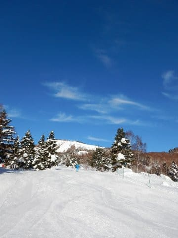
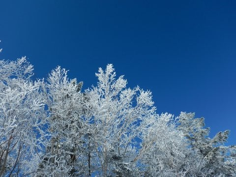
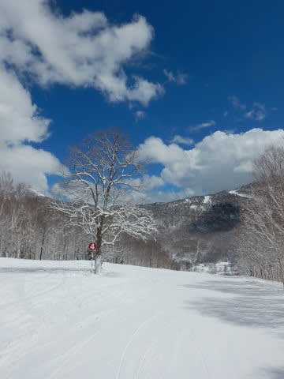
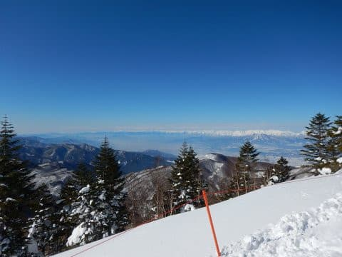
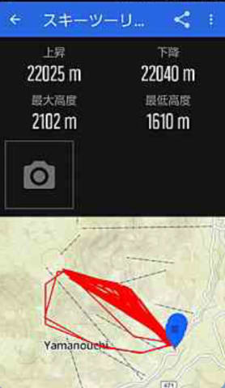
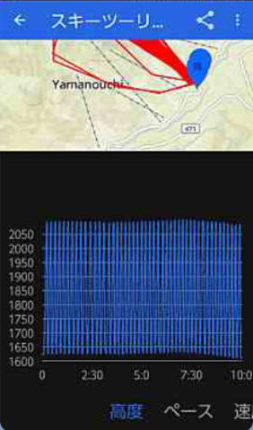
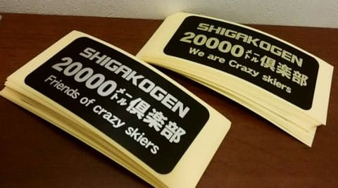

# 2019シーズンを振り返ってみる…え？？焼額だけで一日標高差20000m越え！？？

📅 投稿日時: 2019-06-07 03:10:21

🏷️ カテゴリ: [スキー雑談](c1f9d2cb7478308da16419928ea3945e9.md)

ということで．

まだまだスキーシーズンは終わって

いないのですが．

…ええ．

終わっていないのですが．

マイホームゲレンデ，焼額山の今シーズンの

営業が終わって，もう一か月近く経つわけで．

…ちょっと，今シーズンの焼額の

話題を振り返ってみたいと思います…

えー．

Skilineが終わってからも，

地味に活動が続いている，20000mクラブですが．

…20000mクラブ．

それは．

一日滑走標高差20000mという．

狂ってるとしか思えない常人には為しがたい滑走量を滑った，

馬鹿素晴らしい方々を指す言葉．

今では，20000m達成者は，

自分がおかしい人であるということを印すその名誉を印す

ゴールドステッカーを受け取れるという，

謎のシステムとなっているわけで．

どうやら今シーズンも，

3人ほど20000m達成＆ステッカー授与

されたようですね…

で．

なんと，今シーズン．

…そのうちの一名が．

焼額のみで一日滑走標高差20000m達成

という．

ひたすら焼額を滑り続けているつもりの

私でも達成したことのない記録を

成し遂げました…っ！！（ぱちぱちぱち）

まさか．

まさか焼額だけで20000mを超えるとは…

いや，焼額をひたすら滑り続けている私だから

分かる．

この記録のすごさが…

これまでの20000m達成者は．

1．一の瀬ファミリーグルグルパターン（これが最も多い）

2．奥志賀ゴンドラグルグルパターン

がほとんどで．

昼間だけで達成しようとすると，

この2パターンでしか達成できません．

それ以外の達成パターンはナイターか

早朝かを足すわけで．

私が20000mを超えるパターンは，

昼間ヤケビ1ゴングルグル，

夜はサンバレーかダイヤナイターで

滑った時ですね…

[Gokuさん](https://red.ap.teacup.com/applet/gokurakuskier/20170302/archive)は昼間焼額1ゴン＋ダイヤナイター，

[わが友人](e88a135f694d88ef49cb5ab33e5bcee51.md)は焼額早朝＋通常営業＋一の瀬ファミリーナイター

で20000mを達成しているわけで．

これまで，焼額だけで20000mを達成した人は

いません．

焼額第1ゴンドラは，昼間の営業時間が

8:30～16:15まで．

最近はトップスピードで運転されることが

ほとんどなく．

1時間で平均4.5本くらいしか乗れません．

休日にそこそこ人が多くて早めの

運転速度だけど，待ち時間がほとんどない…

という絶妙な混雑具合だったら，

頑張って乗って，一日38本．

ガラガラだけど，お客さんが少ないので

ゴンドラのスピードが落とされているとか，

お客さんが多くてゴンドラのスピードは速いけど，

ゴンドラ待ちがあるとかだと．

一日38本は無理です．

だもんで．

お客さんがそこそこいてゴンドラが

トップスピードなのに，ギリギリ待ちが無く

乗れる

というぴったりの条件以外では，一日38本

行けないんです…！！

あ，コース途中で立ち止まるなんてもってのほか．

おそらく，オリンピックコースをひたすら

ノンストップで滑り続けないと38本は無理．

コースが長いGSコースだと，1本あたり20～30秒

時間が余計にかかります．

20～30秒って，わずかな差に感じるけど．

30本滑ると積もり積もって10分～15分の

差になっちゃうので．

これだけでも，ゴンドラ1本分少なくなります…

と，ここまで頑張って38本乗っても，

1ゴンの標高差は450mなので．

稼げる標高差は17100m

そして．

焼額のナイターは18時～20時の2時間．

第3高速リフトも，最近はスピードを落として

運転しているので．

2時間で乗れるのは12～13本．

3高の標高差は220mなので．

ナイターで頑張っても，2860m．

この両者を足しても，残念ながら20000mに

ほんのわずか，届かないんです…（涙）

ダイヤモンドナイターなら，3500m．

サンバレーナイターなら4000mは稼げるので．

焼額の昼間＋ダイヤモンドか

サンバレーのナイターという組み合わせなら，

20000mを達成できるのですが．

焼額だけでは，20000mは困難です…

ただ．

焼額は，3月に入ると早朝営業が始まるので…

6:30～8:30まで，2時間ゴンドラに乗れば，

8～9本ゴンドラに乗れ，4000m近く滑れます．

ってことは．早朝営業で4000m，

通常営業で17000m滑れるので．

理論的には，早朝から通常営業終了まで

ひたすら滑り続ければ，

21000m行けるはずなんです．

…いや，理論的には行ける．

理論的には行けるんだけど…

昼間＋ナイターなら，

休憩時間がある．

16時半まで昼間営業を8時間滑ったら．

その後ナイター開始の18時まで1時間半休めるので．

体力も回復するし．

その間はゆっくり食事もできて，

トイレにものんびり行けます．←20000m達成にはトイレは大事．

トイレに行く回数が多いと負け．

でも．

早朝＋昼間で20000mを達成しようと

した場合．

6時半～16時半まで．休みなしで

10時間ぶっ続けになるのだ．

10時間，休まず止まらず，

ひたすら滑り続けなくてはならないのだ！！！

こんなバカなことをしてまで20000m達成しようとは，

普通は思わないのだ！！←いや，そもその20000m達成しようという時点ですでにバカだから，

その達成の仕方に普通も何もないと思うけど…

ところが，3月のある日のこと．

早朝開始時に一緒に滑っていた，

某焼額朝礼メンバーから，

午後1時過ぎ．LINEが入ってきました…

「15000m超えました」

え？？

13:20で15000越え？

単純計算で，焼額は1時間2000mずつ稼げるので…

営業時間があと3時間残っているから，

20000m超えられるじゃないですか！

「密かに狙ってます」

…そして．

14:30ごろ…

「17000m超えました」

…順調に1時間2000m稼いでますね．

そろそろ滑走開始から8時間を超え．

身体が厳しくなってくるころですね…

ってか．

夕方になり．

コースはかなり荒れてきてます．

体力と気力が失われつつある最後に，

凸凹斜面になっていき，より体力が

必要になっていくという．

この辛さをひしひしと感じるころ…

果たして．

朝6:30から滑り続けているのに．

最後までもつのか…？？？

10時間，休まず滑り続けられるのか…！？？

15:50頃

「20000m超えました」

をををを！！！！

ついに行ったか…

ついに，焼額のみで20000m達成者の誕生ですっ！！！！

そして，営業終了時には…．

「22000m突破！」

…お疲れ様でした．

ホントに，お疲れ様でした…

いや．

「トイレは2回のみ」

というメッセージと共に．

こんな写真も送られてきましたが…

うむ．

エネルギー補給も水分補給も，

全てゴンドラの中で済ませたわけですか…

スキー○カですね素晴らしいですね…！！

ということで．

標高差22000mを超えたようですが．

もう，この日の記録を見せてもらうと．

見事に1ゴンにしか乗ってませんね．

そして，2回パノラマ-サウスコースを行った以外．

後は全てGSコースだけを滑ったようです…（本人談）

1ゴン乗車回数，47回．

他のリフトもゴンドラも動いているのに．

ゴンドラ1本に一日50回近く乗り続けるとは…

おかしいとしか思えない素晴らしい精神力！←人のこと言えないでしょ

1ゴンをこよなく愛する私でも，

早朝から通常営業まで，

1ゴン以外に乗らなかった，ってことは

ほとんど無い気がする…

50本近く1ゴンに乗り続けるなんて．

なんて偏っているすごいんだろう…！

まさか，1ゴンだけで20000m突破する人が

出てくるとは思わなかった．

ホントに1ゴンだけで突破できるとは

思わなかったよ…！

この結果をきいて．

1ゴンを愛する私としては

「やられた」

と感じたのが，正直なところ…

これは．

私が達成しなくてはならない記録だった

かも…（ちょっと悔しい）

とりあえず．

翌朝．

ゴールドステッカー授与式を

行いましたが．

（達成者の証，ゴールドステッカーと，

　配布用のシルバーステッカーが同時に授与されます)

20000mを超えるための秘訣が．

「休まない，傾かない，頑張らない」

…これ，ある種の迷言かも．

ただ．

何か壁を突き破ると．

傾きながらでも20000mを超えられるように

なるんだよ

と．

言ってみたいSkier_Sなのだった…

つーちゃん，20000m越え

おめでとうございます！

（おめでたいのかどうか，良く分からないけど）

## 💬 コメント一覧

### 💬 コメント by (つーちゃん)
**タイトル**: Unknown
**投稿日**: 2019-06-07 18:36:30

記事作成中とは聞いていましたが、中々出てこないのでお蔵かと思いました

いやいや、これで私も全国区ですね(￣ー￣)

今思い返しても、あの時は妖怪に取り憑かれていたとしか思えません！

終わった直後は達成感と、ナイター滑らずに済むという安堵がこみ上げてきましたが、

日に日に何故あんな事をしたのかと疑問が湧いてきました。笑

楽しみながら20000超えちゃう境地はまだまだ遠そうなので、

しばらくはペーパーゴールド決め込みますッ！

あと、内容に若干誤りがあります。

スントの時計でトラッキングしましたが、

標高は若干多めに出るようで乗車回数は47本です。

軌跡も結構いい加減でパノラマ-サウス2本以外は全てGSコースです。

という一般人アピールをしておきます！

### 💬 コメント by (naoちゃんねる)
**タイトル**: Unknown
**投稿日**: 2019-06-07 20:22:14

つーちゃん、おめでとうございました👏

いやー、あの日は吹雪まではいかないまでも雪降りで、密かに狙ってるとのLINEが来たときはみんなビックリしてましたよね～

で、驚いたのは翌日早朝営業からしれっと現れ滑っていたので…

やはり、ゴールドメンバーは一般人とはかけ離れた終わった…じゃなくて素晴らしいスキーヤーなのですね(笑)

### 💬 コメント by (yumi)
**タイトル**: Unknown
**投稿日**: 2019-06-07 21:12:23

Ｓさぁ～ん☃️⛷️🚀

久々の志賀高原ネタ💖

記事を読み進めて行くうちに、この 話題の主は誰❓️なんだろう⁉️って・・・

後で FBで スキー仲間に聞こう💡

・・・と、思いきや、

主人公は つーちゃんさんだったのね☺️

お疲れ様でした✨✨✨

それと おめでとうございます🎊🎊⛷️🎉🎉

### 💬 コメント by (Skier_S)
**タイトル**: ゴールド達成おめでとうございます
**投稿日**: 2019-06-08 01:14:26

＞つーちゃんさま

思ったよりボリュームがある記事になったので，

コツコツ書いてましたが，ようやっとネタにできました．

お待たせしてすみません（笑）．

これで全国区ですよ～！

コメント内容は修正しました（感謝）．

しかし，47本ゴンドラ乗車は記録ですね．

私も来シーズンは頑張って記録を抜こうかと

思います（嘘）．

ゴールド達成おめでとうございました～！

＞naoちゃんねるさま

いや…

あのLINEは衝撃的でしたよね．

そして次の日も当然のごとく早朝から

かっ飛ばしているという（笑）．

ぜひ，今度20000mチャレンジしてみてください（笑）．

＞yumiさま

そうなんです．

つーちゃん，4月に入ってから板に貼ってあるシールが

さりげなく金色になっていたんですよ…

ぜひ祝福（？）してあげてください！

### 💬 コメント by (しんちゃん)
**タイトル**: ミラクルシーズン
**投稿日**: 2019-06-08 02:37:02

2019シーズン、つーちゃんのミラクルには驚かされました。昼間だけで20000m達成はホントにすごいなと思いました。おめでとうございます!!特選Gokuﾗｯｸの出来にも驚かされました。ゴールドメンバーからも称賛・絶賛でしたよね!!気が付いたらHEADの白い板を履いて滑走スピードが格段に上がっていたのも驚きでした。

gold保持者は、どこか突き抜けている気がします(笑)

### 💬 コメント by (Skier_S)
**タイトル**: ＞しんちゃんさま
**投稿日**: 2019-06-08 20:23:51

来シーズンはしんちゃんがゴールドチャレンジする番だと思ってましたが…（笑）

### 💬 コメント by (Goku)
**タイトル**: え！今シーズン３名も・・・
**投稿日**: 2019-06-10 23:04:41

つーちゃん以外にも達成者がいたとは知りませんでした。

他の方も焼額山で達成したのですか？

それにしても、自分でさえいつやったのか覚えていないのに、私のブログの記事までリンクしているところが凄すぎです。

### 💬 コメント by (Skier_S)
**タイトル**: ＞Gokuさま
**投稿日**: 2019-06-11 02:58:07

今シーズン，「わたナベ」さんでコメントくださってる方が

奥志賀で20000m達成されてます～！

あと，KonSukeさんから，他に達成者がいると聞いています．

まだまだ地味にゴールドメンバー増えて行ってます…

