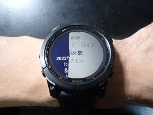
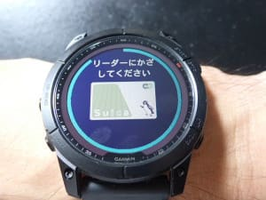
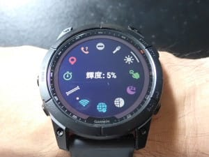

# 新しいスマートウォッチ，Garmin Fenix7Xを買ったよ！その6…スマホ着信表示やらスイカやら，追加機能を見てみる

📅 投稿日時: 2022-08-20 01:34:19

🏷️ カテゴリ: [PC,カメラ&小物](c0d8caed13e597efe97b661a8ae56bed0.md)

ということで．

2回ほど塔の岳の山歩きレポートを

挟みましたが．

…塔の岳のレポートも終わってないいうのに．

今日はまたGarmin Fenix7Xのレポートに

戻ります！

（Garmin Fenix7Xのレポート全16回のもくじ

機能説明，登山用地図の作り方，登山で使ってみた…など

は[ここをクリック](e516b23a4874189de2e9208be87fa5184.md)）

…しかし．Fenix7．

あまりにも機能が多すぎて．

何回の連載になるか，私も全く読めない…（追記・全16回でした…）

ってなことで．

前回はスマートウォッチとしての

基本機能を見てみましたが．

今回は，いくつかの追加の機能を

見てみましょう！

まずは，これはどちらというとスマート

ウォッチとしては基本機能のような気もする，

スマホのメッセージ通知通知機能ですが…’

まぁ，LINEやらメールやらの着信通知．

こいつはちゃんと絵文字付きで表示されますし…

受信したメッセージやメールに，

事前に設定しておいたいくつかの

定型文から選んで返事を送ることも

できます…！

良く使う文をあらかじめ設定しておけば，

スマホを使うことなく返事できるので，

結構便利かも…

　

そして，当然電話着信も確認できて．

電話の切断や，SMSでの返信ができます．

さらに，左上のLIGHTボタン長押しで

出てくる，このメニュー画面．

基本的にはこのメニューは設定用

メニューで．

例えばバッテリー節約モードの

On/Offとか，そんな設定ができる

メニュー画面なんですが…

（しかし，バッテリー節約モードにすると

　バッテリー80％くらいで76日もつようで…

　すごいバッテリーもち）

このメニューの中には，ウォレットって

メニューがあって．

このメニューを選んで，4ケタのパスコードを

入力すると…

なんと．

スイカが使えます！！

パスコードを入れて30秒（だったかな？）

以内にカードリーダーに当てれば，

支払いや乗り物の乗車に使えます！

スイカのチャージは，時計単体ではできないので，

スマホが必須ですが…

あと，Google Payでしか払えないし．

Garminウォッチ専用にチャージする感じで．

他のカードのチャージとは連携できないので

注意…

そして．

このFenix7Xの独自機能がこいつ．

フラッシュライト機能なんですが．

4段階で強さを選べば

こんなふうに，上部についた白色

LEDライトが光ります！

さらに，赤色ライトも点けられるし．

このLEDライト，Fenix6以前にはなかった

機能で．

Fenix7も，7Xのみの機能です．

ちなみに，LEDライト点灯時にメニューボタンを

長押しすると，いろんな点滅パターンも選べて．

夜間ランやバイクライドの時とかの周囲への

注意喚起用に使えます…

そのほかにも，このメニュー画面からは，

ストップウォッチや…

そしてアラーム＆タイマーが設定できます．

アラームは，バイブレーションと

アラーム音，その両方が選べて．

右上ボタンでストップ，

左下ボタンでスヌーズですが．

スヌーズは10分後に再通知です．

そのほか，このメニューは

基本的には設定メニューなので．

バックライトの明るさ設定や…

タッチパネルのオン・オフ設定．

あとは睡眠モードon/offの切り替え．

睡眠モードon時，

通知のアラームを鳴らす・鳴らさない

バッテリー節約モードのOn/Off，

バックライトのOn/Offとかが選べるし．

さらに，各曜日ごとに何時から

何時までは睡眠モードにするという

スケジュール機能がありますが．

せっかくの睡眠測定機能があるので，

Amazon GTRみたいに，睡眠検出したときに

睡眠モードになってくれるといいんですけど…

それはできませんでした（残念）

他には，サイレントモードやら，

スマホのブザーを鳴らしてスマホを

探す機能やら，

いろいろあります…

ってな感じで．

いろいろ機能があるんですが…

そうそう．

意外に知られてない機能として．

右上ボタンを長押しするとスクリーンショットが

撮れたりします．

PCにUSB接続して，画像ファイルを

読みだせます…

地図画面をスクリーンショットすると…

なぜか丸じゃなく，四角い画面が撮れます．

ってな感じで．

全くもって超多機能なこの時計ですが．

まだ肝心な，ワークアウト（運動記録）系の

機能をまだ説明していないという…

ってことで．

次回はワークアウトの説明…

と行きたいところですが．

その前に，スマホアプリの説明を

する予定です…

（続く）

## 💬 コメント一覧

### 💬 コメント by (だいき)
**タイトル**: Unknown
**投稿日**: 2023-07-16 09:09:34

初めてコメントさせていただきます。

ちょっと質問なのですが、こちらの時計のテキスト返信機能なのですが、GmailやLINEなどへの定型文での返信は可能なのでしょうか？

オフィシャルサイトを見ると着信、SMSメッセージのみの対応とかいてあり、LINEへの定型文での返信が可能なのであれば購入しようと思っている感じで、、

コメント気づいていただけましたらぜひ教えていただけると嬉しいです、、

### 💬 コメント by (Skier_S)
**タイトル**: ＞だいきさま
**投稿日**: 2023-07-17 02:04:17

コメントありがとうございます～！

LINEでも定型文で返事できます！

Gmailにも定型文で返事できてます．大丈夫です…

