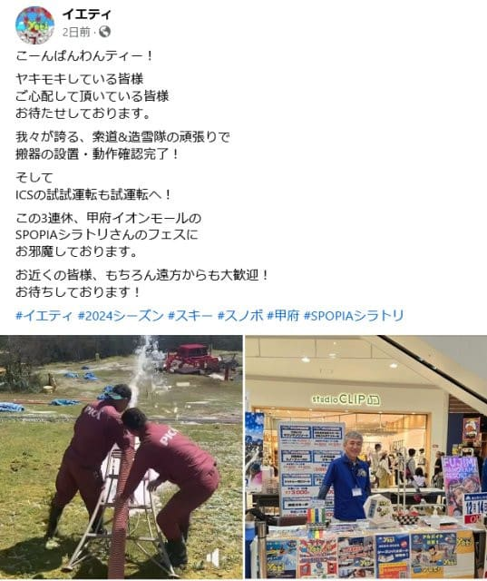

# 2024年8月，5度目の子連れモアルボアル，コロナ後初の海外へ！その7…モアルボアルのダイビング1本目！

📅 投稿日時: 2024-10-15 01:18:41

えー．

そろそろイエティのオープンが近づいてきて．

おそらく，25日（金）のオープンだろうなぁ…

と予測していたわけですが．

いまだにオープン日が公開されてませんね…

ただ，例年遅くともオープン1週間前に

オープン日が公開されていることから，

10月11日（金）にイエティのオープン日が

公開されていない時点で，その一週間後の

18日のオープンはないな…

と読めるわけで．

これで，25日(金)のオープンがほぼ確定ですね．

イエティのFacebookにも，10月12日に造雪機の

試運転をやっと始めたということなので…

さすがに6日間では，全ての造雪と

コース整備が終わるわけがないので．

イエティのオープンは，10月25日(金)で

ほぼ間違いないと思います…

（[イエティFacebook](https://www.facebook.com/YetiSnowtown/posts/pfbid0ysUiDFjxbmNcjz31y9ktkp73K5HY7NdcbtcP1m3Um8CdZ4X4EKJ4Pod1XY6japcDl)より）

ということで．

25日オープンなら，オープンまであと10日

余り．

私も本日，板にワクシングして，ウェアに

防水スプレーをかけて…

と，シーズンインの準備を始めました～！

という，スキーシーズンが近づいて

きている時期にもかかわらず．

今日の本題は，いつものダイビング日記です…

ーーーー

（[前回はこちら](eaf1efea840f20fa4676d43a1093200b7.md)）

ってな感じで，ダイビング初日の本日ですが．

ボートはモアルボアルのダイビング1本目，

ペスカドール島に向かって移動を始め

ましたが…

いい感じのべた凪ですね～！

そして．

ボートに乗ること20分ほど．

ペスカドール島へ到着！

…やはりメジャーポイントだけあって，

かなり他のボートもいっぱい来てます

ね…

いやーー．

やっぱりペスカドール，海がきれい…！

早く潜りたい～！！

とりあえず．

モアルボアル1本目なので，

しっかりブリーフィングを聞きますが…

今日はどうやら我が家族3人だけで1チーム

として，ガイドがついくれるようで．

これなら，家族3人だけで好きなように

潜れますね！

今回は，ブリーフィングをしてくれた

じゅんこさんが我が家族をガイドしてくれる

ようです…！

ありがたや～

ってなことで．

ブリーフィングが終わったら…

いざ，5年ぶりのモアルボアルの海へ，

エントリー！

水温29℃と暖かく，

透明度もいいから…

海に飛び込んだら，気持ちいい！！

モアルボアルの海は5年ぶりだけど．

座間味で潜ってから中5日のダイビング

なので，ダイビングの久しぶり感は

ないけど…

透明度も良く，日が射す明るい海で

潜るのは，やっぱり気持ちいいよ！

そして，ガイドのじゅんこさんの引率で

ドロップオフに向かい，深度を落として

いきますが…

いきなり目の前で繰り広げられる，

ハナダイ系の乱舞！

そうだよ…これがペスカドールだよ！！

ガイドのじゅんこさん．

大きなマグネットスレートをもっていて，

何か見つけたら，いろいろ書いてくれますが…

おっと．

オオモンカエルアンコウですか…！

さて．

この写真の中に写っているんですが…

どれがオオモンカエルアンコウか，わかるかな？

そうです．上の写真のかなり右端，真ん中より

ちょい上にいるやつです．

近寄ってみると…

うわ．

確かに巨大だわ…これ．

そして，またサンゴとハナダイの乱舞を

見ながら進んでいくと…

黄色くて目立つコクテンフグ黄化固体やら…

ダイバーを恐れなくて，ダイバーがかなり

近づいているのに，イソギンチャクに戻らない

クマノミやら…

いろいろなものを眺めながら，

ドロップオフ沿いを流していきます．

いや．

しかし，

メラネシアンアンティアスの群れは

写真映えするし．

透明度が良くて日が射しているので．

海の中も明るい感じで．

いかにも南国のダイビングといった，

きらびやかな海ですね…！

このキラキラでカラフルな魚の群れを，

家族3人貸し切りガイドのダイブで，

他の人に気兼ねなく好きなように潜れる，

この贅沢…！！

娘も他の人に気兼ねなく写真を撮って

られるし．

いや．モアルボアル1本目から，なんて

満足度の高いダイビングでしょうか…！！

ってな感じで潜っていたら，

あっという間にダイブタイム40分．

残念ながらダイビングももう終盤．

ボートの下に戻って，安全停止です…

が，安全停止中でも十分楽しめる，

この透明度を見よ…！！

しかし．

無情にもダイブタイム終了の時間です．

ボートに戻りますが…

うーん．

海の中から，これだけきれいに空が見えるとは…！

ってなことで，ボートに上がりますが…

ボートのラダーに取り付いたら，ガイドが

フィンもBCもウェイトも外してくれるという，

久しぶりの，フィリピンならではの殿様ダイブ

スタイルのエグジット．

この殿様ダイビングに慣れると，他のところで

ダイビングできなくなるかも…

ということで．

5年ぶりのモアルボアル．

1本目から，かなり満足度が高いダイビング

でした…！！！

（[続く](ee6506ef8241b7b5c8472bd9e536133f4.md)）

## 💬 コメント一覧

### 💬 コメント by (だい)
**タイトル**: ヤケビに動きが
**投稿日**: 2024-10-15 23:47:07

お久しぶりです。だいです。

本来ダイビングカテゴリに書く話ではないのですが、どうしても伝えたかったので失礼いたします。

この3連休焼額山に登ったのですが、パノラマコース上部で重機を使った土木工事が行われています。

コースの北アルプス側に大きな溝を掘っていて、脇にはホースが何本か巻かれて置いてあったので、何となくですが人工降雪用のパイプを引いているように見えました。

是非S様はじめヤケビガチ勢の見解も伺いたい所なのですが、撮った写真をお渡しする方法が無く…

既にご存じでしたらすみません。

### 💬 コメント by (Skier_S)
**タイトル**: ＞だいさま
**投稿日**: 2024-10-16 01:50:47

ええ？？

パノラマ上部に人工降雪機？？

うーん．確かにあり得ない話じゃないですが…私の情報網には引っかかってないです．

情報ありがとうございます！

写真，見てみたいんですが…確かに受け取る方法がありませんね（涙）

### 💬 コメント by (Unknown)
**タイトル**: Unknown
**投稿日**: 2024-10-18 07:54:15

「あの異様な光景は誰か上げているよね」と思ったらありました。

https://yamap.com/activities/35097973/article#image-483065647

４枚目の写真で溝を横切っている下は金属管一本、フレキシブル管三本が通してありました。

  * 溝の行き先はサウスコースなのか唐松コースなのか？

  * 12月7日までに工事が終わるのか？

  * 下は草だと思っていると思い切り岩を踏みそう。

### 💬 コメント by (Skier_S)
**タイトル**: ＞だいさま
**投稿日**: 2024-10-19 01:19:32

ホントだ…工事してますね…！！

これは確かに人工降雪機用の水パイプと電線にも見えなくない…

パノラマ上部，ついに人工降雪設置ですかね…

昨シーズンは，パノラマ上部の積雪があと10cmあればもっと早めにゴンドラ営業できたから，

パノラマ上部に人工雪を打てるようにするんですかね～…

