# 11月5日(日)の軽井沢スキー場特派員レポート！…そして，Garmin Fenix7Xのスキーモードの地図を見てみた

📅 投稿日時: 2023-11-06 01:27:51

🏷️ カテゴリ: [スキー雑談](c1f9d2cb7478308da16419928ea3945e9.md)

えー．

本日の日曜も，軽井沢スキー場に滑りに

行った特派員がいたようですが…

日曜朝は，リフトが最大15分待ちくらい

だったらしく．

長めの待ち時間ながらも，軽井沢の

朝とすれば少なめですね…

リフト＆駐車場料金値上げが効いてる

のかな？

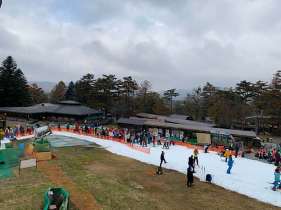

で．

コースはしっかり硫安が効いて硬かった

らしく…

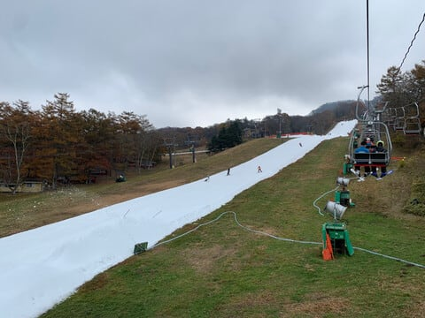

昼近くまでそれほどひどくは荒れなかった

ようですね．

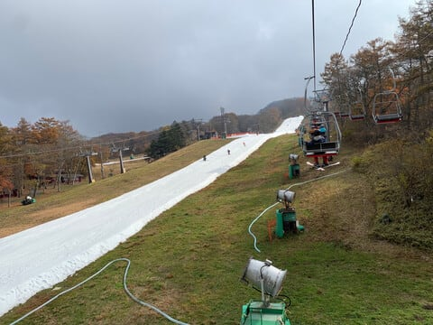

そして，昼頃にはリフト待ちが5分程度に

短くなったとのことで．

これは，3連休としては，思ったより

すいてますね～．

…やっぱり値上げが効いてる？？

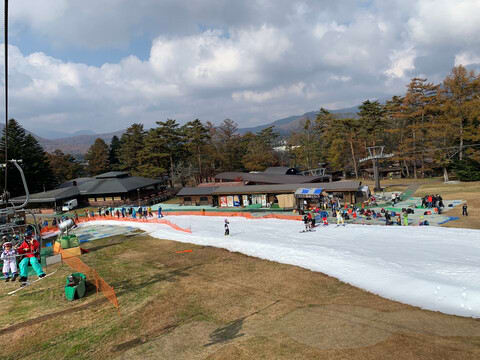

ただ．

12時を過ぎると，さすがにゲレンデも

荒れ始め．

コブコブになるというより，小回り

レーン的に真ん中が掘れてきて，両側に

雪が溜まった滑りにくいバーンに

なってきたみたいですが…

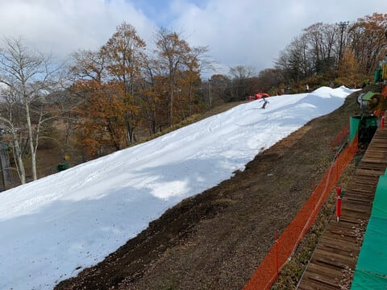

とはいえ．

コース幅もそこそこあるし．

荒れているとはいえ，コブコブに

なっているわけでもないし．

思ったよりよさそうな感じに

見えますね～

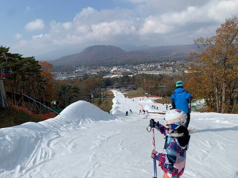

リフト5分待ち以下で，午後になって

待ち時間が減っていくならイエティより

少ないくらいだし．

まぁ，午後のゲレンデは荒れるみたい

だけど，リフト待ち30分の昔の

軽井沢よりずっとよさそう…

ただ，リフト券と駐車料金は高いけど（涙）

ってなことで，本題へ．

山登りでお世話になってる私のGarminさん

ですが…

スキーでも思いっきり活用しているわけで．

こんな感じで，上の段から

現在時刻，

今のスピードと最高スピード，

高度グラフと総滑走標高差，

滑走本数と滑走距離，

心拍グラフ…

なんかが1画面で見れるし．

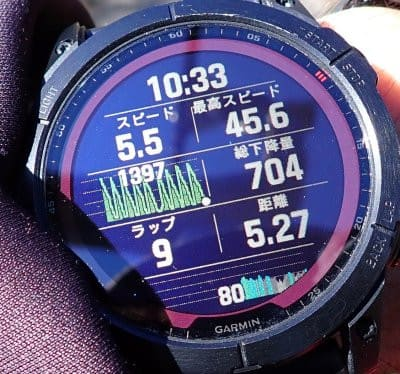

画面をスクロールすれば，

現在時刻，

気温と消費カロリー，

滑走距離とバッテリー残量，

日の入り時刻と前の1本の平均スピード，

GPS受信感度

が見られるように設定していたり

するわけですが…

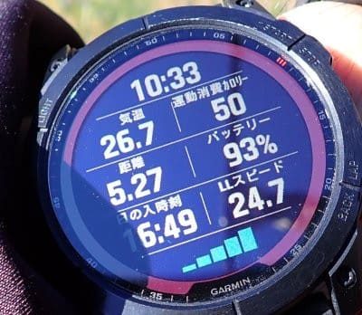

Garminさんでは，さらに時計で地図も

確認できて．

こんな感じで滑った軌跡が地図で確認

できます…！

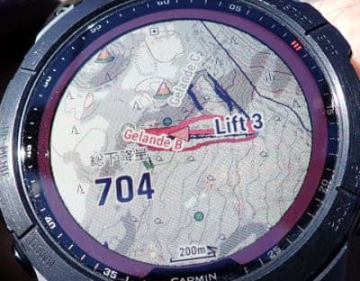

拡大すると．

ちゃんとイエティのゲレンデマップが

入っていて，

リフトとゲレンデCとかゲレンデBとか

コースマップが表示されてます…！

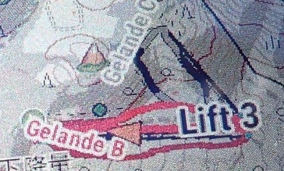

ちなみに，日本国内の主要スキー場は

大体カバーされてるみたいで．

古いマップではイエティや志賀高原が

入ってなかったようですが，

私のバージョンではイエティも志賀も

マップが表示されました…！

スマホではさらに詳細なデータや

地図が確認できますが…

…イエティの滑走記録だとよく

わからないですが，

これ，やっぱりスマホのGPSより

かなり正確だと思います．

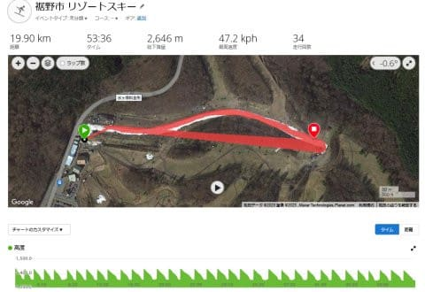

ってなことで．

過去の志賀高原のログを見てみると…

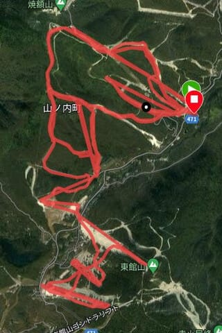

拡大しても，コースからはみ出ている

ところは全くないし．

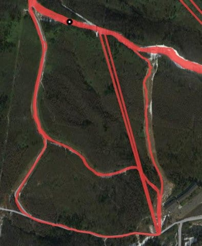

さらにもっと拡大してみると…

一ノ瀬ファミリーのあたりの軌跡ですが．

どのようにターンしたかまでわかる

感じですね…！

右側の急斜面部分，小回りで滑っているのが

わかるレベルです…

これはすごい…

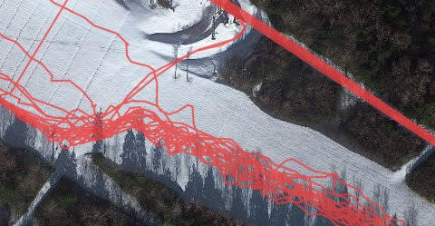

ってなことで．

GPSはかなり正確だし．

時計で今のスピードやら滑走本数やらが

確認できるし．

コースマップまで見ることができるし…

そしてスキーモードで朝から晩まで

滑っても，電池が10％くらいしか減らない！

これはすごい…

Garminさん，山登りだけじゃなく．

スキーのお供としても，手放せません！！
